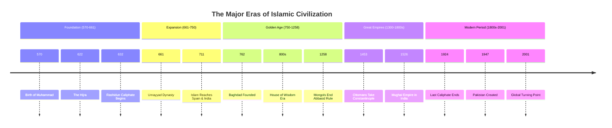
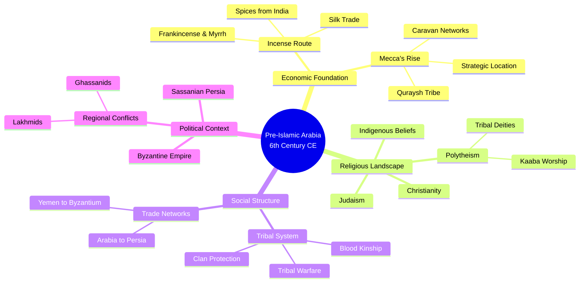
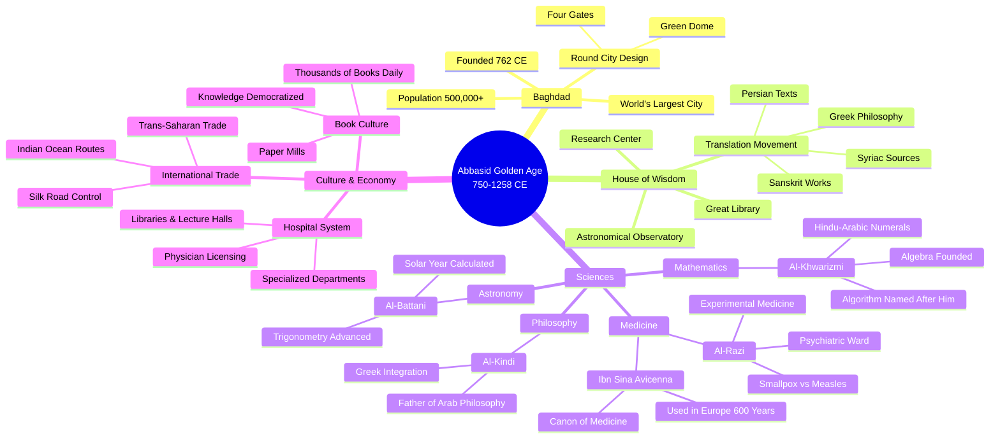
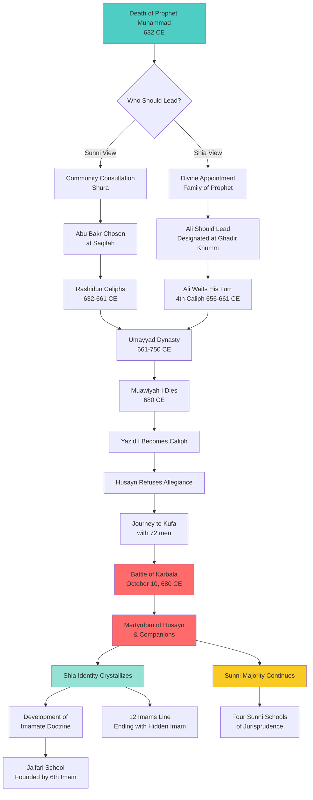
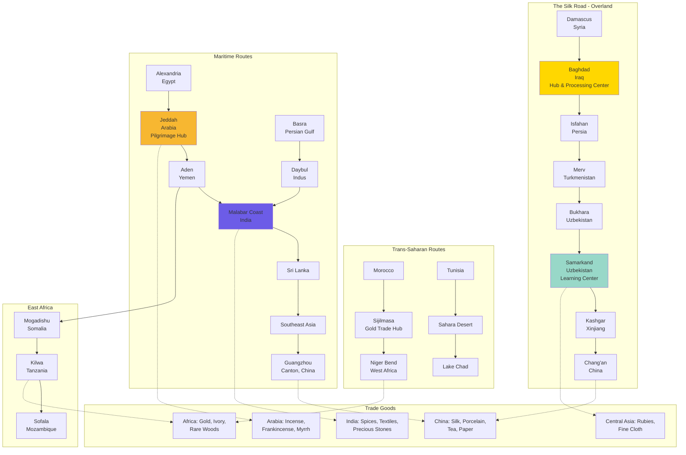
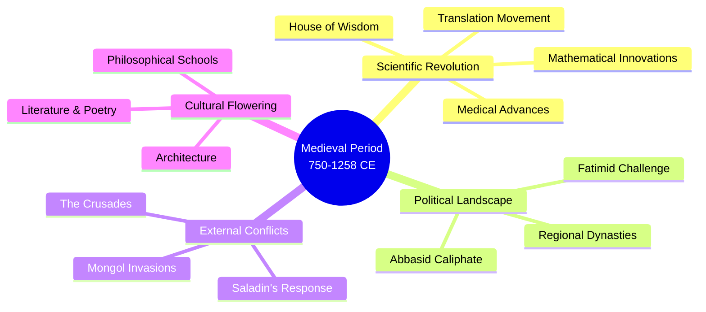
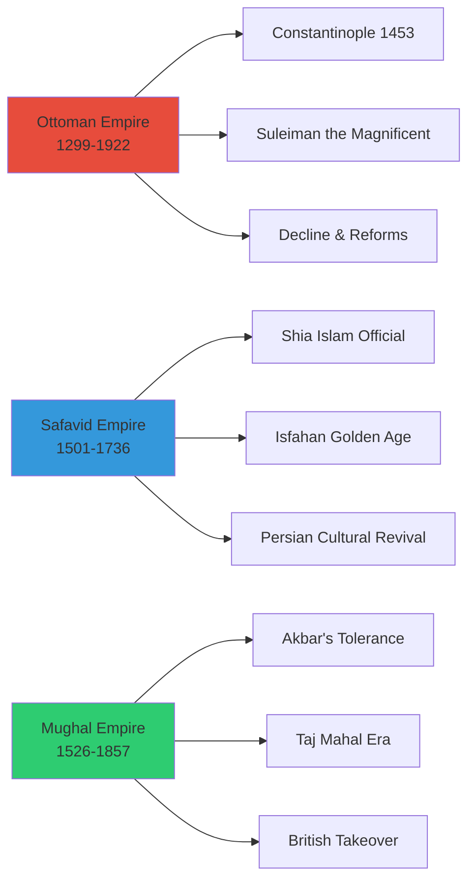
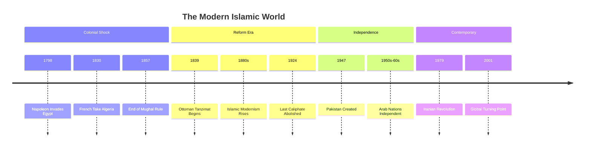

*A comprehensive chronological exploration of Islamic history spanning 1,400 years—from the birth of Prophet Muhammad in 570 CE through the formative early centuries, medieval golden ages, powerful empires, colonial encounters, to the contemporary era ending with the pivotal events of 2001 CE.*

---

## Table of Contents

### Comprehensive Timeline
- [Complete Timeline of Islamic History (570-2001 CE)](#complete-timeline)

### Early Period (570-765 CE)
  1. [Introduction](#introduction)
  2. [Pre-Islamic Arabia: Setting the Stage](#pre-islamic-arabia)
  3. [The Life of Prophet Muhammad (570-632 CE)](#prophet-muhammad)
  4. [The Qur'an: Revelation and Compilation](#quran-revelation)
  5. [The Hijra and Formation of the Muslim Community](#hijra)
  6. [The Rashidun Caliphate (632-661 CE)](#rashidun-caliphate)
  7. [Major Battles and Military Expansion](#battles-and-expansion)
  8. [The Umayyad Caliphate (661-750 CE)](#umayyad-caliphate)
  9. [The Abbasid Revolution and Golden Age](#abbasid-caliphate)
  10. [The Sunni-Shia Split](#sunni-shia-split)
  11. [Ja'far al-Sadiq and Islamic Jurisprudence](#jafar-al-sadiq)
  12. [Trade Routes and Economic Systems](#trade-and-economics)
  13. [The Spread of Islam Across Continents](#islamic-expansion)
  14. [Daily Life and Social Institutions](#daily-life)
  15. [Islamic Scholarship and Intellectual Traditions](#scholarship)

### Medieval Period (750-1258 CE)
  16. [The Abbasid Golden Age and House of Wisdom](#abbasid-golden-age)
  17. [Islamic Science, Philosophy, and the Arts](#islamic-sciences)
  18. [The Crusades: Conflict and Cultural Exchange](#crusades)
  19. [Saladin and the Ayyubid Dynasty](#saladin-ayyubids)
  20. [The Mongol Invasions and Fall of Baghdad](#mongol-invasions)

### Age of Empires (1250-1924 CE)
  21. [The Mamluk Sultanate](#mamluk-sultanate)
  22. [The Ottoman Empire: Rise and Expansion](#ottoman-rise)
  23. [The Conquest of Constantinople and Ottoman Peak](#ottoman-peak)
  24. [The Safavid Empire and Shia Iran](#safavid-empire)
  25. [The Mughal Empire in India](#mughal-empire)
  26. [Islamic Architecture, Art, and Culture](#islamic-arts)

### Colonial Era and Modernity (1798-2001 CE)
  27. [European Colonialism and Muslim Responses](#colonial-period)
  28. [Reform Movements and Intellectual Renaissance](#reform-movements)
  29. [The Fall of the Ottoman Caliphate](#fall-of-caliphate)
  30. [Independence Movements and Nation-States](#independence)
  31. [Partition of India and Creation of Pakistan](#partition-1947)
  32. [The Iranian Revolution and Islamic Revivalism](#iranian-revolution)
  33. [Contemporary Era and Global Islam](#contemporary-islam)

### Conclusion
  34. [Legacy and Continuing Influence](#conclusion)

---

## Complete Timeline of Islamic History (570-2001 CE)

*This comprehensive timeline provides quick reference to major events, dates, and milestones in Islamic history. Each entry links to detailed sections below for deeper exploration.*

### The Prophetic Era and Early Community (570-632 CE)

- **c. 570 CE** — Birth of Prophet Muhammad in Mecca
- **610 CE** — First revelation of the Qur'an in the Cave of Hira
- **613 CE** — Public preaching of Islam begins in Mecca
- **615 CE** — First migration (hijra) to Abyssinia (Ethiopia) to escape persecution
- **619 CE** — "Year of Sorrow" (deaths of Khadija and Abu Talib)
- **620/621 CE** — Isra and Mi'raj (Night Journey and Ascension) traditionally dated
- **622 CE** — The Hijra to Medina; beginning of the Islamic calendar (1 AH)
- **624 CE** — Battle of Badr (first major Muslim victory)
- **625 CE** — Battle of Uhud
- **627 CE** — Battle of the Trench (Khandaq)
- **628 CE** — Treaty of Hudaybiyyah with Mecca
- **630 CE** — Conquest of Mecca; peaceful surrender of the city
- **632 CE** — Farewell Pilgrimage and death of Prophet Muhammad

### The Rightly Guided Caliphs (632-661 CE)

- **632-634 CE** — Caliphate of Abu Bakr al-Siddiq
- **633-634 CE** — Ridda Wars (Wars of Apostasy)
- **634-644 CE** — Caliphate of Umar ibn al-Khattab
- **636 CE** — Battle of Yarmouk (decisive victory over Byzantine Empire)
- **637 CE** — Battle of Qadisiyyah (conquest of Sassanian Persia)
- **638 CE** — Muslim capture of Jerusalem
- **644-656 CE** — Caliphate of Uthman ibn Affan
- **c. 650 CE** — Standardization and compilation of the Qur'anic text under Uthman
- **656-661 CE** — Caliphate of Ali ibn Abi Talib
- **656 CE** — Battle of the Camel (first civil war/fitna)
- **657 CE** — Battle of Siffin
- **658 CE** — Battle of Nahrawan (defeat of Kharijites)

### Umayyad Caliphate (661-750 CE)

- **661 CE** — Beginning of the Umayyad Caliphate under Muawiyah I
- **680 CE** — Battle of Karbala and martyrdom of Husayn ibn Ali
- **685-705 CE** — Reign of Abd al-Malik ibn Marwan
- **691/692 CE** — Dome of the Rock completed in Jerusalem
- **711 CE** — Muslim entry into Iberia (al-Andalus); Battle of Guadalete
- **711-713 CE** — Muhammad bin Qasim's conquest of Sindh (Pakistan)
- **732 CE** — Battle of Tours/Poitiers (Charles Martel halts Muslim advance in France)

### Abbasid Caliphate and Golden Age (750-1258 CE)

- **750 CE** — Abbasid Revolution; end of Umayyad rule; start of Abbasid Caliphate
- **762 CE** — Founding of Baghdad as Abbasid capital
- **786-809 CE** — Reign of Harun al-Rashid (Golden Age peak)
- **813-833 CE** — Reign of al-Ma'mun; establishment of House of Wisdom (Bayt al-Hikma)
- **833-848 CE** — Mihna (inquisition period under Abbasids)
- **909 CE** — Founding of the Fatimid Caliphate in North Africa
- **945 CE** — Buyid dynasty gains control over Baghdad
- **969 CE** — Fatimid conquest of Egypt; founding of Cairo and Al-Azhar University

### The Crusades Era (1095-1291 CE)

- **1055 CE** — Seljuk Turks enter Baghdad
- **1095 CE** — First Crusade proclaimed by Pope Urban II
- **1099 CE** — Crusaders capture Jerusalem and massacre inhabitants
- **1144 CE** — Zengi captures Edessa from Crusaders
- **1169 CE** — Saladin becomes vizier of Egypt
- **1171 CE** — Saladin ends Fatimid Caliphate, establishes Ayyubid Dynasty
- **1187 CE** — Battle of Hattin; Saladin recaptures Jerusalem
- **1189-1192 CE** — Third Crusade (Richard the Lionheart vs. Saladin)
- **1250 CE** — Mamluk Sultanate established in Egypt
- **1258 CE** — Mongol sack of Baghdad; end of Abbasid Caliphate

### Mongol Period and Recovery (1200s-1300s CE)

- **1206 CE** — Delhi Sultanate established in India
- **1220s CE** — Genghis Khan's armies invade Central Asia and Persia
- **1258 CE** — Mongols under Hulagu Khan destroy Baghdad
- **1260 CE** — Battle of Ain Jalut; Mamluks defeat Mongols
- **1261 CE** — Mamluk Sultan Baibars establishes Abbasid Caliphate-in-exile in Cairo

### Age of Great Empires (1299-1700s CE)

#### Ottoman Empire
- **1299 CE** — Traditional founding date of the Ottoman state under Osman I
- **1453 CE** — Ottoman conquest of Constantinople by Mehmed II; city renamed Istanbul
- **1517 CE** — Ottomans conquer Mamluk lands, including Egypt and Syria; claim Caliphate
- **1520-1566 CE** — Reign of Suleiman the Magnificent (Ottoman peak)
- **1529 CE** — First Siege of Vienna
- **1571 CE** — Battle of Lepanto (Ottoman naval defeat)
- **1683 CE** — Second Siege of Vienna; Ottoman defeat marks beginning of decline

#### Safavid Empire
- **1501 CE** — Safavid Empire established in Iran; Twelver Shi'ism made state religion
- **1514 CE** — Battle of Chaldiran (Ottomans defeat Safavids)
- **1588-1629 CE** — Reign of Shah Abbas I the Great
- **1598 CE** — Isfahan becomes Safavid capital

#### Mughal Empire
- **1526 CE** — Mughal Empire established in India by Babur; Battle of Panipat
- **1556-1605 CE** — Reign of Akbar the Great (religious tolerance, administrative reforms)
- **1628-1658 CE** — Reign of Shah Jahan
- **1632-1653 CE** — Construction of the Taj Mahal
- **1658-1707 CE** — Reign of Aurangzeb (greatest territorial extent)

### Colonial Era and Reform (1798-1924 CE)

- **1798 CE** — Napoleon Bonaparte invades Egypt
- **1830 CE** — French conquest of Algeria begins
- **1839-1876 CE** — Ottoman Tanzimat reforms (modernization efforts)
- **1857 CE** — Indian Rebellion against British East India Company; end of Mughal rule
- **1881 CE** — French establish protectorate over Tunisia
- **1882 CE** — British occupation of Egypt
- **1906 CE** — Persian Constitutional Revolution
- **1912 CE** — Italian conquest of Libya
- **1914-1918 CE** — World War I; Ottoman Empire enters on Central Powers side
- **1916 CE** — Sykes-Picot Agreement (British-French partition of Ottoman territories)
- **1917 CE** — Balfour Declaration (British support for Jewish homeland in Palestine)
- **1918 CE** — Ottoman Empire defeated; Arab Revolt successful
- **1922 CE** — Abolition of Ottoman Sultanate
- **1924 CE** — Abolition of the Ottoman Caliphate by Turkish Republic

### Modern Era: Nation-States and Independence (1924-2001 CE)

#### Post-Colonial Independence
- **1932 CE** — Kingdom of Saudi Arabia established
- **1945 CE** — Arab League founded
- **1947 CE** — Partition of British India; creation of Pakistan and India
- **1948 CE** — Establishment of Israel; First Arab-Israeli War
- **1952 CE** — Egyptian Revolution; Gamal Abdel Nasser comes to power
- **1956 CE** — Suez Crisis
- **1962 CE** — Algerian independence from France
- **1967 CE** — Six-Day War; Israel occupies West Bank, Gaza, Golan Heights, Sinai
- **1969 CE** — Organization of Islamic Cooperation (OIC) founded
- **1971 CE** — Bangladesh independence from Pakistan
- **1973 CE** — Yom Kippur/October War; OPEC oil embargo

#### Islamic Revival and Contemporary Conflicts
- **1979 CE** — Iranian Revolution; Islamic Republic established under Ayatollah Khomeini
- **1979-1989 CE** — Soviet-Afghan War
- **1980-1988 CE** — Iran-Iraq War
- **1987 CE** — First Palestinian Intifada
- **1990-1991 CE** — Gulf War (Iraq invades Kuwait; international coalition responds)
- **1992-1996 CE** — Bosnian War
- **1996 CE** — Taliban takes control of Kabul
- **2000 CE** — Second Palestinian Intifada
- **2001 CE** — September 11 attacks in United States; major global political turning point

---

*This timeline provides a framework for understanding the flow of Islamic history. Each period and event is explored in detail in the sections below, with comprehensive analysis, academic citations, and visual resources.*

### Visual Timeline: Major Eras of Islamic History

---

## Introduction

> **📖 Reading Guide:** This comprehensive exploration spans 1,400 years across five major eras. Use the [Table of Contents](#table-of-contents) to jump to specific topics, or read chronologically. Visual diagrams throughout help illustrate complex relationships and timelines.

The history of Islam represents one of the most profound and far-reaching transformations in human civilization. From its 7th-century origins in the Arabian Peninsula to its global presence today, Islam has shaped the lives of billions, influenced arts and sciences, built great empires, and navigated complex encounters with modernity and globalization.

This comprehensive narrative traces Islam's 1,400-year journey through distinct eras:

**The Prophetic and Formative Period (570-765 CE)**: From Prophet Muhammad's birth through the establishment of foundational institutions, ending with Ja'far al-Sadiq's scholarly contributions that influenced both Sunni and Shia traditions.

**The Medieval Golden Age (750-1258 CE)**: The Abbasid Caliphate's intellectual flowering, the House of Wisdom, groundbreaking achievements in science and philosophy, the Crusades, and the catastrophic Mongol invasions.

**The Age of Empires (1250-1924 CE)**: The rise of three great Islamic empires—the Ottomans, Safavids, and Mughals—each creating distinctive civilizations and leaving enduring architectural, cultural, and political legacies.

**Colonial Encounters and Reform (1798-1924 CE)**: European colonialism's impact on Muslim lands, reform movements, the fall of the Ottoman Caliphate, and the emergence of modern nation-states.

**The Contemporary Era (1924-2001 CE)**: Independence movements, the creation of Pakistan, the Iranian Revolution, the complexities of Muslim-majority nations in a globalized world, and the events of September 11, 2001, which marked a watershed moment in global politics.

This blog post employs chronological organization with comprehensive citations, maps, and images to make this vast history accessible and engaging. Navigation anchors throughout allow readers to easily bookmark and return to specific sections.

*Map showing the expansion of the Islamic Caliphates from 622-750 CE. Source: Wikimedia Commons (Public Domain)*

---

## Pre-Islamic Arabia: Setting the Stage

### The Arabian Peninsula in the 6th Century

Before Islam's emergence, the Arabian Peninsula was a diverse region characterized by tribal societies, thriving trade networks, and religious pluralism. The peninsula's inhabitants practiced various religions including polytheism, Christianity, Judaism, and indigenous belief systems.

**Economic Foundation: The Incense Route**

The ancient incense trade route was a crucial network linking the Mediterranean world with eastern and southern sources of luxury goods. This route served as channels for trading Arabian frankincense and myrrh, Indian spices, precious stones, pearls, ebony, and silk. The route connected:

- **Origin**: Ancient Yemeni cities (South Arabia)
- **Key Cities**: Shabwa → Qataban → Saba' → Ma'in → Petra
- **Destination**: Gaza (Mediterranean coast)
- **Northern Extension**: Bosra (near Damascus)

**Mecca's Commercial Prominence**

By the 6th century CE, Mecca rose to prominence by successfully diverting caravans from Oman and Bahrain. Several factors facilitated this shift:

- Intensified hostilities between the Byzantine and Sassanian Persian Empires
- Conflicts between the Ghassanid and Lakhmid Arab kingdoms
- The fall of the Ḥimyarite state in Yemen
- Ethiopian competition with Persian merchants in silk trade

The Quraysh tribe, which controlled Mecca, became skilled merchants and traders. They joined the lucrative spice trade and created a network of agreements with northern and southern tribes, allowing caravans to move freely from Yemen to Byzantium or Iraq.

**Social and Political Structure**

Pre-Islamic Arabian society was organized around tribal affiliations, with each tribe providing protection and identity to its members. This tribal system would pose challenges to the universal message of Islam, which emphasized faith-based community over blood kinship.

**Academic Sources:**
- Watt, W. Montgomery. *Muhammad: Prophet and Statesman*. Oxford University Press, 1961.
- Donner, Fred M. *Muhammad and the Believers: At the Origins of Islam*. Harvard University Press, 2010.
- Hoyland, Robert G. *Arabia and the Arabs: From the Bronze Age to the Coming of Islam*. Routledge, 2001.

### Mind Map: Pre-Islamic Arabia

---

## The Life of Prophet Muhammad (570-632 CE)

### Birth and Early Life

**Muhammad ibn Abdullah** was born around **570 CE** in Mecca, in what Islamic historians call the "Year of the Elephant." He belonged to the **Banu Hashim clan** of the influential **Quraysh tribe**, which claimed descent from Ishmael and Abraham.

**Family Background:**
- **Father**: Abdullah ibn Abd al-Muttalib (died before Muhammad's birth)
- **Mother**: Amina bint Wahb (died when Muhammad was six years old)
- **Grandfather**: Abd al-Muttalib (raised Muhammad until his death in 578 CE)
- **Uncle**: Abu Talib ibn Abd al-Muttalib (became Muhammad's guardian)

Muhammad experienced a challenging childhood marked by early parental loss. His mother Amina died around 577 CE at Abwa', and after his grandfather's death in 578 CE, his uncle Abu Talib, a prominent Qurayshi chief and custodian of the Kaaba, took him into his care.

### Marriage to Khadijah

At age 25 (around **595 CE**), Muhammad married **Khadijah bint Khuwaylid**, a wealthy widow who employed him to manage her trading caravans. Khadijah was either 28 or 41 years old at the time (sources vary). This marriage lasted 24 years until her death in 619 CE, and during this time, Muhammad practiced monogamy—having no other wives while Khadijah lived.

**Khadijah's Crucial Role:**
- Provided financial support that allowed Muhammad leisure for meditation
- Became the first person to accept Muhammad's prophetic claims
- Offered unwavering emotional support during persecution
- Her wealth protected the early Muslim community

### The First Revelation (610 CE)

According to Islamic tradition, Muhammad regularly retreated to the **Cave of Hira** on Jabal al-Nour (about three miles north of Mecca) for contemplation. In **610 CE**, when Muhammad was approximately 40 years old, he experienced his first revelation.

**The Revelation Event:**

On the night of **Ramadan 21** (various sources date it to December 13-14 or August 10, 610 CE), the angel **Gabriel (Jibril)** appeared to Muhammad and revealed the first verses of what would become the Qur'an:

*"Read: In the name of your Lord Who created, Created man from a clot. Read: And God is the Most Generous, Who taught by the pen, Taught man that which he knew not."* (Qur'an 96:1-5)

Frightened and trembling, Muhammad returned to Khadijah, who comforted him and consulted her cousin Waraqah ibn Nawfal, a Christian scholar. Waraqah confirmed that Muhammad had encountered the same angel that came to Moses, validating his prophetic experience.

### The Meccan Period (610-622 CE)

For the next 13 years, Muhammad preached Islam in Mecca, calling for monotheism and social justice. His message challenged:

- Polytheistic practices centered around the Kaaba
- The economic interests of Meccan elites who profited from pilgrimage
- Traditional tribal hierarchies and social inequalities

**Early Converts and Persecution**

The first Muslims included Muhammad's immediate family and close associates:
- Khadijah (his wife)
- Ali ibn Abi Talib (his cousin)
- Abu Bakr (his close friend)
- Zayd ibn Haritha (his adopted son)

As the Muslim community grew, so did opposition from the Quraysh. The early Muslims, particularly those without tribal protection, faced severe persecution.

**The First Martyrs:**

- **Sumayya bint Khayyat**: The first martyr in Islam, killed by Abu Jahl who impaled her with his spear. She was one of the first seven to publicly display their Islamic faith.
- **Yasir ibn Amir**: Sumayya's husband, tortured to death by Abu Jahl and other Quraysh polytheists.

Both were "foreigners" in Mecca with no tribal affiliation, making them vulnerable to savage torture.

**The Year of Sorrow (619 CE)**

This year marked profound personal losses for Muhammad:
- Death of Khadijah, his beloved wife and steadfast supporter
- Death of Abu Talib, his uncle and protector

Without Abu Talib's protection, persecution intensified, leading Muhammad to seek allies elsewhere.

### Family Life

**Children with Khadijah:**

According to Sunni tradition, Muhammad had seven biological children, all but one with Khadijah:

- **Three sons**: None survived to adulthood
- **Four daughters**: All reached adulthood but died relatively young
  - **Fatima**: The only child who outlived Muhammad
  - Fatima married Ali ibn Abi Talib and became the mother of Hasan and Husayn
  - Through Fatima, Muhammad's descendants spread throughout the Muslim world

**Later Marriages:**

After Khadijah's death in 619 CE, Muhammad married ten women, including:
- **Sawdah bint Zam'ah** (619 CE)
- **Aisha bint Abi Bakr** (620 CE) - daughter of Abu Bakr, who became one of the most important transmitters of hadith

**Academic Sources:**
- Lings, Martin. *Muhammad: His Life Based on the Earliest Sources*. Inner Traditions, 1983.
- Armstrong, Karen. *Muhammad: A Prophet for Our Time*. HarperOne, 2006.
- Ibn Ishaq/Ibn Hisham. *The Life of Muhammad* (Sirat Rasul Allah). Translated by Alfred Guillaume, Oxford University Press, 1955.

### Journey of Prophet Muhammad's Life

---

## The Qur'an: Revelation and Compilation

### Timeline of Revelation

The Qur'an was revealed gradually over approximately **23 years** (610-632 CE), divided into two main periods corresponding to Muhammad's life circumstances.

### Meccan Period (610-622 CE)

**Number of Surahs**: 86 Meccan surahs

**Characteristics:**
- Vivid imagery and poetic language
- Emphasis on Allah's oneness (*tawhid*)
- Warnings of judgment day and the afterlife
- Consolation to persecuted believers
- Moral and ethical teachings
- Stories of earlier prophets

**Context**: These revelations addressed an oppressed minority facing hostility. The Meccan surahs urged steadfastness, promised divine justice, and emphasized that all humans would be held accountable for their actions.

**Examples of Meccan Surahs:**
- Surah Al-Fatiha (The Opening)
- Surah Al-Ikhlas (Sincerity)
- Surah An-Nas (Mankind)
- Surah Al-Fil (The Elephant)

### Medinan Period (622-632 CE)

**Number of Surahs**: 28 Medinan surahs

**Characteristics:**
- Detailed legal prescriptions
- Community governance guidelines
- International relations protocols
- Ritual regulations (prayer, fasting, hajj, zakat)
- Rules for marriage, divorce, and inheritance
- Military conduct and treaties
- Treatment of non-Muslims

**Context**: These revelations reflect the community's transformation from an oppressed minority to a governing body. The Medinan surahs provided practical guidance for building and maintaining an Islamic society.

**Examples of Medinan Surahs:**
- Surah Al-Baqarah (The Cow) - the longest surah
- Surah Ali 'Imran (The Family of Imran)
- Surah An-Nisa (The Women)
- Surah Al-Ma'idah (The Table Spread)

### Compilation History

**During Muhammad's Lifetime:**

Muhammad himself dictated revelations to scribes, including:
- Zayd ibn Thabit (primary scribe)
- Ali ibn Abi Talib
- Mu'awiya ibn Abi Sufyan
- Others among the companions

The revelations were recorded on various materials including:
- Palm leaves
- Flat stones
- Pieces of leather
- Shoulder blades of animals
- Wooden tablets

Many companions also memorized the entire Qur'an (*huffaz*).

**First Compilation Under Abu Bakr (632-634 CE):**

After the Battle of Yamama (633 CE), where many Qur'an memorizers (*huffaz*) were killed, Umar ibn al-Khattab urged Caliph Abu Bakr to compile the Qur'an into a single manuscript. Abu Bakr appointed **Zayd ibn Thabit** to oversee this monumental task.

**Standardization Under Uthman (644-656 CE):**

By the time of the third caliph, Uthman ibn Affan, variations in Qur'anic recitation emerged due to different Arabic dialects. In approximately **650 CE (25 AH)**, Uthman established an official standardized text:

**The Process:**
1. Obtained the complete manuscript compiled under Abu Bakr (kept by Hafsah, Muhammad's widow)
2. Appointed a commission led by Zayd ibn Thabit and three Qurayshi scholars
3. Instructed the commission to use the Qurayshi dialect when differences arose
4. Produced multiple identical copies sent to major Muslim provinces (Mecca, Damascus, Kufa, Basra, Medina)
5. Ordered all other Qur'anic manuscripts destroyed to prevent future discrepancies

This standardization preserved the Qur'anic text in a unified form that has remained remarkably consistent to the present day.

**Academic Sources:**
- von Denffer, Ahmad. *'Ulum al-Qur'an: An Introduction to the Sciences of the Qur'an*. Islamic Foundation, 1983.
- Burton, John. *The Collection of the Qur'an*. Cambridge University Press, 1977.
- Al-Azami, Muhammad Mustafa. *The History of the Qur'anic Text*. Islamic Academy, 2003.

---

## The Hijra and Formation of the Muslim Community

### Negotiations with Medina

In the pilgrimage seasons of 621 and 622 CE, Muhammad held secret meetings at al-Aqabah near Mina with delegations from **Yathrib** (later renamed **Medina**), a city about 200 miles north of Mecca.

**Medina's Internal Conflicts:**

The city had experienced internal strife for approximately 100 years between:
- Pagan Arab inhabitants and Jewish tribes
- Two main Arab tribes: the **Aws** and **Khazraj**

The Medinans invited Muhammad to serve as a neutral arbitrator and leader. At the **Second Pledge of Aqaba** in 622 CE, 75 Medinan converts (including two women) pledged their support to Muhammad.

### The Hijra: The Great Migration (622 CE)

**The Assassination Plot:**

In June 622 CE, the Quraysh leaders, alarmed by the planned Muslim departure, ordered Muhammad's assassination. The plot involved 11 men from different clans with swords, designed to distribute blood guilt and prevent retaliation from Muhammad's clan.

**The Escape:**

Warned of the conspiracy, Muhammad devised an escape plan. On the night of **Thursday, September 13, 622 CE (Rabi' al-Awwal 1, year 14 after Bi'that)**, Muhammad secretly left Mecca with his companion **Abu Bakr**.

**The Journey:**

1. **Deception**: Ali ibn Abi Talib slept in Muhammad's bed that night, risking his own life to deceive the would-be assassins
2. **The Cave**: Muhammad and Abu Bakr traveled south (opposite direction from Medina) and took refuge in the **Cave of Thawr** on Mount Thawr, about three miles from Mecca
3. **Three Days in Hiding**: They remained hidden while Quraysh search parties scoured the area
4. **The Journey North**: After three days, they resumed their journey to Medina, covering approximately 200 miles through harsh Arabian terrain

**Arrival in Quba and Medina:**

Upon reaching **Quba**, a settlement on Medina's outskirts, Muhammad established the **Quba Mosque**, considered the first mosque built in Islam. After waiting for Ali and his family to arrive safely, Muhammad proceeded to Medina, where the inhabitants warmly welcomed him.

**Historical Significance:**

The Hijra's importance is reflected in its adoption as the beginning of the Islamic calendar. In **639 CE (17 AH)**, the second caliph **Umar ibn al-Khattab** officially established the Hijri calendar, with its first year beginning on **Muharram 1**, corresponding to **July 16, 622 CE** in the Julian calendar.

### Formation of the First Muslim Community

**The Brotherhood System (Mu'akhah):**

To unite the community and address socioeconomic challenges, Muhammad instituted a revolutionary system of brotherhood between:

- **Muhajirun** (Emigrants): Muslims who migrated from Mecca
- **Ansar** (Helpers): Local Medinan Muslims

Under this arrangement:
- Each Ansari family with sufficient means opened their homes to a Muhajir family
- They shared wealth and resources in complete brotherhood
- This system initially even included inheritance rights (later abrogated by Qur'anic revelation)
- The bond was based on faith rather than blood kinship

This innovative social structure reduced class distinctions and strengthened community cohesion, demonstrating Islam's emphasis on unity over tribal affiliations.

### The Constitution of Medina (622 CE)

One of the earliest written constitutions in human history, the **Constitution of Medina** (Mithaq al-Madina) was drafted shortly after the Hijra. Composed of approximately **47 clauses**, this document governed Medina's diverse population.

**Key Provisions:**

1. **Multi-Religious Character**: Recognized Muslims, Jews, and pagans as constituent groups
2. **Unified Community (Ummah)**: Declared all signatories as forming one community while maintaining distinct religious identities
3. **Mutual Defense**: Required collective defense against external aggression
4. **Judicial Authority**: Appointed Muhammad as chief magistrate and ultimate arbitrator
5. **Internal Security**: Prohibited individual clans from making separate peace treaties with enemies
6. **Jewish Relations**: Affirmed religious freedom for Jewish tribes (Banu Qaynuqa, Banu Nadir, Banu Qurayza)

**Academic Significance:**

Oxford Bibliographies describes the Constitution of Medina as "the most significant document that survived from the time of the Prophet Muhammad." It represents a pioneering social contract that unified diverse groups under a shared political framework while maintaining religious plurality.

**Academic Sources:**
- Denny, F. M. "Ummah in the Constitution of Medina." *Journal of Near Eastern Studies* 36 (1977): 39-47.
- Arjomand, S. A. "The Constitution of Medina: a Sociolegal Interpretation of Muhammad's Acts of Foundation of the Umma." *International Journal of Middle Eastern Studies* 41 (2009): 555-575.
- Watt, W. Montgomery. *Muhammad at Medina*. Oxford University Press, 1956.

---

# PART I: THE FORMATIVE ERA (570-765 CE)

> **Era Overview:** This foundational period begins with the birth of Prophet Muhammad and spans nearly two centuries of remarkable transformation. You'll explore the emergence of Islam, the rapid expansion of the early caliphates, and the intellectual flourishing that laid the groundwork for Islamic civilization. Key themes include revelation, community formation, political succession, and the establishment of legal and scholarly traditions.

---

## The Rashidun Caliphate (632-661 CE)

The term "**Rashidun**" means "Rightly Guided" and refers to the first four caliphs who succeeded Muhammad as leaders of the Muslim community. Sunni Muslims consider their reigns a golden age of Islamic governance, characterized by rapid expansion, administrative development, and adherence to Islamic principles.

### The Succession Crisis (632 CE)

When Muhammad died on **June 8, 632 CE (12 Rabi' al-Awwal, 11 AH)**, the Muslim community faced its first leadership crisis. Muhammad had not explicitly named a successor, creating immediate uncertainty about future leadership.

**The Saqifah Meeting:**

While Ali ibn Abi Talib and other close relatives were preparing Muhammad's body for burial, senior companions and Ansar leaders met at the **Saqifah of the Banu Sa'ida clan** to discuss succession.

**The Debate:**

- The Ansar initially proposed one of their own as leader
- Umar ibn al-Khattab argued that leadership should remain with the Quraysh tribe
- After heated discussion, Umar nominated **Abu Bakr**, Muhammad's close friend and father-in-law
- With additional support, Abu Bakr was confirmed as the first caliph

**Seeds of Division:**

This event sowed the seeds of the **Sunni-Shia split**:

- **Sunni Position**: Leadership should be determined by community consultation (*shura*) and consensus (*ijma*)
- **Shia Position**: Leadership should remain within Muhammad's family (*Ahl al-Bayt*), specifically through Ali ibn Abi Talib

### Abu Bakr al-Siddiq (632-634 CE)

**The Ridda Wars (Wars of Apostasy, 632-633 CE):**

Abu Bakr's caliphate immediately faced a major crisis. Following Muhammad's death, numerous Arabian tribes renounced their allegiance to Medina, refusing to pay *zakat* (obligatory alms) and asserting their independence. Some tribal leaders even claimed prophethood:

- **Musaylima al-Kadhdhab** ("Musaylima the Liar")
- **Tulayha ibn Khuwaylid**
- **Sajah** (a female claimant)

Under the brilliant generalship of **Khalid ibn al-Walid**, whom Abu Bakr appointed as supreme commander, Muslim forces:

- Defeated Tulayha at Buzakha
- Confronted Malik ibn Nuwaira at Butah
- Fought the decisive **Battle of Yamama** (633 CE) against Musaylima, where thousands of Muslims were killed, including many Qur'an memorizers
- Subdued rebellions in Bahrain, Oman, Mahra, Hadhramaut, and Yemen

By **March 16, 633 CE**, Abu Bakr had successfully reunified Arabia under central authority.

**Qur'an Compilation:**

Concerned about the loss of Qur'an memorizers at Yamama, Umar urged Abu Bakr to compile the Qur'an in written form. Abu Bakr appointed Zayd ibn Thabit to oversee this critical task.

**Early Conquests:**

With Arabia secured, Abu Bakr launched military campaigns into:
- Byzantine Syria
- Sassanian Iraq

**Death**: Abu Bakr died on **August 23, 634 CE**, after a reign of approximately two years and three months. He was the only Rashidun caliph not to die by assassination.

### Umar ibn al-Khattab (634-644 CE)

**Administrative Genius:**

Umar's caliphate is renowned for establishing sophisticated administrative structures that transformed the Muslim community into a complex empire.

**The Diwan System:**

Umar created the first government bureaus:

1. **Diwan al-Jund**: Military register managing soldiers, salaries, and logistics
2. **Diwan al-Kharaj**: Revenue bureau managing land taxes and zakat
3. **Bayt al-Mal**: State treasury for public welfare and infrastructure

**Calendar Reform:**

Umar established the **Hijri calendar** in **639 CE (17 AH)**, making the year of the Hijra (622 CE) the first year.

**Judicial System:**

Umar separated judicial authority from executive power, appointing *qadis* (judges) to adjudicate disputes according to Islamic law.

**Urban Planning:**

Umar founded new garrison cities (*amsar*) including:
- **Basra** (Iraq)
- **Kufa** (Iraq)
- **Fustat** (Egypt)

These cities served as military bases and administrative centers.

**Treatment of Non-Muslims (Dhimmi System):**

Umar established the system of *dhimmi* (protected persons) status for non-Muslims:

- Adult, able-bodied, free, non-Muslim males paid *jizya* (poll tax)
- Women, children, elderly, disabled, monks, and the destitute were exempted
- In exchange, they received state protection and exemption from military service
- Umar set reasonable tax rates and stipulated humane treatment

**Major Conquests:**

**Battle of Yarmouk (August 636 CE):**
- Decisive victory over Byzantine forces
- Muslim commander: **Khalid ibn al-Walid**
- Byzantine casualties: approximately 40,000 killed
- Result: Ended Byzantine rule in Syria

**Battle of Qadisiyyah (November 636 CE):**
- Decisive engagement against Sassanian Persia
- Muslim commander: **Sa'd ibn Abi Waqqas**
- Sasanian casualties: over 30,000 dead, including Field Commander Rustam
- Result: Opened path to Persian heartland; Ctesiphon fell in March 637 CE

**Conquest of Jerusalem (637 CE):**
- Jerusalem surrendered peacefully
- Umar personally entered the city
- Guaranteed protection to Christian and Jewish inhabitants

**Conquest of Egypt (639-642 CE):**
- Led by **Amr ibn al-As**
- Alexandria captured in 642 CE
- Coptic Christian majority welcomed Muslim rule over Byzantine persecution

**Extent of Conquests:**

By the end of Umar's caliphate, the Muslim empire controlled:
- The entire Arabian Peninsula
- Byzantine Syria, Palestine, and parts of Anatolia
- Egypt and parts of North Africa
- The complete Sassanian Persian Empire
- Mesopotamia (Iraq)

**Death**: On **November 3, 644 CE**, Umar was assassinated by Abu Lu'lu'ah Firuz, a Persian slave, while leading morning prayers in Medina. Before dying, Umar appointed a six-member council (*shura*) to select his successor.

### Uthman ibn Affan (644-656 CE)

**Standardization of the Qur'an (circa 650 CE):**

The most significant achievement of Uthman's caliphate was the standardization of the Qur'anic text. As Islam spread across diverse regions, variations in Qur'anic recitation emerged. Uthman responded by establishing an official standardized text, as detailed in the earlier section on Qur'an compilation.

**Continued Expansion:**
- Completion of the conquest of Persia (651 CE)
- Expansion into North Africa
- Naval operations in the Mediterranean
- Battle of the Masts (655 CE) - first Muslim naval victory against the Byzantine fleet

**Administrative Challenges:**

Uthman faced increasing criticism:
- Accusations of nepotism (appointing Umayyad relatives to key governorships)
- Complaints about financial management
- Discontent among some companions

**Assassination:**

On **June 17, 656 CE**, rebels from Egypt, Kufa, and Basra stormed Uthman's house in Medina and killed him while he was reading the Qur'an. He was approximately 82 years old.

Uthman's assassination sparked the first major civil war (*fitna*) in Islamic history.

### Ali ibn Abi Talib (656-661 CE)

**Background:**

Ali ibn Abi Talib was:
- Muhammad's cousin
- Son-in-law (married to Fatimah, the Prophet's daughter)
- One of the earliest converts to Islam
- Known for his knowledge, bravery, and piety

**The First Fitna (656-661 CE):**

Ali's entire caliphate was consumed by internal conflict:

**Battle of the Camel (December 656 CE):**

- **Context**: Aisha (Muhammad's widow) and companions Talha and Zubayr demanded immediate justice for Uthman's murder
- **Location**: Near Basra, Iraq
- **Casualties**: 10,000-15,000 deaths
- **Result**: Ali victorious; Talha and Zubayr killed

**Battle of Siffin (July 657 CE):**

- **Combatants**: Ali vs. Muawiyah ibn Abi Sufyan (Governor of Syria)
- **Location**: Banks of Euphrates River
- **Casualties**: Ali's forces: ~25,000; Muawiyah's forces: ~45,000
- **Outcome**: Inconclusive; arbitration agreed upon
- **Consequence**: Weakened Ali's authority

**The Kharijites:**

A faction of Ali's supporters (approximately 12,000) opposed the arbitration decision. They adopted the slogan "**La hukma illa lillah**" ("No judgment except Allah's"), arguing that human arbitration violated Islamic principles.

**Battle of Nahrawan (July 658 CE):**
- Ali defeated the Kharijites decisively
- Most Kharijites killed
- Remnants survived and continued as a radical sect

**Assassination:**

On **January 28, 661 CE**, Ali was struck on the head with a poisoned sword by **Abd al-Rahman ibn Muljam**, a Kharijite seeking revenge, while leading morning prayers at the Great Mosque of Kufa. He died two days later on **January 30, 661 CE**, at approximately 62 years old.

**Academic Sources:**
- Kennedy, Hugh. *The Great Arab Conquests*. Da Capo Press, 2007.
- Donner, Fred M. *The Early Islamic Conquests*. Princeton University Press, 1981.
- Madelung, Wilferd. *The Succession to Muhammad*. Cambridge University Press, 1997.

---

## Major Battles and Military Expansion

### Early Battles Under Prophet Muhammad

**Battle of Badr (March 13, 624 CE):**

- **First major Muslim victory**
- Muslim force: 313 fighters
- Meccan force: ~1,000 warriors
- Muslim casualties: 14 martyrs
- Quraysh casualties: ~70 killed, including Abu Jahl
- Significance: Established Muslims as credible military force

**Battle of Uhud (March 23, 625 CE):**

- **Context**: Meccan revenge for Badr
- Muslim force: ~700 fighters
- Quraysh force: 3,000 men
- Muslim casualties: ~70 martyrs, including **Hamza ibn Abd al-Muttalib** (Muhammad's uncle)
- Quraysh casualties: 22 men
- Outcome: Muslim defeat due to tactical error (archers abandoning positions)
- Lesson: Importance of military discipline

**Battle of the Trench (January 627 CE):**

- **Innovative defense**: Trench dug around Medina (suggested by Salman the Persian)
- Confederate forces: ~10,000 men
- Muslim force: Approximately 3,000
- Duration: ~20-day siege
- Muslim casualties: 5-6 martyrs
- Confederate casualties: 3 killed
- Outcome: Complete Muslim victory; Quraysh unable to breach defenses
- Significance: Last major Meccan offensive against Medina

**Conquest of Mecca (January 630 CE):**

- Muslim force: 10,000 soldiers
- Conquest achieved peacefully with minimal bloodshed
- Total casualties: 12-28 individuals
- Significance: Eliminated idolatry from spiritual center of Arabia

### The Byzantine-Arab Wars

**Battle of Yarmouk (August 636 CE):**

**Strategic Importance**: One of the most decisive battles in military history

**Forces**:
- Muslims: ~40,000 fighters under Khalid ibn al-Walid
- Byzantines: Various estimates 40,000-70,000

**Khalid's Tactical Genius**:
1. Conducted defensive campaign for first five days
2. Masterful cavalry operations throughout battle
3. Night before final assault, dispatched cavalry to seal off retreat path
4. Drew Byzantines into large-scale pitched battle
5. Sand-laden wind aided Muslim final offensive

**Outcome**:
- Muslim casualties: 5,000
- Byzantine casualties: 40,000 killed
- Many Byzantine troops fell to deaths in ravines or drowned in Yarmouk River
- End of Byzantine rule in Syria

### Conquest of Persia

**Battle of Qadisiyyah (November 636 CE):**

- **Persian forces**: ~30,000-60,000 including war elephants
- **Muslim forces**: ~30,000 under Sa'd ibn Abi Waqqas
- **Persian casualties**: Over 30,000 dead, including Commander Rustam
- **Outcome**: Decisive Muslim victory; opened path to Ctesiphon

**Battle of Nahavand (642 CE):**

- Called the "**Victory of Victories**" in Islamic history
- **Persian forces**: 50,000-150,000 (mostly farmers and villagers)
- **Muslim forces**: ~30,000 under An-Nu'man ibn Muqarrin
- **Outcome**: Catastrophic Persian defeat; end of organized Sassanian resistance
- Last Sassanid emperor Yazdegerd III assassinated in 651 CE

### Military Organization and Tactics

**The Mobile Guard (Tulai'a Mutaharrika):**

- Elite cavalry unit under Khalid ibn al-Walid
- Initial composition: 4,000 soldiers
- Served as strategic mobile reserve and main strike force
- Participated in major battles from Iraq to Syria

**Cavalry Tactics:**
1. Infantry and archers engage enemy
2. Cavalry held as reserve
3. Once enemy fully engaged, cavalry executes pincer movement
4. **Karr wa Farr** technique: Repeated charges and withdrawals

**Khalid ibn al-Walid - "Sword of Allah":**

**Military Genius**:
- Adapted tactics to each unique situation
- Used speed to exploit enemy lack of mobility
- Employed psychological warfare
- Made armies appear larger through strategic positioning

**Career**:
- Originally fought against Muslims at Uhud
- Converted to Islam before Conquest of Mecca
- Led Ridda Wars (632-633)
- Conquered Sassanian Iraq (633-634)
- Conquered Byzantine Syria (634-638)
- Never lost a battle in over 100 engagements

**Academic Sources:**
- Kennedy, Hugh. *The Armies of the Caliphs*. Routledge, 2001.
- Nicolle, David. *Yarmuk AD 636: The Muslim Conquest of Syria*. Osprey Publishing, 1994.
- Kaegi, Walter E. *Byzantium and the Early Islamic Conquests*. Cambridge University Press, 1992.

---

## The Umayyad Caliphate (661-750 CE)

### Establishment

Following Ali's assassination and his son Hasan's abdication, **Muawiyah ibn Abi Sufyan** established the Umayyad Caliphate in **661 CE**. This marked a significant departure from the elective caliphate tradition, as Muawiyah transformed leadership into hereditary rule.

**Capital**: Damascus, Syria (core power base)

### The Fourteen Umayyad Caliphs

1. Mu'awiya I (661–680)
2. Yazid I (680–683)
3. Mu'awiya II (683–684)
4. Marwan I (684–685)
5. **Abd al-Malik** (685–705) - Major reformer
6. **al-Walid I** (705–715) - Peak expansion
7. Sulayman (715–717)
8. **Umar II** (717–720) - Reformist caliph
9. Yazid II (720–724)
10. Hisham (724–743)
11. al-Walid II (743–744)
12. Yazid III (744)
13. Ibrahim (744)
14. Marwan II (744–750)

### Territorial Expansion

**Spain (Al-Andalus) - 711-714 CE:**

In **711 CE**, commander **Tariq ibn Ziyad** crossed from North Africa with 1,700-7,000 troops and defeated Visigothic King Roderic at the **Battle of Guadalete**. The name "Gibraltar" derives from **Jabal Ṭāriq** (Mountain of Tariq).

By 714 CE, most of the Iberian Peninsula was under Muslim control, establishing Islamic civilization in Spain that would last nearly 800 years until 1492.

**Battle of Tours (October 732 CE):**

The northward expansion was halted when **Charles Martel** defeated Muslim forces from Spain in west-central France. While traditionally viewed as saving Christian Europe, modern scholars suggest internal Umayyad divisions were equally significant in halting expansion.

**Central Asia (Transoxiana) - 705-715 CE:**

Under **Qutayba ibn Muslim**, governor of Khurasan:
- 706-709: Conquest of Bukhara
- 711-712: Conquest of Khwarazm and Samarkand
- 713: Conquest of Farghana

The **Battle of Talas (751 CE)** later solidified Muslim control over the western Silk Road.

**Geographic Extent:**

At its height, the Umayyad Caliphate covered **11,100,000 km²** (4,300,000 sq mi), stretching from:
- **West**: Southern France and all of Iberian Peninsula
- **East**: Central Asia to the borders of China and India
- **North**: Caucasus region
- **South**: North Africa

### Abd al-Malik's Reforms (685-705 CE)

**Arabization Program:**

The fifth Umayyad caliph implemented consequential administrative reforms:

**Language Reform** - Arabic replaced administrative languages:
- Persian in Iraq (697 CE)
- Greek in Syria (700 CE)
- Greek and Coptic in Egypt (705/706 CE)

**Coinage Reform** (693-698 CE):
- Replaced Byzantine gold solidus with the **dinar** (693 CE)
- Initial coins featured caliph's image
- Revised in 696-697 CE to feature image-less designs with Qur'anic inscriptions
- Silver **dirhams** reformed in 698/699 CE

**Centralization**:
- Consolidated provincial rule in Damascus
- Used loyalist Syrian troops to control provinces
- Tax surpluses forwarded to Damascus
- Abolished stipends to early conquest veterans

### Administrative and Economic Systems

**The Diwan System** - Six main administrative boards:
- Diwan al-Kharaj (Revenue)
- Diwan al-Rasa'il (Correspondence)
- Diwan al-Khatam (Signet)
- Diwan al-Barid (Posts)
- Diwan al-Qudat (Justice)
- Diwan al-Jund (Military)

**Taxation**:
- **Kharaj**: Land tax on conquered territories
- **Jizyah**: Poll tax on non-Muslims
- **Zakat**: Islamic alms tax on Muslims (approximately 2.5% per year)

### The Fall of the Umayyads

Multiple factors contributed to Umayyad decline:
- Discrimination against non-Arab Muslims (*mawali*)
- Heavy taxation and economic discontent
- Loss of popular support
- Religious opposition from both Sunni and Shia Muslims

On **January 16, 750 CE**, Umayyad and Abbasid forces met at the **Battle of the Zab**. The Umayyads were decisively defeated. Damascus fell in April 750, and Caliph Marwan II was killed in Egypt in August 750.

**Umayyad Survival:**

One Umayyad prince, **Abd al-Rahman I**, escaped to Spain and established an independent Umayyad emirate in Córdoba in 756 CE, which later became a caliphate (929-1031 CE).

**Academic Sources:**
- Kennedy, Hugh. *The Prophet and the Age of the Caliphates*. Pearson, 2004.
- Hawting, G. R. *The First Dynasty of Islam: The Umayyad Caliphate AD 661-750*. Routledge, 2000.
- Robinson, Chase F. *Abd al-Malik*. Oneworld Publications, 2005.

---

## The Abbasid Revolution and Golden Age

### The Abbasid Revolution (747-750 CE)

**Causes:**
- Resentment against Umayyad Arab-centric governance
- Discrimination against non-Arab Muslims (*mawali*)
- Heavy taxation
- Religious opposition

**The Revolution:**

On **June 9, 747 CE**, **Abu Muslim** initiated open revolt in Khurasan under the **Black Standard** (which became the Abbasid color). The revolution drew support from:
- Non-Arab Muslims (especially Persians)
- Arab Muslims opposed to Umayyad policies
- Shia supporters (initially)
- Various dissatisfied groups

**Abu Muslim** nominated **Abul Abbas** as the first Abbasid Caliph in Kufa on **November 25, 749 CE**. He took the regnal title **al-Saffah** ("the blood spiller"), reflecting the violent nature of the transition.

### Early Abbasid Caliphs

1. **al-Saffah** (749-754)
2. **al-Mansur** (754-775) - Real founder; built Baghdad
3. **al-Mahdi** (775-785)
4. **al-Hadi** (785-786)
5. **Harun al-Rashid** (786-809) - Golden Age begins
6. **al-Amin** (809-813)
7. **al-Ma'mun** (813-833) - Patron of learning

### Foundation of Baghdad (762 CE)

**Al-Mansur's Vision:**

Modern historians regard **al-Mansur**, the second Abbasid caliph, as the real founder of the Abbasid Caliphate. His most enduring achievement was founding Baghdad.

**Construction:**

- **Founded**: July 30, 762 CE
- **Official name**: Madīnat as-Salām (City of Peace)
- **Design**: Circular layout, 2,000 meters in diameter
- **Completion**: 766-767 CE
- **Cost**: Estimated 4 million silver dirhams
- **Labor**: Over 100,000 laborers from across the empire

**Architectural Design:**

The Round City featured four main gates equidistant from each other:
- Southwest: Kufa Gate
- Southeast: Basra Gate
- Northeast: Khurasan Gate
- Northwest: Damascus Gate

A Green Dome featuring a rider holding a spear was situated at the highest point of the palace in the exact center.

**Geographic Advantage:**

Baghdad's location in Mesopotamia on the Tigris River made it:
- A hub of massive international trading networks
- A meeting point of land and sea Silk Routes
- A bridge between Iran, India, Central Asia, China and the Arabian Peninsula, Syria, Egypt, and the West

**Population and Growth:**

By the 9th century, Baghdad:
- Covered over 25 square miles
- Boasted a population approaching half a million people
- Was the world's largest city and intellectual center

### The Islamic Golden Age

**Harun al-Rashid (786-809 CE):**

Harun al-Rashid's reign is traditionally regarded as the beginning of the Islamic Golden Age. His achievements included:

- Established the **Bayt al-Hikma** (House of Wisdom) in Baghdad
- Built the earliest known Islamic hospital in Baghdad (805 CE)
- Chinese papermaking technology became prevalent
- Advances in medicine, astronomy, and mathematics
- Baghdad flourished as world center of knowledge and culture

**The House of Wisdom (Bayt al-Hikma):**

Initially built by Harun al-Rashid, the House of Wisdom was greatly expanded under **al-Ma'mun** (r. 813–833).

**Function:**
- Translation office
- Astronomical observatory
- Great library
- Research facilities

**The Translation Movement:**

Foreign works were translated into Arabic from:
- Greek (especially Aristotle, Plato, Galen, Ptolemy)
- Persian
- Sanskrit (Indian)
- Syriac
- Chinese

**Translation Standards:**
1. Translators had to be knowledgeable in the field
2. Fluency in at least two of the House's official languages
3. Work only from original sources

**Key Translators:**

- **Hunayn ibn Ishaq** (809–873): Most productive translator with 116 works; Arab Christian physician placed in charge of translation work
- **Thābit ibn Qurra** (826–901): Sabian who translated Apollonius, Archimedes, Euclid, and Ptolemy

### Scientific and Intellectual Achievements

**Mathematics - Muhammad ibn Musa al-Khwarizmi (c. 780–850):**

Working at the House of Wisdom around 820 CE, al-Khwarizmi produced groundbreaking works:

- **Al-Jabr** (The Compendious Book on Calculation by Completion and Balancing): First systematic solution of linear and quadratic equations
- The word "**algebra**" derives from the title of his book
- **Hindu-Arabic Numerals**: His work spreading these numerals throughout the Middle East and Europe
- **Algorithm**: The term derives from the Latinization of his name

**Astronomy - Muhammad Ibn Jabir al-Battani (c. 858-929):**

- Determined solar year length as **365 days, 5 hours, 46 minutes, and 24 seconds** (remarkably precise)
- Innovated new trigonometric functions
- Created table of cotangents
- Introduced use of sines and tangents, replacing Greek chords

**Medicine - Abu Bakr al-Razi (Rhazes, c. 865-925):**

- Early proponent of experimental medicine
- Chief Physician of Baghdad and Ray hospitals
- First to clinically distinguish between smallpox and measles
- Founded first psychiatric ward in Baghdad
- Pioneered medical treatment of mental illnesses

**Medicine - Ibn Sina (Avicenna, 980-1037):**

- Established free hospitals
- Authored **Kitab al-Qanun fit-Tibb** (The Canon of Medicine)
- The Canon remained central to medical studies in Europe for six centuries

**Hospital System (Bimaristans):**

- Major hospitals in Baghdad, Cairo, Damascus
- Separate wards for men and women
- Specialized departments: internal medicine, surgery, ophthalmology, psychiatry
- Included libraries, pharmacies, and lecture halls
- After a fatal medical error in Baghdad in **931 CE**, the Abbasid state introduced physician examinations and licensing

**Philosophy - Al-Kindi (c. 801-873):**

- "Father of Arab philosophy"
- Active in the House of Wisdom
- Successfully incorporated Aristotelian and Neoplatonic thought into Islamic framework
- Combined Greek philosophy with Islamic theology

### Economic Systems

**International Trade:**

Trade and commerce grew through networks connecting:
- Mediterranean to Indian Ocean to Silk Road
- Spain and North Africa to China and India
- Iraqi ports to Indonesia via sea routes

**Economic Framework:**

- Sharia law provided protection to merchants across the Islamic world
- Increased monetary supply and circulation
- Development of state fiscal institutions
- Efficient tax collection
- Creation of legal institutions upholding property rights

**Baghdad's Markets:**

By caravan and ship to Baghdad's bazaars came:
- Silk and porcelain from China
- Spices and dyes from India
- Rubies, precious stones, and fine cloth from Central Asia
- Honey, furs, and slaves from Russia and Scandinavia
- Ivory, gold dust, and slaves from East Africa

**Book Culture:**

The first Abbasid paper mill was built in Baghdad in the 9th century. Chinese paper technology enabled Baghdad bookstores to sell thousands of books a day, democratizing knowledge.

**Academic Sources:**
- Kennedy, Hugh. *When Baghdad Ruled the Muslim World*. Da Capo Press, 2005.
- Gutas, Dimitri. *Greek Thought, Arabic Culture*. Routledge, 1998.
- Lyons, Jonathan. *The House of Wisdom: How the Arabs Transformed Western Civilization*. Bloomsbury, 2009.

### The Abbasid Golden Age: Achievements and Innovations

---

## The Sunni-Shia Split

### Origins of the Division (632 CE)

The Sunni-Shia divide originates from a fundamental dispute over rightful succession to Prophet Muhammad after his death in 632 CE.

**The Saqifah Event:**

While Ali ibn Abi Talib and Muhammad's close relatives were preparing for his burial, companions and Ansar leaders met at the Saqifah to decide on new leadership. Abu Bakr was chosen as the first caliph.

**Theological Foundations:**

**Sunni Position:**
- Leadership determined by community consultation (*shura*) and consensus (*ijma*)
- Most qualified individual should lead, regardless of family relation to Muhammad
- Recognize all four Rashidun caliphs as "Rightly Guided"

**Shia Position:**
- Leadership should remain within Muhammad's family (*Ahl al-Bayt*)
- Ali was divinely appointed as Muhammad's successor
- Muhammad designated Ali at **Ghadir Khumm** following revelation of Qur'an 5:67
- First three caliphs were usurpers

### The Battle of Karbala (October 10, 680 CE)

The event that cemented the Sunni-Shia division occurred 19 years after the Rashidun period ended.

**Background:**

- Muawiyah I died in April 680 CE
- Before death, designated his son **Yazid I** as successor (violating treaty with Hasan)
- **Husayn ibn Ali** (Ali's younger son, Muhammad's grandson) refused to pledge allegiance to Yazid

**The Journey:**

Invited by Kufans who claimed support, Husayn traveled from Medina to Kufa with approximately:
- 72 fighting men
- Women and children from his family

**The Battle:**

On **October 10, 680 CE** (10 Muharram, 61 AH), at **Karbala** in present-day Iraq:

- Yazid's forces: Thousands of soldiers under Umar ibn Sa'd
- Husayn's party: 72 men
- After being denied water for three days, battle commenced
- Husayn and almost all male companions were killed
- Survivors (mostly women and children) were taken as captives to Damascus

**Significance for Shia Islam:**

The martyrdom of Husayn became the defining event of Shia Islam:

- Husayn venerated as "**Sayyid al-Shuhada**" (Prince of Martyrs)
- Sacrifice viewed as standing against tyranny and injustice
- **10th of Muharram (Ashura)** observed with intense mourning
- Passion plays (*ta'ziyah*) and processions commemorate the event
- Self-flagellation rituals by some groups
- Karbala became one of Shia Islam's holiest pilgrimage sites

The Battle of Karbala transformed the early pro-Alid political party into a distinct religious sect with a religious identity. Scholars describe it as the "big bang" that created the rapidly expanding cosmos of Shi'ism.

### Development of Shia Theology

**The Imamate:**

Central to Shia theology is belief in the divine guide (*Imam*). According to Twelvers, there is at all times an Imam who is the divinely appointed authority on all matters of faith and law.

**Key Principles:**

1. **Divine Appointment (Nass)**: Imams chosen by divine decree through Muhammad or the previous Imam
2. **Infallibility (Ismah)**: Imams are free from error and sin
3. **Wilayah (Guardianship)**: Imams possess esoteric knowledge and divine mandate
4. **Special Knowledge**: Able to interpret hidden aspects of revelation and Qur'an

**The Twelve Imams:**

1. **Ali ibn Abi Talib** (600-661) - First Imam
2. **Al-Hasan ibn Ali** - Elder son of Ali
3. **Al-Husayn ibn Ali** (d. 680) - Martyred at Karbala
4. **Ali ibn Husayn (Zayn al-Abidin)** (658-712)
5. **Muhammad al-Baqir** - Son of fourth Imam
6. **Ja'far al-Sadiq** (c. 702-765) - Founder of Ja'fari jurisprudence
7. **Musa al-Kadhim**
8. **Ali al-Ridha**
9. **Muhammad al-Taqi (al-Jawad)**
10. **Ali al-Naqi (al-Hadi)**
11. **Hasan al-Askari**
12. **Muhammad al-Mahdi** - The Hidden Imam, awaited to return

**Academic Sources:**
- Madelung, Wilferd. *The Succession to Muhammad*. Cambridge University Press, 1997.
- Nasr, Seyyed Hossein. *Shi'ism: Doctrines, Thought, and Spirituality*. SUNY Press, 1988.
- Dakake, Maria Massi. *The Charismatic Community: Shi'ite Identity in Early Islam*. SUNY Press, 2007.

### The Sunni-Shia Divide: Origins and Development

---

## Ja'far al-Sadiq and Islamic Jurisprudence (c. 702-765 CE)

### Life and Historical Context

**Ja'far ibn Muhammad al-Sadiq** (c. 702–765 CE / 83-148 AH) was:
- The sixth Shia Imam (Twelver and Ismaili)
- Eponymous founder of the Ja'fari school of Islamic jurisprudence
- Respected teacher in both Sunni and Shia traditions
- Known by the title **al-Sadiq** ("The Truthful")

**Family Lineage:**

- **Father**: Muhammad al-Baqir (fifth Imam)
- **Grandfather**: Ali Zayn al-Abidin (fourth Imam)
- **Great-grandfather**: Husayn ibn Ali (martyred at Karbala)
- **Great-great-grandfather**: Ali ibn Abi Talib (first Imam, fourth Rashidun caliph)

Ja'far was approximately 37 years old when his father died, designating him as the next Imam.

### Political Context: The Abbasid Period

Ja'far's Imamate (c. 732-765 CE) coincided with a crucial period:

**The Umayyad-Abbasid Transition:**
- Witnessed overthrow of Umayyad Caliphate (750 CE)
- Saw Abbasids' prosecution of their former Shiite allies
- Experienced harassment by Abbasid caliphs, especially **al-Mansur** (r. 754-775)

**Quietist Political Stance:**

Ja'far kept aloof from political conflicts, evading requests for support from rebels. This approach allowed him to maintain scholarly activities despite political turbulence.

**Persecution:**

Al-Mansur monitored prominent Shiite figures to neutralize potential focal points for dissent:
- Summoned Ja'far to Baghdad multiple times for interrogation
- Feared his scholarly influence inspiring Alid loyalty
- According to Shia sources, Ja'far was poisoned at al-Mansur's instigation (though Sunni sources dispute this)

**Death**: Ja'far died in **765 CE (148 AH)** at 64 or 65 years old.

### The Golden Opportunity for Scholarship

The years of transition from Umayyads to Abbasids was a period of weak central authority, which allowed Ja'far to teach freely. He formulated and spread the tradition of Prophet Muhammad and his family.

**Some four thousand scholars** reportedly studied under him in Medina, allowing him to crystallize authentic teachings into **al-Fiqh al-Ja'fari** (Ja'fari jurisprudence).

### The Ja'fari School of Islamic Law

Building on the work of his father, Ja'far is remembered as the eponymous founder of the **Ja'fari school of law** (al-Madhab al-Ja'fari), followed by Twelver Shia.

**Legal Authority:**

In Shia writings of the Imamiyya, his legal rulings constitute the most important source of Imamiyya law. The Imam's legal doctrine is called Ja'fari jurisprudence (Madhhab Ja'fari) by both Imamis and Sunnis.

**Methodological Features:**

The Ja'fari school utilizes **ijtihad** by adopting reasoned argumentation in finding the laws of Islam, distinguishing it through emphasis on rational interpretation alongside textual sources.

**Contemporary Recognition:**

The five schools of Islamic thought accepted by all Muslims:
- **Ja'fari**: 23% of Muslims
- **Hanafi**: 31%
- **Maliki**: 25%
- **Shafi'i**: 16%
- **Hanbali**: 4%

**Legal Application:**
- **Iran**: Ja'fari jurisprudence enshrined in the constitution
- **Lebanon**: Accounted for in the legal system
- Shia Muslims can call upon it for legal disputes

### Key Theological Doctrines

**Predestination:**

Ja'far adopted a middle road on the question of predestination, asserting that God decreed some things absolutely but left others to human agency.

**Hadith Science:**

He proclaimed the principle that what was contrary to the Qur'an should be rejected, whatever other evidence might support it.

**Taqiyya (Religious Dissimulation):**

**Taqiyya** was introduced by al-Baqir and later advocated by Ja'far to protect followers from persecution during al-Mansur's brutal campaign against Alids and their supporters.

**Definition**: Permits hiding one's true opinions if revealing them would put oneself or others in danger.

Several hadiths transmitted from Imam al-Sadiq emphasize taqiyya's importance, according to some of which taqiyya equals prayer in importance.

### Role in Both Sunni and Shia Scholarship

**Sunni Recognition:**

Ja'far is revered by Sunni Muslims as:
- A reliable transmitter of hadith
- A teacher to prominent Sunni scholars

**Abu Hanifa** (founder of Hanafi school) once said: "I have not seen anyone with more knowledge than Ja'far ibn Muhammad."

**Malik ibn Anas** (founder of Maliki school) studied under Ja'far and quoted him in **Muwatta Imam Malik**, calling him "The truthful (thiqa) Ja'far ibn Muhammad."

This connects all four great Imams of Sunni fiqh to Ja'far from the household of Muhammad, whether directly or indirectly.

**Scholarly Output:**

He is reported to have trained thousands of disciples in:
- Theology
- Jurisprudence
- Arabic grammar
- Mathematics (according to some sources)
- Chemistry (according to some sources, though debated by scholars)

Al-Yaqubi's Tarikh states that scholars used to refer to him as "**the learned one**" (al-Alim) when narrating from him.

**Hadith Collections:**

In the canonical Twelver hadith collections, more traditions are cited from Ja'far than from the other Imams combined, and more than from the Prophet himself (though their attribution to him is questioned by some scholars).

### The Succession Crisis and Ismaili Split (765 CE)

Following Ja'far's death in 765 CE, a fundamental split occurred in the Shia community.

**The Issue:**

**Ismail ibn Jafar**, who at one point was appointed by his father as the next Imam, appeared to have predeceased his father in 755 CE.

**Two Positions:**

**Twelver Shia Position:**
- Either Ismail was never heir apparent or he truly predeceased his father
- **Musa al-Kadhim** (Ja'far's other son) was the true heir to the Imamate
- Continues with twelve Imams ending with Muhammad al-Mahdi (the Hidden Imam)

**Ismaili Position:**
- Either the death of Ismail was staged to protect him from Abbasid persecution
- Or the Imamate passed to **Muhammad ibn Ismail** in lineal descent
- The Ismailis get their name from acceptance of Imam Ismail ibn Jafar

**Historical Evidence:**

Most historical sources confirm that Imam Ja'far publicly designated Ismail as his successor, but most sources also say Ismail died before his father.

### Legacy

Ja'far al-Sadiq stands as one of the most significant figures in Islamic history, bridging both Sunni and Shia traditions. His contributions to:

- Islamic jurisprudence
- Hadith sciences
- Theology
- Education

Had profound and lasting impacts on both major branches of Islam. Living during the tumultuous transition from Umayyad to Abbasid rule, he navigated political persecution while establishing one of the most influential schools of Islamic law.

His legacy as the sixth Imam in Twelver Shia Islam and as a respected teacher in Sunni tradition demonstrates his unique position in Islamic scholarship, making him a unifying figure whose teachings continue to shape Islamic thought fourteen centuries later.

**Academic Sources:**
- Gleave, Robert. *Scripturalist Islam: The History and Doctrines of the Akhbari Shi'i School*. Brill, 2007.
- Amir-Moezzi, Mohammad Ali. *The Divine Guide in Early Shi'ism*. SUNY Press, 1994.
- Modarressi, Hossein. *Tradition and Survival: A Bibliographical Survey of Early Shi'ite Literature*. Oneworld, 2003.

---

## Trade Routes and Economic Systems

### Major Trade Routes

The Islamic world controlled crucial segments of transcontinental trade networks during the 7th-9th centuries, connecting four continents through overland and maritime routes.

### Overland Routes

**The Silk Road (Western Segment):**

By the mid-8th century, Muslims gained full control of the western half of the Silk Road following the **Battle of Talas (751 CE)**, where the Abbasid Caliphate halted Chinese westward expansion.

**Key Cities and Route:**
- Damascus (Syria) → Baghdad (Iraq) → Isfahan (Persia) → Merv (Turkmenistan) → Bukhara (Uzbekistan) → Samarkand (Uzbekistan) → Kashgar (Xinjiang) → Chang'an (China)

**Major Urban Centers:**
- **Baghdad**: Processing center where Asian goods were repackaged for European and African markets
- **Samarkand** and **Bukhara**: Hubs of commerce, scholarship, and religious transmission under the Samanid Empire (9th-10th centuries)
- **Merv, Nishapur**: Important Central Asian trading posts

**Trans-Saharan Routes:**

From the 8th-9th centuries, regular trade routes developed alongside Islamic conversion of West Africa.

**Main Routes:**
- **Western Route**: Morocco → Sijilmasa → Niger bend → West African kingdoms
- **Eastern Route**: Tunisia → Sahara → Lake Chad area

**Trade Dynamics:**
- Mediterranean economies demanded gold and could supply salt
- Sub-Saharan economies had abundant gold but needed salt
- Arab merchants in Sijilmasa bought gold from Berbers and financed caravans

### Maritime Routes

**Red Sea Route:**

- Alexandria (Egypt) → Damietta → Jeddah (Arabia) → Aden (Yemen) → Indian Ocean
- In **647 CE**, Caliph Uthman made Jeddah a travel hub for Muslim pilgrims to Mecca
- Jeddah established as major port for Indian Ocean trade

**Persian Gulf Route:**

- Basra, Siraf (Persia) → Daybul (Indus mouth) → Gujarat → Malabar Coast
- Primary trade route to India during 8th-9th centuries

**Indian Ocean Crossing:**

- Aden/Arabian ports → Malabar Coast → Sri Lanka → Southeast Asia
- Monsoon-dependent: summer monsoon eastbound, winter monsoon westbound

**East African Coastal Route:**

- Aden → Somali coast → Mogadishu → Kilwa → Sofala
- Key commodities: gold, ivory from East Africa

**China Route:**

- Indian ports → Bay of Bengal → Strait of Malacca → South China Sea → Guangzhou
- **8th century**: Muslim traders reached Tang dynasty capital Chang'an
- Muslims frequented Guangzhou (Canton), Quanzhou, and Hangzhou

### Major Trade Cities

**Mecca (21°25'N, 39°49'E):**
- Central node connecting Yemen, Syria, Iraq, and Egypt
- Alliances with nomadic tribes facilitated leather, livestock, metals trade
- Commercial prominence surpassed Petra and Palmyra

**Damascus (33°30'N, 36°18'E):**
- Umayyad capital (661-750 CE)
- Key node between Mediterranean and Central Asia/India

**Baghdad (33°20'N, 44°26'E):**
- Founded 762 CE; by 9th century covered over 25 square miles
- Population approaching 500,000
- Hub of massive international trading network
- By caravan and ship came goods from China, India, Central Asia, Russia, Scandinavia, East Africa

**Basra (30°30'N, 47°47'E):**
- Major garrison city and port
- Persian Gulf access
- Key for maritime trade to India and beyond

**Samarkand (39°40'N, 66°57'E):**
- Conquered early 8th century by Arabs
- One of oldest inhabited cities in Central Asia
- Prospered from location on trade route between China and Europe
- By 9th-10th centuries: major Muslim learning center

**Guangzhou/Canton (23°07'N, 113°15'E):**
- Arab name: Khanfu
- First major Muslim settlements in China
- **651-798 CE**: 39 Arab envoys traveled to Tang China
- **758**: Arab-Persian raid on city
- **879**: Tragic massacre of 120,000-200,000 foreigners (mostly Arabs/Persians) during Huang Chao Rebellion

### Trade Goods and Commodities

**From China:**
- Silk, tea, porcelain, ceramics, paper, ink

**From India and Southeast Asia:**
- Spices (especially black pepper), textiles, precious stones, pearls

**From Arabia:**
- Incense (frankincense, myrrh), leather, livestock, metals

**From East Africa:**
- Gold, ivory, animal skins, feathers, rare woods, slaves, ambergris

**From West Africa:**
- Gold (main commodity), slaves

**From Central Asia:**
- Rubies, precious stones, fine cloth

**From Russia and Scandinavia:**
- Honey, furs, slaves

### Economic Policies and Financial Innovations

**Taxation Systems:**

**Major Taxes:**
- **Kharaj**: Land tax applied to conquered territories
- **Jizyah**: Head tax levied on non-Muslims in exchange for protection
- **Zakat**: Islamic alms tax on Muslims (~2.5% per year)

**Economic Growth Factors (8th-10th centuries):**
- Increases in monetary supply and circulation
- Development of state fiscal institutions with efficient tax collection
- Creation of legal institutions to uphold property rights
- Demographic growth

**The Hawala System (9th Century):**

Established in 9th-century Baghdad, the hawala was a money transfer system based on trust:

**Mechanism:**
- Merchants deposited money with a trusted agent
- Agent transferred it to recipient at another location
- Non-interest intermediation system
- Enabled trust-based transfers across regions

**Significance:**
- Allowed safe transfer without physical movement of currency
- Reduced robbery risk
- Foundation for later banking practices

**Other Financial Instruments:**

- **Checks (Sakk)**: Medieval Islamic finance promoted use of checks; English word "check" derives from Arabic *sakk*
- **Letters of Credit**: Enabled merchants to travel safely without carrying large sums
- **Early forms of Sukuk**: Under the Umayyads, sukuk representing goods were used as payment to state soldiers

**Banking Functions (9th-10th Century):**

By the time of Abbasid Caliph al-Muqtadir (908-932 CE), financiers known as *sarrafs* performed most basic functions of modern banks:
- Accepted deposits
- Assigned debt (*hawalah*)
- Exchanged money
- Issued banknotes
- Licensed bankers had offices in different parts of Islamic Empire

### Economic Status and Supremacy

The Rashidun, Umayyad, Abbasid, Ayyubid, and Fatimid Caliphates were the world's leading extensive economic powers (7th-13th centuries). During the 8th-11th centuries, the Muslim world exerted economic supremacy, with more urban and commercialized orientation during the Islamic Golden Age.

**Academic Sources:**
- Watson, Andrew M. *Agricultural Innovation in the Early Islamic World*. Cambridge University Press, 1983.
- Ashtor, Eliyahu. *A Social and Economic History of the Near East in the Middle Ages*. University of California Press, 1976.
- Udovitch, Abraham L. *Partnership and Profit in Medieval Islam*. Princeton University Press, 1970.

### Islamic Trade Networks: Land and Sea Routes

---

## The Spread of Islam Across Continents

### South Asia: The Indian Subcontinent

**Early Arab Traders (7th Century):**

Islamic influence first reached India during the early 7th century through Arab maritime traders. According to historians Elliot and Dowson, **the first ship bearing Muslim travelers arrived on the Indian coast as early as 630 CE**.

**The Malabar Coast (Kerala):**

- **629 CE**: The **Cheraman Juma Masjid** in Kodungallur (Kerala) was reportedly built by **Malik Bin Deenar**, possibly during Muhammad's lifetime, making it potentially the first mosque in India
- **752 CE**: Muslim inscription in Pantalayini Kollam provides concrete evidence of early Islamic presence
- **8th Century**: Four gold coins from Umayyad Caliphate (665-750 CE) discovered in Kothamangalam

**Nature of Spread:**

Islam made headway in Kerala "quite peacefully and without adopting jingoistic methods." Muslim Arabs engaged in missionary work while strengthening commercial contacts, leading to gradual propagation of Islamic faith, culture, and language.

The people of Yemen and other Arabian communities who came to Kerala as traders also spread Islam, resulting in the development of the **Mappila community**—descendants of Arab traders who married local women and settled permanently.

**Muhammad bin Qasim's Conquest of Sindh (711-713 CE):**

The Arab conquest of Sindh marked the first significant military expansion of Islam into South Asia.

**The Campaign:**

- **711 CE**: **Muhammad ibn al-Qasim** (17 years old) appointed commander
- Force: ~6,000 Syrian and Iraqi soldiers
- Opponent: **Raja Dahir** of the Chach dynasty

**Major Battles and Conquests:**
1. **Debal** (near modern Karachi) - first major city captured
2. **Nerun** and **Sewistan** - subdued during northward march
3. **Battle near Aror** - decisive engagement where Raja Dahir was defeated and killed
4. **Brahmanabad, Multan**, and other strongholds captured

**Administrative Approach:**

Muhammad bin Qasim's governance was notably pragmatic and tolerant:
- Co-opted local Brahman elite, re-appointing them to previous positions
- Offered honors to Brahman religious leaders and scholars
- Respected local customs and allowed religious freedom
- Buddhists and Hindus permitted to practice as protected **dhimmis**
- Applied **Hanafi school** of Islamic law, extending dhimmi status and "People of the Book" designation to Hindus, Buddhists, and Jains

**Historical Significance:**

Muhammad ibn al-Qasim became **the first Muslim to successfully capture Indian land**, marking the beginning of Muslim rule in South Asia. However, Arab rule remained largely confined to Sindh for over a century.

### East Africa: The Swahili Coast

**Early Arrival (7th Century):**

Islam arrived on the eastern coast of Africa primarily through maritime trade with Arabian and Persian merchants.

**Timeline:**
- **7th Century**: Islam introduced to northern Somali coast shortly after the hijra
- **7th Century**: Zeila's two-mihrab **Masjid al-Qiblatayn** dates to this period
- **780 CE**: First timber and mud mosque built at **Shanga** on Pate Island
- **Around 850 CE**: Muslim traders built first small wooden mosque at Shanga
- **9th Century**: **Kilwa Kisiwani** first settled by Swahili (Carbon-14 dating confirms)

**Major Swahili City-States:**

From the 12th century onwards, urban settlements rapidly grew:
- **Mogadishu** (most important 13th-century coastal town)
- **Kilwa**
- **Zanzibar**
- **Lamu**
- **Mombasa**

**Mechanism of Spread:**

The spread occurred primarily through **peaceful means via trade** rather than military conquest. Intermarriage and cultural exchange played crucial roles in developing the distinctive Swahili civilization.

The spread of Islam south of the Sahara owes very little to Arab military occupation. Extensive trade networks created a medium through which Islam spread peacefully, initially through the merchant class, with scholars and imams later becoming primary agents of Islamization.

### Early Muslim Communities in China (7th-9th Centuries)

**Arrival and Settlement:**

According to Chinese records, Muslim missionaries reached China through an embassy sent by **ʿUthmān ibn ʿAffan**, the third caliph, in **651 CE**. However, modern historians believe Muslim diplomats and merchants arrived within a few decades from the beginning of the Muslim Era (622 CE).

**Routes of Entry:**

During the Tang dynasty (618-907 CE), Arab and Persian traders arrived via:
1. **Overland Silk Road**: Settling in Chang'an (Xi'an), Kaifeng, Yangzhou
2. **Maritime Silk Road**: Through Indian Ocean to Guangzhou, Quanzhou, Hangzhou

**Religious Infrastructure:**

- **8th Century**: Canton (Guangzhou) had a functioning mosque
- **7th Century**: The **Great Mosque of Xi'an** created during Tang dynasty

**Diplomatic Relations:**

- **651-747 CE**: Umayyad Caliphate dispatched envoys to China **17 times**
- **752-798 CE**: Abbasid Caliphate sent envoys to China **16 times**

**Tang Dynasty Tolerance:**

The Tang dynasty's cosmopolitan culture, with intensive contacts with Central Asia and significant communities of Central and Western Asian merchants resident in Chinese cities, facilitated Islam's introduction. Until the 9th century, China experienced openness and tolerance toward foreign religions and merchants.

### Southeast Asia: Indonesia and Malaysia (7th-9th Centuries)

**Early Islamic Presence:**

Islam first arrived in Southeast Asian regions by the **7th century**, primarily through maritime trade routes encouraged by development of the maritime Silk Roads.

**Early Evidence:**

- **7th Century**: Muslim traders visited and resided in Southeast Asia, mainly through **Barus** on west coast of Sumatra
- **674 CE**: Dutch historian J.C. Van Leur estimated Arab colonies had already formed in Barus
- **9th Century**: Records of Muslim merchants and communities in ports in southern China
- **10th Century**: Muslim communities documented in **Palembang**, capital of Srivijaya Empire

**The Peureulak Sultanate (9th Century):**

The first local Muslim conversions arose in **Aceh** in Northern Sumatra. The **Peureulak Sultanate**, established around **840 CE**, is considered the **oldest Islamic sultanate in Southeast Asia**.

**Interaction with Srivijaya Empire:**

The **Srivijaya Empire** (7th-13th centuries) was a Buddhist thalassocracy based in Sumatra adhering to Mahayana Buddhism. It served as one of the most important centers of Buddhist expansion throughout Southeast Asia from the 7th to 11th century.

**Islamic Contact:**
- **718 CE**: Maharaja Sri Indravarman sent a messenger to **Caliph Umar ibn Abd al-Aziz** of the Umayyad Caliphate, demonstrating early diplomatic contact

**Religious Coexistence:**

The discovery of a Hindu temple within predominantly Buddhist Srivijaya suggests religious groups coexisted harmoniously during this period.

**Important Note:** Large-scale conversion and replacement of Buddhism and Hinduism by Islam would occur much later, during the 15th-16th centuries, rather than during the initial 7th-9th century contact period.

### Mechanisms of Spread

**Peaceful vs. Military:**

The mode of Islamic expansion differed across time and space:

**Africa:**
Following the conquest of North Africa by Muslim Arabs in the 7th century CE, Islam spread throughout West and East Africa via merchants, traders, scholars, and missionaries, largely through peaceful means whereby African rulers either tolerated the religion or converted themselves.

**South Asia:**
The acceptance of Islam in most of Inner Asia, Southeast Asia, and Sub-Saharan Africa occurred primarily through contacts with Muslim merchants. However, South Asia also experienced military conquest, particularly the Arab conquest of Sindh (711-713 CE).

**Economic Incentives:**

Benefits for merchants converting to Islam were clear:
- Cooperation and contacts shared among Muslim traders at home and abroad
- Muslim officials and Islamic laws favored Muslim over non-Muslim traders
- Common religion and transliteration (Arabic) fostered greater trust and investment
- Shared values and rules established common ground for trade

**Academic Sources:**
- Eaton, Richard M. *The Rise of Islam and the Bengal Frontier, 1204-1760*. University of California Press, 1993.
- Wink, André. *Al-Hind: The Making of the Indo-Islamic World, vol. 1: Early Medieval India and the Expansion of Islam, 7th-11th Centuries*. Brill, 1990.
- Bulliet, Richard W. *Conversion to Islam in the Medieval Period*. Harvard University Press, 1979.

---

## Daily Life and Social Institutions

### Family Structure and Marriage

**Patrilineal Structure:**

Early Islamic society was fundamentally patrilineal, with social status defined by the father's lineage. Marriage was crucial for controlling reproduction and ensuring children were properly recognized within this system.

**Marriage as Contract:**

Under Islamic law, marriage was viewed as a "contract" rather than a "status," distinguishing it from contemporary European conceptions.

**Essential Elements:**
- An offer by the man
- An acceptance by the woman
- Payment of *mahr* (dower) to the bride

**The Mahr (Dower):**

The dower system underwent significant reform in early Islam. Previously regarded as a bride-price paid to the father in pre-Islamic Arabia, it became a nuptial gift retained by the wife as part of her personal property.

Islamic marriage contracts typically included:
- An immediate *mahr* (becoming wife's private property)
- A deferred *mahr* (payable upon demand, death, or divorce)

**Polygamy:**

Islamic law limited men to four wives at one time, not including slave concubines—a reform from the unlimited polygamy widely practiced in pre-Islamic Arabia. However, a man was required to:
- Provide suitable marriage gift for each wife
- Ensure financial support for all
- Provide separate housing for each

Only wealthy men could historically afford to practice polygyny.

### Women's Roles and Rights

**Revolutionary Legal Reforms:**

Prior to Islam in the 7th century, women in Mecca were systematically denied basic rights. The Qur'anic reforms introduced transformative changes:

- Right to consent to marriage
- Protections in divorce
- Condemnation of female infanticide
- Recognition of women's participation in public, religious, and political life

**Property and Inheritance Rights:**

For the first time in Arabian society, women were granted the right to own property and inherit wealth. Although the inheritance share was often half of what a male counterpart received (Qur'an 4:7), this was significant advancement from the pre-Islamic era where women had no inheritance rights.

Married women's property, including land, was held by them in their own names and did not become the property of their husbands by marriage—representing a major difference from European laws until the modern era.

**Prominent Women in Early Islamic History:**

- **Khadijah bint Khuwaylid** (d. 619): Muhammad's first wife; provided crucial financial and emotional support
- **Aisha bint Abi Bakr** (d. 678): Known for knowledge of Islamic jurisprudence and transmitting Hadith
- **Shaffa bint Abdullah**: Appointed by Umar as supervisor of the bazaar
- **Al-Khayzuran** (d. 789): Wife of caliph al-Mahdi; educated in arts, science, mathematics, theology, and Islamic law

**Women in Scholarship:**

Medieval biographical works documented prominent Andalusi women who participated in scholarship between the 9th-13th centuries. Ibn Hajar acknowledged **1,552 women as disciples** in his directory of biographies.

The House of Wisdom in Baghdad (9th century) was a center of intellectual activity where men and women alike shared ideas.

### Education Systems

**Elementary Education: Kuttab/Maktab:**

The *kuttab* or *maktab* (writing place) served as the foundational institution for basic religious and literacy education from the first half of the 7th century.

**Curriculum:**
- Qur'an recitation and memorization (typically ages 4-7 to puberty around 13-14)
- Writing, grammar, and Islamic studies
- Poetry, elementary arithmetic, physical sciences
- Penmanship and ethics

**Geographic Spread:** Maktabs appear to have been already widespread in the early Abbasid period (8th-9th centuries), playing an early role in socializing new ethnic and demographic groups into Islam.

**Higher Learning (8th-9th Centuries):**

Formal madrasas had not yet been fully established (the first famous madrasa was founded in 1057). Instead, higher learning was characterized by:

**Informal Study Circles:** Since the 8th-9th centuries, scholars met in mosques throughout the Islamic world in study circles known as *halaq* or *majalis*, presided over by acknowledged teachers in law, Hadith, and Qur'anic commentary.

**Certification System:** When higher learning grew in the 8th-9th centuries, it was centered around learned men to whom students traveled and from whom they obtained certificates (*ijāzah*) to teach.

**The House of Wisdom (Bayt al-Hikma):**

Founded in 8th-century Baghdad and formally supported under Caliph al-Ma'mun in the early 9th century, it served as:
- Translation office
- Astronomical observatory
- Great library
- Research facilities

By the second half of the 9th century, it was the greatest repository of books in the world and had become one of the greatest hubs of intellectual activity during the Medieval era.

### The Mosque as Community Center

Early mosques were not simply religious centers but rather community centers of the faithful, in which all social, political, educational, and individual affairs were transacted.

**The Prophet's Mosque in Medina** served as prototype:
- Place of worship
- Social and political center
- Court of law
- Religious school

**Umayyad Period:** The mosque became a definite building reserved for variety of needs. The Umayyad Mosque in Damascus maintained symbolic unity of communal prayer and governance.

**Abbasid Period:** The mosque developed a new character as an increasingly specialized religious institution, though it continued to serve important social and educational functions.

### Housing and Urban Planning

**Domestic Architecture: The Courtyard House:**

The prototype for Islamic domestic architecture was the house built by Prophet Muhammad in Madinah. It consisted of a simple courtyard structure built in unbaked brick, with a rectangular floor plan measuring about 53 by 56 meters.

**Key Architectural Features:**
- Inward-turning design with relatively unadorned exterior
- High, narrow windows on exterior walls
- Door opening on angled entryway
- Centrally placed interior garden or courtyard
- High value placed on privacy

This design principle found support in Islamic social mores and diffused throughout all Islamic countries, becoming significant in cultural, environmental, structural, and religious aspects.

**Urban Planning:**

**New Garrison Cities** established during 7th-century conquests:
- **Fustat** (Egypt, founded 641 CE)
- **Kufa** (Iraq)
- **Basra** (Iraq)

**Baghdad** (founded 762 CE):
- Circular plan with central palace and radiating streets
- Inspired by previous Persian towns
- By 9th century: covered over 25 square miles with population approaching half a million

**Public Infrastructure:**

From the 7th to 13th centuries, cities under Muslim rule developed infrastructure unmatched in many parts of Europe until the modern era:
- Running water
- Underground sewerage
- Public baths (*hammams*) in every district

### Food, Clothing, and Daily Life

**Food and Agricultural Innovation:**

One of the first novelties in food production was cultivation of rice, unknown to pre-Islamic Arabians and subjects of Roman and Byzantine Empire. During Umayyad and Abbasid empires, many new fruits made their way westward:
- Peaches (*malum persicum* or "Persian apple")
- Apricots
- Pomegranates

**Clothing:**

**Umayyad Period (661-750 CE):**
- Dynastic color: white
- Influenced by Byzantine and Persian styles
- Known for lavish styles

**Abbasid Period (750-1258 CE):**
- **Black** became official court color
- Initially more refined, austere, and conservative
- Caliph al-Mansur (r. 754-775) required court bureaucrats to wear honorific black robes for ceremonial affairs
- Genuine cosmopolitan style realized in Baghdad

**Fashion Trendsetters:**
- Caliph Muʿtasim (r. 833-842) wore turban over soft cap imitating Persian kings; populace emulated this
- **Zubayda** (d. 831), wife of Harun al-Rashid, introduced fashion of wearing sandals embroidered with gemstones

**Daily Life in Baghdad (8th-9th Centuries):**

**Population:** Up to one million (impressive for the time)

**Markets and Bazaars:** Baghdad was a hub of commerce. To its open-air markets came:
- Silk and porcelain from China
- Spices and dyes from India
- Rubies and fine cloth from Central Asia
- Honey, furs, and slaves from Russia and Scandinavia
- Ivory, gold dust, and slaves from East Africa

**Entertainment:**
- Cabarets
- Chess halls
- Live plays
- Concerts and acrobatics
- Professional storytellers (*al-Qaskhun*) who inspired tales of Arabian Nights

### Social Classes

**Early Period:** In the first two centuries of Islam, Muslims were viewed as synonymous with Arab ethnicity, and non-Arab *mawali* (converts and freedmen) were considered inferior Muslims, facing discrimination.

**Evolution:** After consolidation of central authority in mid-2nd/8th century:
- Bureaucrats rose to prominence (latter half of 8th-9th centuries)
- Merchant class emerged (same period)
- Religious class (*ʿolamāʾ*) emerged in 9th century

**Mawali: Non-Arab Converts:**

**Discrimination Under Umayyads:**
- Required to pay *jizya* even after converting to Islam
- Not allowed in government or military officer positions
- Could not live in garrison cities
- Not allowed to wear Arabian-style clothing

**Abbasid Reform:** When the Abbasid family took over the caliphate, they eliminated policies distinguishing between Arabs and *mawali*. Under the Abbasids, the *mawali*—especially the Persians—came a long way from their position of inferiority.

**Slavery:**

Slavery was a major part of 7th-century socioeconomic system. As in many ancient societies, slaves formed the lowest rung through war slavery or debt bondage. Slaves in Islam were mainly directed at the service sector—concubines and cooks, porters and soldiers.

**The Zanj Rebellion (869-883 CE):**

Basran landowners brought several thousand East African blacks (*Zanj*) into southern Iraq to drain salt marshes. Their working and living conditions were considered extremely miserable.

**The Revolt:** Led by Ali ibn Muhammad, the revolt began in 869:
- Basra fell in September 871, resulting in the city being burned and inhabitants massacred
- The Zanj built a capital called al-Mukhtārah in the salt flats
- The revolt claimed tens of thousands of lives before Ali ibn Muhammad was killed in battle in 883

### Treatment of Non-Muslims: The Dhimmi System

**Definition:**

*Dhimmi* is a historical term for non-Muslims living in an Islamic state with legal protection and certain restrictions. The word means "protected person," referring to the state's obligation under sharia to protect the individual's life, property, and freedom of religion, in exchange for loyalty and payment of *jizya* tax.

**Scope:**

Historically applied to Jews, Christians, and Sabians ("People of the Book"). As monotheists, they were afforded special legal status.

**Rights and Protections:**

**Religious Autonomy:**
- "There is no compulsion in religion" (Qur'an 2:256)
- "To you your religion, and to me mine" (109:6)

The Prophet and early caliphs showed religious tolerance and caution toward religious minorities.

**Financial Obligations:**
- *Jizya* poll tax on adult, able-bodied, free, non-Muslim males
- Dhimmis and Muslims could not inherit from each other
- Dhimmis forbidden to bear arms (did not perform military service)
- Had certain rights under laws of property, contract, and obligation

**Social Restrictions (from Pact of Umar):**
- Prohibitions on building new places of worship in Muslim areas
- Required to wear distinctive clothing
- Show public deference to Muslims
- Faced restrictions in Islamic court system

**Practical Application (9th Century):**

Payment of poll tax seems to have been regular, but other obligations were inconsistently enforced. In the late 9th and early 10th centuries, Jewish bankers and financiers were important at the Abbasid court.

**Comparative Context:**

Compared to contemporary Christian Europe, where religious minorities often faced expulsion, forced conversion, or severe persecution, the dhimmi system provided relatively secure and stable arrangements. However, it also institutionalized inequality and subordination.

### Public Services and Charity

**Zakat and Sadaqah:**

Islamic tradition emphasizes two primary forms of charitable giving:
- **Zakat**: Mandatory almsgiving (one of the Five Pillars)
- **Sadaqah**: Voluntary charity

**Waqf** evolved as a unique form of Sadaqah, wherein a person could dedicate certain assets to be used for charitable purposes.

**Umayyad Period Developments:**

Schools (*madrasas*), libraries, hospitals, caravanserais, and soup kitchens were endowed with *waqfs* in the time of Umayyads and Abbasids.

**Umar bin Abdul Aziz's Reforms (717-720 CE):**
- His reforms led to development of *waqf* institutions funding social services, education, and research
- During his time, it was difficult to find a person to give *zakat* to, suggesting the welfare system's effectiveness

**Abbasid Period Expansion:**

The two oldest known *waqfiya* (deed) documents are from the 9th century. In the Abbasid Era, the Caliphate paid great attention to healthcare *Awqaf*. Hospitals spread, and caliphs brought in senior doctors and dedicated them to public hospitals' *Waqf*.

**Comprehensive Welfare Coverage:**

These Islamic charitable institutions created a comprehensive welfare system addressing:
- Education
- Healthcare
- Infrastructure
- Poverty relief
- Water management
- Religious institutions

### Legal and Judicial Systems

**Early Development (7th-8th Centuries):**

Initially, *qadis* (judges) were appointed by caliphs, though by the end of the 7th century they started to be appointed by provincial governors as well.

**Qualifications:** In the 7th-8th centuries, the *qadi* was expected to be capable of deriving specific rules of law from their sources in the Qur'an, Hadith, and *ijma* (consensus).

**9th Century Developments:**

**Specialization:** By the 9th century, the *qadi*'s role was limited to civil matters such as:
- Taking care of interests of orphans and women without male kin
- Inheritances
- Notary public functions
- Management of endowments

**Bureaucratization:** The fact that *qadis* wore special dress under the Abbasids, that the State paid them and their staff, and that the State had established the *divān al-qażāʾ* (judicial administration) indicates how much the judgeship had become bureaucratized by the 9th century.

**Chief Judge:** The Abbasids appointed a chief judge (*qāżi-al-qożāt*) between 786 and 798, influenced by an Iranian model, creating a hierarchical judicial structure.

**Academic Sources:**
- Berkey, Jonathan. *The Formation of Islam*. Cambridge University Press, 2003.
- Cooperson, Michael, and Shawkat M. Toorawa, eds. *Arabic Literary Culture, 500-925*. Gale, 2005.
- Hodgson, Marshall G. S. *The Venture of Islam, Volume 1: The Classical Age of Islam*. University of Chicago Press, 1974.

---

## Islamic Scholarship and Intellectual Traditions

### Development of Islamic Jurisprudence (Fiqh)

Islamic jurisprudence (*fiqh*) developed systematically during the 7th-8th centuries as Muslim scholars sought to derive practical legal rulings from the Qur'an and Sunnah. The four main Sunni schools of sharia that remain today developed in the first 200 years of Islam.

### The Four Sunni Schools of Law

**1. Hanafi School**

**Founder**: Abu Hanifa al-Nu'man ibn Thabit (699-767 CE)

**Background**: Born in 699 CE in Kufa, a garrison city in present-day Iraq that served as a vibrant center of Islamic learning.

**Methodology** (in order of importance):
1. The Qur'an
2. Authentic hadith
3. Consensus (*ijma*)
4. Analogical reasoning (*qiyas*)
5. Juristic discretion (*istihsan*)
6. Local customs (*'urf*)

**Current Influence**: Followed by approximately **45% of Muslims worldwide**, making it the most widely practiced school.

**2. Maliki School**

**Founder**: Malik ibn Anas (711-795 CE)

**Background**: Born in 711 CE in Medina, 79 years after Prophet Muhammad's death in that same city. Known as the "Imam of Medina."

**Major Work**: **Al-Muwatta'** - one of the oldest and most revered Sunni hadith collections and one of "the earliest surviving Muslim law-books." Malik spent over 40 years compiling it.

**Methodology**: Emphasized the practice (*'amal*) of the people of Medina as an important source of law, reflecting continuation of prophetic tradition.

**Current Influence**: Around **500 million followers** (~25% of Muslims).

**3. Shafi'i School**

**Founder**: Muhammad ibn Idris al-Shafi'i (767-820 CE)

**Groundbreaking Work**: **Al-Risala** - first book on principles of Islamic jurisprudence, composed in Egypt. Laid down the basis for systematic Islamic legal theory and established the overriding authority of the Sunnah, next only to the Qur'an.

**Methodology**: While later writers argued for four sources (Qur'an, hadith, consensus, analogy), modern scholarship shows the *Risala* ultimately recognizes only two sources: Qur'an and hadith. The school rejected dependence on local community practice.

**4. Hanbali School**

**Founder**: Ahmad ibn Hanbal (780-855 CE)

**Scholarship**: Widely recognized as the scholar who memorized the most hadiths in Islamic history. Compiled the largest hadith collection, *al-Musnad*.

**Methodology**: Known for strict adherence to Qur'an and Sunnah, prioritizing textual evidence over analogical reasoning. Deeply suspicious of speculative legal reasoning.

**The Mihna Persecution (833-848 CE):**

Ibn Hanbal became famous for the crucial role he played during the *Mihna* instituted by Abbasid caliph al-Ma'mun, in which the ruler gave official state support to the Mu'tazili doctrine of the Qur'an being created—a view contradicting the orthodox position of the Qur'an being eternal and uncreated.

At risk of his life, Ibn Hanbal refused to subscribe to the Mu'tazili doctrine. He was put in chains, beaten, and imprisoned for about two years. His fortitude in this event bolstered his "resounding reputation" in Sunni history.

**Legacy**: Ibn Hanbal came to be venerated as an exemplary figure in all traditional schools of Sunni thought. In the Middle Ages, the school acted as a spearhead of traditionalist orthodoxy against rationalism.

### Ja'fari School of Shia Law

**Founder**: Ja'far ibn Muhammad al-Sadiq (c. 702-765 CE)

The Ja'fari school, also known as Ja'fari *fiqh*, is a prominent school within Twelver and Ismaili Shia Islam. Building on the work of his father, al-Sadiq is remembered as the eponymous founder of the Ja'fari school of law, followed by Twelver Shia.

**Methodological Features**: Utilizes *ijtihad* by adopting reasoned argumentation in finding the laws of Islam.

**Current Recognition**: Comprises approximately **23% of Muslims**.

### Hadith Collection

**The Kutub al-Sittah (Six Canonical Collections):**

The six canonical hadith collections of Sunni Islam were all compiled in the 9th and early 10th centuries, roughly from 840 to 912 CE. They are thought to embody the Sunnah of Prophet Muhammad.

**The Six Books:**

1. **Sahih al-Bukhari** (d. 870) - Muhammad al-Bukhari
2. **Sahih Muslim** (d. 875) - Muslim ibn al-Hajjaj
3. **Sunan Abu Dawud** (d. 889) - Abu Dawud
4. **Sunan al-Tirmidhi** (d. 892) - Al-Tirmidhi
5. **Sunan al-Nasa'i** (d. 915) - Al-Nasa'i
6. **Sunan Ibn Majah** (d. 887) - Ibn Majah

**Sahih al-Bukhari and Sahih Muslim** are together known as the *Sahihayn* and are regarded by Sunnis as the most authentic books after the Qur'an.

**Canonization**: They were first formally grouped by Ibn al-Qaisarani in the 11th century.

**Remarkable Feature**: All six canonical hadith compilers were ethnically Persian, despite composing their works in Arabic during the 3rd century AH (9th century CE).

**Muhammad al-Bukhari (810-870 CE):**

- Born July 21, 810 in Bukhara
- *Sahih al-Bukhari* contains about 7,500 hadiths
- Claimed only approximately 7,400 narrations of 600,000 investigated met his criteria
- Al-Bukhari's methods of testing hadiths and *isnads* are seen as exemplary

### Science of Hadith Authentication

The field of hadith sciences (*'ilm al-hadith*) arose to distinguish between reliable or "sound" (*sahih*) and unreliable hadith, reaching a mature stage by the 3rd century of Islam.

**The Isnad System:**

A hadith is composed of two parts:
- **Matn** (text)
- **Isnad** (chain of reporters)

The *isnad* was considered part of the religion. As Abdullah ibn al-Mubarak stated, without it, anyone could say whatever they liked.

**Rijal al-Hadith (Study of Narrators):**

An elaborate system determined authenticity based on:
- Reliability of transmitters (*rawi*)
- Carefully scrutinizing individual transmitters
- Continuity of their chains

**Narrator Evaluation:**

Transmitters were studied and rated for:
- "General capacity" (*dabit*; *itqan*)
- Moral character (*'adala*)

*'Adala* transmitters must be:
- Adult Muslims
- Fully in control of mental faculties
- Aware of moral responsibilities
- Free from major sins
- Not prone to minor sins

Ratings included "trustworthy" (*thiqa*) for those possessing both qualities. This study resulted in vast biographical dictionaries to check against *isnads* of individual hadith.

**Early Critics:**

- **Shu'bah ibn al-Hajjaj** (died 160/777): Considered first systematic *isnad* critic
- Starting date of systematic *rijal* criticism: about 130/747

### Islamic Theology (Kalam)

**Emergence:**

*Kalam* is the classical Islamic tradition of rational theology that aims to articulate, defend, and systematize doctrines of Islam using reasoned argument and dialectical debate. *Kalam* emerged in the 8th-9th centuries within a context of intense political, legal, and doctrinal disputes.

**The Mu'tazila School:**

**Origins**: Flourished in Basra and Baghdad (8th-10th century). According to Sunni sources, Mu'tazili theology originated in the 8th century in Basra when **Wasil ibn 'Ata'** (died 131 AH/748 AD) left the teaching lessons of Hasan al-Basri after a theological dispute.

**Founder: Wasil ibn Ata (699-748 CE)**

The founding event occurred when Wasil asked about the legal state of a sinner: is a person who has committed a serious sin a believer or an unbeliever? Wasil dissented, suggesting that a sinner was neither a believer nor an unbeliever and withdrew from the study circle.

**Core Principles:**

The Mu'tazila developed an Islamic type of rationalism based around:
- The oneness (*Tawhid*) and justice (*Al-'adl*) of God
- Human freedom of action
- Creation of the Qur'an

**Major Debates:**

1. **Free Will vs. Predestination**: Mu'tazilites believed in free will and that humans are responsible for evil acts
2. **The Qur'an's Nature**: Rejected doctrine of Qur'an as uncreated and co-eternal with God

**Political Prominence and Decline:**

Under al-Ma'mun (813-833), "Mu'tazilism became the established faith." However, the failure to impose their views during the *Mihna* seriously discredited rationalism, leading to resurgence of traditionalism and emergence of Ash'ariyya school.

**Ash'ari Theology:**

**Founder: Abu al-Hasan al-Ash'ari (9th-10th century)**

After leaving the Mu'tazila school and joining traditionalist theologians, al-Ash'ari formulated the theology of Sunni Islam through *Kalam* and usage of the Qur'an and Sunnah.

**A Middle Path**: Al-Ash'ari established a middle way between Athari and Mu'tazila schools, based both on reliance on sacred scriptures and theological rationalism concerning agency and attributes of God.

Ash'arism eventually became the predominant school of theological thought within Sunni Islam and is regarded as the single most important school of Islamic theology in history.

### Qur'anic Exegesis (Tafsir)

**Ibn Abbas: Father of Qur'anic Exegesis**

**Abdullah ibn Abbas** (c. 619-687 CE) was a cousin of Prophet Muhammad and one of the most renowned Islamic scholars and Qur'anic commentators. Sunnis view him as the most knowledgeable of the Companions in *tafsir*.

**Legacy**: The reports related from Ibn Abbas regarding interpretation of the Qur'an are quite abundant, with almost no Qur'anic verse for which one cannot find an interpretation attributed to him.

**Mujahid ibn Jabr (642-722 CE)**

A prominent student of Abdullah ibn Abbas. It is related that he went over the explanation of the Qur'an together with Ibn Abbas **thirty times**.

Sufyan al-Thawri said about his authority: "If you get Mujahid's *tafsir*, it is enough for you."

**Al-Tabari's Monumental Commentary:**

**Abu Ja'far Muhammad ibn Jarir al-Tabari** (839-923 CE) was a Sunni Muslim scholar, polymath, historian, exegete, jurist, and theologian.

**Major Work**: *Jami al-bayan* (Comprehensive Exposition of the Interpretation of the Verses of the Qur'an), also known as Tabari's *Tafsir*, is one of the great monuments of classical Arabic and Islamic scholarship which, over a millennium, has been a fundamental reference work.

### Arabic Language Development

**The Basra and Kufa Schools:**

After initial codification, grammarians slowly divided into two camps of Basra and Kufa. By the end of the Arab golden age at around the 10th century, these groups became well established and were rivals. Intense competition arose, and public disputations were often held at caliphal courts.

**Al-Khalil ibn Ahmad al-Farahidi (died 791 CE):**

- Codified phonetics and metrics
- Credited with devising basic principles of lexicography in his work *Kitab al-Ayn*—the first Arabic dictionary
- His student Sibawayh authored the first book on theories of Arabic grammar

**Sibawayh: The Father of Arabic Grammar (c. 760-796 CE)**

Abu Bishr Amr ibn Uthman ibn Qanbar al-Basri was a Persian leading grammarian of Basra. Sibawayh was the first to produce a comprehensive encyclopedic Arabic grammar.

**Al-Kitab**: *Kitab Sibawayh* ('Book of Sibawayh') is the foundational grammar of the Arabic language, and perhaps the first Arabic prose text. Al-Nadim describes the voluminous work, reputedly the collaboration of forty-two grammarians, as "unequaled before his time and unrivaled afterwards."

### Early Sufism and Ascetic Traditions

**Origins:**

Early Sufis who flourished in the later 7th and early 8th centuries C.E., such as al-Hasan al-Basri, are not uniformly recognized as having been Sufis. By the 9th century C.E., however, the label "Sufi" became accepted in Islamic society.

**Zuhd (Asceticism)**: The practice of *zuhd* (renunciation or asceticism) formed the core of pre-Sufi Islamic piety, emerging prominently in the 7th-8th centuries CE as Muslim conquests introduced vast wealth and luxury.

**Hasan al-Basri: Father of Islamic Asceticism (642-728 CE)**

Lived in Basra, modern-day Iraq. He and his students are among the earliest proponents of asceticism (*zuhd*), and their legacy influenced the early development of the Sufi movement.

For most historians and critics, al-Basri was the founder of Islamic asceticism and mysticism. In his preachings, he mostly underlined that a true Muslim should stay in continuous anxiety against the fact that death was certain, and nobody could be sure of their destiny in the other world.

**Rabia al-Adawiyya: The Pioneer of Divine Love (c. 716-801 CE)**

Rabi'a al-'Adawiyya al-Qaysiyya or Rabia Basri was a poet, one of the earliest Sufi mystics and an influential religious figure from Iraq.

**Contributions**: According to Sufi accounts, she was the first to set forth the doctrine of divine love known as *Ishq* and is widely considered the most important of the early renunciants. She was the first to introduce the idea that God should be loved for God's own sake, not out of fear—as earlier Sufis had done.

**Academic Sources:**
- Hallaq, Wael B. *The Origins and Evolution of Islamic Law*. Cambridge University Press, 2005.
- Melchert, Christopher. *The Formation of the Sunni Schools of Law, 9th-10th Centuries C.E.* Brill, 1997.
- Brown, Jonathan A.C. *Hadith: Muhammad's Legacy in the Medieval and Modern World*. Oneworld Publications, 2009.
- Schacht, Joseph. *An Introduction to Islamic Law*. Oxford University Press, 1964.

---

# PART II: THE MEDIEVAL GOLDEN AGE (750-1258 CE)

> **Era Overview:** This section explores one of history's most brilliant intellectual periods. The Abbasid Caliphate transforms Baghdad into the world's learning capital, pioneering advances in mathematics, astronomy, medicine, and philosophy. However, this era also brings challenges: the Crusades, internal conflicts, and ultimately the catastrophic Mongol invasions that end the classical Islamic Golden Age.

---

## The Abbasid Golden Age and House of Wisdom

As the 8th century drew to a close, the Islamic world stood at the threshold of an unprecedented intellectual flowering. The Abbasid caliphs, having moved the capital from Damascus to the newly founded city of Baghdad in 762 CE, fostered an atmosphere where knowledge was treasured as much as gold. The circular city on the banks of the Tigris River would soon become the beating heart of medieval scholarship, attracting scholars, translators, and thinkers from across the known world.

The transformation was remarkable. Where once stood ancient Mesopotamian villages, Caliph al-Mansur envisioned a metropolis that would eclipse all others. Baghdad's circular design, with its massive double walls and four gates aligned with the cardinal directions, symbolized both cosmic order and imperial ambition [1]. Within a generation, the city swelled to perhaps half a million inhabitants, making it the largest city in the world outside China [2].

But Baghdad's true glory lay not in its bricks and mortar, but in its commitment to knowledge. The Abbasid caliphs, particularly al-Mansur (754-775) and his successors, understood that imperial power rested not merely on military might but on intellectual supremacy. They looked eastward to Persia, southward to India, and westward to the Byzantine Empire, recognizing that each civilization possessed knowledge worth acquiring [3].

The translation movement that emerged in the late 8th century represented one of history's great intellectual projects. Greek philosophical and scientific works, Persian administrative texts, and Indian mathematical treatises flowed into Baghdad, where multilingual scholars rendered them into Arabic. The palace library grew into something unprecedented—a vast repository of human knowledge from diverse civilizations [4].

Under Caliph Harun al-Rashid (786-809 CE), whose reign has been romanticized in the tales of *One Thousand and One Nights*, the translation movement accelerated. But it was his son, al-Ma'mun (813-833 CE), who institutionalized this quest for knowledge by establishing the Bayt al-Hikma—the House of Wisdom [5].

*A medieval illustration from the Maqamat of al-Hariri depicting scholars at work in a library, representing the scholarly environment of the House of Wisdom. Source: Wikimedia Commons (Public Domain)*

The House of Wisdom was more than a library; it was a research institute, translation bureau, and academy rolled into one. Scholars of different faiths—Muslims, Christians, Jews, Zoroastrians, and others—worked side by side, united by their passion for learning [6]. The institution's director, Hunayn ibn Ishaq (809-873 CE), a Nestorian Christian, exemplified this cosmopolitan spirit. A master of Arabic, Syriac, Greek, and Persian, Hunayn traveled to Byzantine territories seeking rare manuscripts and produced translations of Galen and Hippocrates so precise that they surpassed the quality of existing Greek copies [7].

The intellectual ferment of Baghdad produced scholars whose contributions shaped not only Islamic civilization but the entire trajectory of human knowledge. In mathematics, Muhammad ibn Musa al-Khwarizmi (c. 780-850 CE) synthesized Greek, Indian, and Persian mathematical traditions into works that would revolutionize human calculation. His book *Hisab al-jabr w'al-muqabala* (The Compendious Book on Calculation by Completion and Balancing) introduced systematic methods for solving linear and quadratic equations—giving us the word "algebra" from "al-jabr" [8]. His work on Hindu-Arabic numerals, including the concept of zero, would eventually replace the cumbersome Roman numeral system in Europe. His name itself would become immortalized in the word "algorithm" [9].

In astronomy, the House of Wisdom sponsored observations that refined Ptolemaic models and corrected Greek astronomical tables. Al-Battani (858-929 CE), working in ar-Raqqah in Syria, produced astronomical observations of remarkable precision, determining the length of the solar year to within minutes of modern calculations [10]. His trigonometric innovations and star catalogues would influence European astronomers for centuries; Copernicus himself cited al-Battani dozens of times [11].

Medicine underwent a similar transformation. Abu Bakr Muhammad ibn Zakariya al-Razi (854-925 CE), known in Latin Europe as Rhazes, directed the hospital in Baghdad and later in Rayy (modern Tehran). His empirical approach to medicine—emphasizing clinical observation, experimentation, and systematic recording of case histories—foreshadowed the scientific method [12]. His monumental medical encyclopedia, *al-Hawi* (The Comprehensive Book), compiled over 25 years, synthesized Greek, Indian, Persian, and Arabic medical knowledge into a massive work that served as a standard reference. But perhaps his most influential contribution was his treatise on smallpox and measles, *Kitab fi al-jadari wa-al-hasbah*, the first clear clinical description differentiating these diseases [13].

The Abbasid period also witnessed the emergence of Islamic philosophy as a distinct intellectual tradition. Scholars grappled with fundamental questions: How could Greek philosophy, with its emphasis on reason and logic, be reconciled with Islamic revelation? What was the relationship between faith and reason, between religious law and rational ethics?

Al-Kindi (c. 801-873 CE), often called "the Philosopher of the Arabs," pioneered Islamic philosophy by attempting to harmonize Greek thought with Islamic theology [14]. Working under the patronage of al-Ma'mun and his successors, al-Kindi argued that truth obtained through reason could not contradict truth obtained through revelation, for both emanated from the same divine source. His works on metaphysics, logic, mathematics, astronomy, and music theory established philosophy (*falsafa*) as a legitimate field of Islamic inquiry [15].

This golden age of learning occurred against a complex political backdrop. The Abbasid caliphate, despite its cultural achievements, faced persistent challenges. Regional dynasties began asserting autonomy, Turkish slave-soldiers (mamluks) gained military power, and theological disputes occasionally erupted into state persecution.

The Mihna (833-851 CE), an inquisition initiated by al-Ma'mun and continued by his successors, revealed the dangers of combining state power with theological enforcement [16]. The caliphs attempted to impose the Mu'tazilite doctrine—which held that the Qur'an was created rather than eternal—on all religious scholars. The persecution of those who refused, most notably the hadith scholar Ahmad ibn Hanbal, ultimately backfired. When the policy was finally abandoned, it left a lasting wariness of state interference in religious matters and elevated ibn Hanbal to the status of a heroic defender of orthodoxy [17].

Despite such tensions, the 9th and early 10th centuries represented the zenith of Abbasid cultural achievement. Baghdad's markets teemed with goods from China, India, East Africa, and Europe. Its hospitals, such as the Bimaristan al-Mansuri, offered free treatment to all, regardless of faith or status [18]. Its libraries preserved and expanded human knowledge. Its poets, like Abu Nuwas, crafted verses that scandalized traditionalists and delighted courtiers. Its jurists refined Islamic law into comprehensive legal systems. Its theologians debated free will, divine attributes, and the nature of faith.

Yet even as Baghdad flourished, the seeds of political fragmentation had been sown. The Abbasid caliphs increasingly relied on Turkish slave-soldiers for military power, a dependence that would eventually reduce the caliphs to figureheads. Regional governors asserted independence, establishing dynasties that ruled in the caliph's name but kept tax revenues for themselves. The Fatimid Caliphate, established in North Africa in 909 CE, challenged Abbasid legitimacy by claiming descent from the Prophet through Ali and Fatima [19].

By the 10th century, real power in Baghdad had passed to military strongmen, while the caliph retained only religious authority. Yet paradoxically, this political decline coincided with the continued flourishing of Islamic culture. The fragmentation of the caliphate into multiple centers of power meant multiple courts competing for prestige by patronizing scholars, poets, and artists. Córdoba in Spain, Cairo in Egypt, Nishapur in Iran, and Bukhara in Central Asia all became vibrant cultural centers, each contributing to the broader Islamic civilization [20].

## Islamic Science, Philosophy, and the Arts

The 10th and 11th centuries witnessed Islamic civilization reach its intellectual peak. The translation movement had done its work; Greek, Persian, and Indian knowledge had been absorbed and translated. Now came the age of original contributions, when Muslim scholars didn't merely preserve ancient learning but surpassed it.

In medicine, no figure loomed larger than Abu Ali al-Husayn ibn Sina (980-1037 CE), known in Latin Europe as Avicenna. Born in Bukhara, this prodigy had mastered the Qur'an by age ten, medicine by sixteen, and went on to become perhaps the most influential philosopher-physician in history [21]. His monumental work, *al-Qanun fi al-Tibb* (The Canon of Medicine), systematized all medical knowledge of his time into a comprehensive encyclopedia of over one million words. The *Canon* organized medicine by diseases and treatments, described hundreds of drugs and their proper dosing, and emphasized the importance of systematic observation and experimentation [22].

Ibn Sina's influence on medicine cannot be overstated. The *Canon* became the standard medical textbook in both the Islamic world and medieval Europe, taught in universities from Montpellier to Padua until the 17th century—making it perhaps the most influential medical text ever written [23]. But Ibn Sina was no mere compiler; his clinical descriptions of meningitis, his recognition of the contagious nature of tuberculosis, and his identification of the connection between emotions and physical health represented genuine advances [24].

Beyond medicine, Ibn Sina's philosophical works attempted an ambitious synthesis of Aristotelian philosophy and Islamic theology. His metaphysical arguments for the existence of God, his theory of the soul, and his influence on both Islamic and Christian scholastic thought earned him reverence across cultures [25].

In optics, Ibn al-Haytham (965-1040 CE), known in the West as Alhazen, revolutionized understanding of vision and light. His masterwork, *Kitab al-Manazir* (Book of Optics), rejected the ancient Greek theory that vision resulted from light rays emanating from the eye. Instead, Ibn al-Haytham argued—correctly—that vision occurs when light reflects off objects and enters the eye [26]. His experiments with lenses, mirrors, and camera obscuras laid the foundations for modern optics. His emphasis on experimental verification of hypotheses made him one of the pioneers of the scientific method. Roger Bacon, Johannes Kepler, and other European scientists would build directly on his work centuries later [27].

The flourishing of science occurred alongside profound developments in philosophy and theology. Al-Ghazali (1058-1111 CE), perhaps the most influential Muslim theologian after the formative period, embodied the tensions of his age. A brilliant legal scholar and philosopher, al-Ghazali mastered the philosophical tradition represented by al-Farabi and Ibn Sina, only to subject it to devastating critique [28].

His famous work, *Tahafut al-Falasifa* (The Incoherence of the Philosophers), attacked key positions of the Muslim philosophers, particularly their views on God's knowledge of particulars, the eternity of the world, and the nature of resurrection [29]. But al-Ghazali's critique aimed not to destroy reason but to subordinate it to revelation, to show the limits of human rationality in grasping ultimate truth.

His spiritual masterpiece, *Ihya' Ulum al-Din* (The Revival of the Religious Sciences), attempted to revitalize Islamic religious life by synthesizing legal scholarship, theological orthodoxy, and Sufi spirituality. Al-Ghazali argued that spiritual experience and inner transformation mattered as much as outward observance of the law [30]. His work gave Sufism intellectual respectability and integrated it into mainstream Sunni Islam, though debates about his legacy continue to this day.

In Spain, the philosopher Ibn Rushd (1126-1198 CE), known in Latin as Averroes, mounted a spirited defense of philosophy against al-Ghazali's critique. His *Tahafut al-Tahafut* (The Incoherence of the Incoherence) argued that reason and revelation could not truly contradict each other, that apparent conflicts resulted from misunderstanding rather than genuine incompatibility [31]. Ibn Rushd's extensive commentaries on Aristotle became so influential in medieval Europe that he was known simply as "The Commentator," while Aristotle was "The Philosopher." His influence on Thomas Aquinas and Latin scholasticism was profound [32].

The artistic achievements of this period matched its intellectual accomplishments. Islamic prohibition of representational imagery in religious contexts channeled artistic creativity into calligraphy, geometric patterns, and arabesque designs. The result was an aesthetic tradition of remarkable sophistication and beauty.

Calligraphy elevated Arabic script to high art. Skilled calligraphers transformed Qur'anic verses into visual masterpieces, developing scripts like Kufic, Naskh, Thuluth, and Nastaliq. The flowing curves of Arabic letters, combined with mathematical precision in geometric patterns, created an artistic language that could express both the infinite complexity and the underlying unity of divine creation [33].

Architecture reached new heights of grandeur and technical sophistication. The Great Mosque of Córdoba, with its forest of columns and horseshoe arches, created a space that seemed to dissolve boundaries between inside and outside, earth and heaven [34]. The Friday Mosque of Isfahan, with its magnificent dome chamber and four-iwan courtyard, demonstrated how architecture could express religious meaning through pure form and spatial organization [35].

Literature flourished in multiple forms. Arabic poetry continued pre-Islamic traditions while absorbing Persian influences. The *maqama*, a genre of rhymed prose narrative, showcased linguistic virtuosity. Persian poetry experienced a renaissance with poets like Ferdowsi (940-1020 CE), whose epic *Shahnameh* (Book of Kings) preserved Persian cultural identity and language [36]. Later, Jalal al-Din Rumi (1207-1273 CE) would use Persian poetry to express Sufi spiritual insights in verses of universal appeal [37].

Historical writing became increasingly sophisticated. Al-Tabari's (839-923 CE) monumental universal history, *Tarikh al-Rusul wa'l-Muluk* (History of Prophets and Kings), established standards for historical scholarship through its careful citation of sources and isnads (chains of transmission) [38]. Geographers like al-Mas'udi and al-Muqaddasi produced detailed descriptions of the Islamic world and beyond, combining personal observation with information from travelers and merchants [39].

This vibrant intellectual and cultural life occurred within a social context that, while hierarchical and patriarchal by modern standards, permitted remarkable social mobility and cosmopolitanism. A poor student from a village could, through mastery of religious sciences, rise to become a qadi (judge) or mufti (legal expert) wielding considerable influence. A talented slave could be educated and manumitted, potentially rising to high positions. Non-Muslims could achieve wealth and influence as physicians, merchants, or administrators [40].

The Islamic world of the 10th-11th centuries was more urbanized, literate, and commercially integrated than medieval Europe. Its cities boasted public libraries, hospitals, observatories, and schools. Its scholars corresponded across vast distances, creating an intellectual community that transcended political boundaries. Its merchants traded from Spain to China, spreading not just goods but ideas, technologies, and cultural practices [41].

Yet even as Islamic civilization flourished, new challenges emerged from unexpected directions. From the steppes of Central Asia, Turkish peoples migrated westward, initially as slave-soldiers and then as rulers in their own right. The Seljuk Turks, recent converts to Sunni Islam, conquered Baghdad in 1055 CE, reducing the Abbasid caliphs to purely symbolic figureheads while claiming to protect orthodoxy and restore order [42].

More ominously, in 1095 CE, Pope Urban II called for a crusade to reclaim Jerusalem from Muslim rule. Few in the Islamic world initially understood the significance of these Frankish invaders, whom they called simply "Franj." But the Crusades would soon embroil the eastern Mediterranean in two centuries of intermittent warfare, cultural exchange, and mutual transformation [43].

## The Crusades: Conflict and Cultural Exchange

In the spring of 1095, in the French town of Clermont, Pope Urban II delivered a sermon that would unleash a torrent of bloodshed and forever alter relations between the Christian and Islamic worlds. Mixing religious fervor with promises of spiritual salvation and material rewards, Urban called on Christian knights to journey to the East, liberate Jerusalem from Muslim rule, and secure safe passage for Christian pilgrims to the Holy Land [44].

The Islamic world was ill-prepared for what followed. Divided among competing dynasties—the Fatimid Caliphate in Egypt and the Levant, the Abbasid Caliphate (now a puppet of the Seljuk Turks) in Iraq, and various Seljuk princes in Syria and Anatolia—Muslim powers initially failed to grasp the religious nature and determination of the Crusaders [45].

When the First Crusade's armies reached the Levant in 1097, they encountered a fractured political landscape. The Seljuk sultan in distant Isfahan could not effectively coordinate resistance. Local emirs, more concerned with their own rivalries than with the threat from the West, sometimes even allied with the Franks against Muslim competitors [46].

The Crusaders' military successes stunned the Muslim world. In 1098, they captured Antioch after a brutal siege. On July 15, 1099, they breached Jerusalem's walls. What followed shocked even hardened warriors: the Crusaders slaughtered tens of thousands of Muslims and Jews, men, women, and children, in an orgy of violence that left the streets running with blood. Contemporary Muslim chroniclers recorded the horror in visceral detail; Ibn al-Athir wrote that in the al-Aqsa Mosque alone, the Crusaders killed more than 70,000 people [47].

The fall of Jerusalem sent shockwaves through the Islamic world. How could the third holiest site in Islam, home to the al-Aqsa Mosque and the Dome of the Rock, be lost to infidel invaders? The disaster prompted soul-searching about divine favor, military weakness, and political disunity. Yet the response was initially muted. Preoccupied with their own power struggles, Muslim rulers failed to mount a coordinated counteroffensive [48].

The Crusaders established four states: the Kingdom of Jerusalem, the County of Edessa, the Principality of Antioch, and the County of Tripoli. These Frankish enclaves would endure for nearly two centuries, creating a complex world of conflict, coexistence, and cultural exchange [49].

Gradually, Muslim resistance coalesced. The turning point came with Zengi, the Turkish atabeg (military governor) of Mosul and Aleppo. A ruthless and effective military leader, Zengi understood that defeating the Crusaders required unity among Muslim forces. In 1144, he captured Edessa, the first Crusader state to fall, prompting Pope Eugenius III to call the Second Crusade [50].

Zengi's son, Nur al-Din (1118-1174 CE), continued his father's work with even greater success. But Nur al-Din brought something beyond military prowess: a vision of Islamic renewal through jihad. He positioned himself as a defender of Sunni orthodoxy against both Crusader aggression and Shi'a Fatimid "heresy." He established madrasas (schools of Islamic law), rebuilt mosques, and patronized scholars, linking military resistance with religious revival [51].

*19th-century painting depicting Saladin, the most famous Muslim leader of the Crusades era. Source: Wikimedia Commons (Public Domain)*

Nur al-Din's most consequential decision was sending his Kurdish general, Salah al-Din Yusuf ibn Ayyub—known to history as Saladin—to Egypt in 1169. There, Saladin maneuvered skillfully, first as vizier to the Fatimid caliph, then, after the caliph's death in 1171, as the effective ruler who abolished the Fatimid Caliphate and restored nominal Abbasid authority [52].

When Nur al-Din died in 1174, Saladin gradually assumed control of Syria as well, unifying Egypt and Syria under his rule for the first time since the early Abbasid period. This unity provided the foundation for a sustained campaign against the Crusader states [53].

Saladin understood that military success alone would not suffice; he needed religious legitimacy. He portrayed himself as a devout Muslim leader prosecuting righteous jihad, in contrast to the Crusaders' violent religious enthusiasm. This image-building succeeded; poets and chroniclers celebrated him as the champion of Islam [54].

The moment of decision came in 1187. At the Battle of Hattin, near the Sea of Galilee, Saladin's forces annihilated the Crusader army. King Guy of Jerusalem, the Grand Masters of the Templars and Hospitallers, and scores of knights fell into Saladin's hands. Saladin personally executed Raynald of Châtillon, who had repeatedly violated truces and even threatened to attack Mecca [55].

With the Crusader military power broken, the path to Jerusalem lay open. On October 2, 1187, after a brief siege, Jerusalem surrendered. But in contrast to the Crusaders' massacre of 1099, Saladin's conquest was marked by restraint. He permitted Christian inhabitants to ransom themselves; those who could not pay were enslaved (standard practice in medieval warfare) but not slaughtered. He allowed Christian pilgrims continued access to holy sites. This magnanimity, widely reported in both Muslim and Christian sources, enhanced Saladin's reputation as a chivalrous opponent [56].

The recapture of Jerusalem provoked the Third Crusade (1189-1192), led by three of Europe's most powerful monarchs: Holy Roman Emperor Frederick I Barbarossa, King Philip II of France, and King Richard I of England (Richard the Lionheart). Frederick drowned en route, and Philip returned to France after the capture of Acre, leaving Richard to face Saladin [57].

The contest between Richard and Saladin has been romanticized in countless chronicles and legends, with both leaders portrayed as embodiments of chivalric virtue. The reality was more complex. The campaign featured impressive military operations—Richard's march down the coast to Jaffa, the battles of Arsuf and Jaffa—but also atrocities, such as Richard's massacre of 2,700 Muslim prisoners at Acre [58].

Neither side could achieve decisive victory. Richard's forces proved superior in open battle, but he lacked the manpower to hold interior territories. Saladin's army, though large, could not overcome the Crusaders' defensive positions. In September 1192, the two leaders agreed to the Treaty of Jaffa, which left Jerusalem in Muslim hands but guaranteed Christian pilgrims access to holy sites [59].

Saladin died the following year, in March 1193, having spent his fortune on jihad and charitable works. His death prompted an outpouring of grief across the Muslim world. He had become, in his own lifetime, a legend—the Muslim leader who had reclaimed Jerusalem and embodied the ideals of just governance and religious devotion [60].

Yet Saladin's death fractured his empire. The Ayyubid dynasty he founded controlled Egypt and much of Syria, but his sons and brothers divided the territories, weakening unified resistance to continued Crusader presence. The Fourth Crusade (1202-1204) never reached the Holy Land, instead infamously sacking Constantinople [61]. Subsequent Crusades achieved mixed results, with the Fifth and Seventh Crusades ending in Muslim victories, while the Sixth Crusade (1228-1229) resulted in a negotiated return of Jerusalem to Christian control through diplomacy [62].

The Crusades' cultural impact transcended military confrontations. In the Levant, centuries of Muslim-Christian coexistence—sometimes hostile, sometimes cooperative—created a unique society. Frankish lords adopted some Eastern customs, wore silk, used Arabic administrative terms, and even developed working relationships with Muslim neighbors. Muslim and Christian merchants traded across battle lines. Physicians treated patients regardless of faith. The military orders—Templars, Hospitallers, Teutonic Knights—adopted organizational structures influenced by Islamic models [63].

The intellectual exchange proved equally significant. European Crusaders encountered advanced Islamic civilization—superior medicine, philosophy, mathematics, and engineering. Though they came as conquerors, they became conduits for Islamic knowledge flowing to Europe. The translations of Arabic scientific and philosophical works in Spain and Sicily accelerated during and after the Crusades, helping spark Europe's intellectual awakening [64].

For the Islamic world, the Crusades reinforced the value of political unity and religious legitimacy in warfare. They elevated jihad as a defensive obligation and created enduring heroes like Saladin. They also fostered a sense of civilizational identity, as Muslims distinguished themselves from the "barbaric" Franks whose military prowess could not compensate for cultural backwardness [65].

But the Crusades also revealed dangerous vulnerabilities. The ease with which relatively small Crusader armies established permanent footholds demonstrated the cost of Muslim disunity. The inability to permanently dislodge the Crusaders until the late 13th century highlighted persistent military and political weaknesses [66].

As the 13th century progressed, a new power emerged that would make the Crusader threat seem minor by comparison. From the steppes of Mongolia, armies appeared that would conquer an empire stretching from Korea to Poland, lay waste to the greatest cities of Islam, and bring the Abbasid Caliphate to a catastrophic end [67].

## Saladin and the Ayyubid Dynasty

The Ayyubid dynasty, founded by Saladin in 1171, represented more than just another medieval Muslim dynasty. It embodied a particular vision of Islamic statecraft—one that balanced military effectiveness with religious legitimacy, centralized authority with familial power-sharing, and ruthless warfare with magnanimous governance.

Salah al-Din Yusuf ibn Ayyub was born in 1137 or 1138 in Tikrit (in modern Iraq) into a Kurdish military family. His father, Najm ad-Din Ayyub, and uncle, Shirkuh, served as commanders under the Turkish atabeg Zengi and his son Nur al-Din. Young Saladin seemed destined for a military career, but also received education in Islamic law and theology—a combination that would define his later rule [68].

Saladin's path to power began unpromisingly. In 1169, when Shirkuh died after being appointed vizier of the Fatimid caliphate in Egypt, the 31-year-old Saladin inherited the position almost by default. Many expected the young Kurd to serve as a puppet of Nur al-Din, the powerful ruler of Syria who had sent him to Egypt. Instead, Saladin maneuvered brilliantly, consolidating power while maintaining the appearance of loyalty [69].

When the last Fatimid caliph died in 1171, Saladin took the momentous step of abolishing the Fatimid caliphate altogether. The Friday sermon (khutba) was read in Cairo in the name of the Abbasid caliph in Baghdad, symbolically ending two centuries of Shi'a rule in Egypt and returning the most populous Muslim region to Sunni orthodoxy. The move earned Saladin legitimacy among Sunni Muslims while positioning him as Nur al-Din's equal rather than subordinate [70].

Nur al-Din's death in 1174 created both opportunity and danger. Saladin moved swiftly to seize Damascus, justifying his action as protecting Nur al-Din's legacy from incompetent heirs. Over the next decade, through a combination of warfare, diplomacy, marriage alliances, and political maneuvering, Saladin brought Egypt, Syria, northern Mesopotamia, and Yemen under his control [71].

This territorial consolidation required as much fighting against fellow Muslims as against Crusaders—a fact that troubled some contemporary observers and later historians. Saladin fought Zengid princes, Seljuk sultans, Bedouin tribes, and the Assassins (Nizari Ismailis). Yet he consistently framed his actions as necessary for the greater goal of jihad against the Crusaders. This rhetoric proved effective; by unifying Muslim territories, Saladin created the military and economic foundation for challenging the Crusader states [72].

Saladin's military genius lay not in brilliant tactical innovation but in strategic vision and organizational ability. He built a professional army based on cavalry, combining Turkish mounted archers with Kurdish heavy cavalry. He secured Egypt's agricultural wealth to fund campaigns. He cultivated relationships with the Abbasid caliph, securing religious sanction for his rule. Most importantly, he remained patient, avoiding pitched battles until circumstances favored him [73].

The catastrophic Crusader defeat at Hattin in 1187, followed by the recapture of Jerusalem, represented the culmination of Saladin's strategy. Yet his subsequent dealings with the Crusader states revealed complexity. He negotiated truces when military advantage was unclear. He exchanged prisoners and sometimes released them without ransom. He maintained diplomatic correspondence with Crusader leaders, even Richard the Lionheart [74].

This pragmatism extended to Saladin's internal governance. Unlike some of his contemporaries, he avoided unnecessary religious persecution. Christian and Jewish communities in his territories generally enjoyed security, subject to the standard jizya tax and dhimmi regulations. He employed Christian and Jewish physicians, administrators, and merchants. Coptic Christians in Egypt continued serving in the bureaucracy. This tolerance stemmed partly from Islamic legal tradition but also from practical recognition that prosperity required social stability [75].

Saladin's religiosity, while genuine, served political purposes. He patronized Sunni religious institutions—building madrasas, endowing Sufi lodges, constructing mosques, supporting scholars. These acts burnished his credentials as a defender of orthodox Islam while creating networks of religious scholars who legitimized his rule and spread his reputation [76].

Yet for all his accomplishments, Saladin's greatest failure was succession. Like many medieval rulers, he divided his empire among male relatives. Upon his death in 1193, his brother al-Adil and various sons inherited different regions, supposedly under the overlordship of Saladin's son al-Afdal in Damascus. Predictably, this arrangement collapsed into rivalry and conflict [77].

Al-Adil (r. 1200-1218), Saladin's brother, eventually reunified most of the Ayyubid territories, proving himself an able ruler. He negotiated the treaty that ended the Fifth Crusade, demonstrating that diplomacy could achieve what warfare could not. His son, al-Kamil (r. 1218-1238), continued this pragmatic approach, famously negotiating with Holy Roman Emperor Frederick II to hand over Jerusalem peacefully in 1229 in exchange for a truce—a decision that horrified many Muslims but achieved strategic objectives [78].

The Ayyubid period witnessed significant cultural achievements. Cairo flourished as a center of learning, with al-Azhar University becoming a premier institution of Islamic scholarship. The Ayyubids patronized architecture, building citadels, madrasas, and mausoleums that remain landmarks today. The Citadel of Cairo, begun by Saladin and completed by his successors, dominated the city's skyline [79].

Ayyubid rulers also promoted economic development. They encouraged trade networks connecting the Mediterranean, Red Sea, and Indian Ocean. The port of Alexandria thrived as a commercial hub. Egyptian textiles, sugar, and alum found markets across the Mediterranean. The dynasty's control of both Egypt and Syria facilitated overland trade between these regions [80].

In the arts and literature, the Ayyubid period produced notable works. Historians like Ibn Shaddad and Baha al-Din ibn Shaddad chronicled Saladin's campaigns, creating historical narratives that also served as political propaganda. Poetry flourished at Ayyubid courts. Scholarly works in jurisprudence, theology, and Sufism received patronage [81].

Yet the Ayyubid system contained inherent weaknesses. The practice of dividing territory among family members created endemic instability. Each prince maintained his own army and administration, competing for resources and primacy. This fragmentation prevented sustained military campaigns and encouraged external powers to play rival Ayyubid princes against each other [82].

More fundamentally, the Ayyubid military system depended on imported Turkish slave-soldiers—mamluks—who formed elite cavalry units. These highly trained, fiercely loyal soldiers owed allegiance to the sultans who purchased, trained, and commanded them. But such loyalty could shift. As mamluks gained influence, they realized they need not remain mere instruments of Ayyubid power; they could become powerbrokers themselves [83].

In 1250, during the chaos of the Seventh Crusade and the captivity of Sultan al-Salih Ayyub's son, Mamluk commanders seized power in Egypt. They assassinated the last effective Ayyubid sultan and elevated one of their own, Aybak, to the sultanate. The Ayyubid dynasty continued nominally in Syria until 1260, but real power had passed to the Mamluks [84].

Saladin's legacy far outlasted his dynasty. In the Muslim world, he became the exemplar of the just warrior-ruler, combining military prowess with piety and generosity. His life was chronicled, romanticized, and mythologized. Even in Europe, despite being an enemy, Saladin earned respect. Medieval Christian chronicles often portrayed him as the embodiment of chivalric virtues—a worthy opponent whose honor matched his skill [85].

Modern Arab nationalism would later resurrect Saladin as a symbol of resistance against Western imperialism. His Kurdish ethnicity mattered less than his role as the Muslim leader who defeated Crusaders and liberated Jerusalem. Statues, streets, schools, and military units were named after him. His story became required reading, his example invoked by leaders seeking legitimacy [86].

Yet the historical Saladin was more complex than legend suggests—neither the perfect Muslim hero of hagiography nor simply a clever opportunist. He was a product of his time: ruthless when necessary, magnanimous when advantageous, religious but pragmatic, a unifier who fought as many Muslims as Christians, a leader whose greatest achievement (recapturing Jerusalem) would be undone by his own succession arrangements.

As the Ayyubid dynasty declined in the mid-13th century, the Islamic world faced threats that would make the Crusades seem manageable. From the East, an unprecedented catastrophe approached—Mongol armies that would leave devastation on a scale the Islamic world had never experienced [87].

## The Mongol Invasions and Fall of Baghdad

Nothing in the Islamic world's experience prepared it for what was coming. The Mongol invasions of the 13th century represented a civilizational catastrophe of such magnitude that it traumatized Muslim historical memory for centuries. Entire cities were obliterated, irrigation systems that had sustained agriculture for millennia were destroyed, libraries containing irreplaceable manuscripts were burned, and populations were slaughtered on a scale that would not be matched until the 20th century.

The story began in the steppes of Mongolia, where a tribal leader named Temüjin had, through military genius and ruthless determination, united the nomadic peoples of the region. In 1206, he was proclaimed Genghis Khan—"Universal Ruler"—and set in motion conquests that would create the largest contiguous land empire in history [88].

Initially, the Islamic world barely registered this distant development. The Mongols seemed merely another group of steppe nomads, similar to the Turks who had migrated westward in previous centuries and ultimately converted to Islam. This complacency would prove catastrophic [89].

The first serious Mongol contact with the Islamic world came in 1218, through a miscalculation with fatal consequences. Genghis Khan had sent a trade caravan to the Khwarazmian Empire (which controlled much of Central Asia and Iran). The governor of Otrar, suspecting the merchants were spies, executed them and confiscated their goods. When Genghis sent ambassadors to demand compensation, the Khwarazmshah, Muhammad II, compounded the error by executing the lead ambassador and humiliating the others [90].

Genghis Khan's response was annihilating fury. In 1219, Mongol armies invaded the Khwarazmian Empire with systematic brutality. Bukhara, one of Islam's greatest centers of learning, was captured in 1220; its libraries were burned, its scholars killed or enslaved, its population decimated. Genghis Khan reportedly rode his horse into the city's main mosque, declaring, "I am the scourge of God. If you had not committed great sins, God would not have sent a punishment like me upon you" [91].

Samarkand, another jewel of Islamic civilization, fell after a brief siege. The Mongols massacred much of the population and enslaved skilled artisans. Urgench resisted longer, but when it finally fell, the Mongols diverted the Amu Darya river to flood the city, ensuring its complete destruction. In city after city, the pattern repeated: resistance led to total destruction, surrender to heavy tribute and partial destruction [92].

The massacres defied comprehension. Medieval chroniclers reported death tolls in the hundreds of thousands for individual cities—numbers that modern historians debate but which, even if exaggerated, indicated devastation of unprecedented scale. The Mongol tactic of terror—massacring populations of resistant cities while sparing those that surrendered—spread panic ahead of their armies [93].

Genghis Khan died in 1227, but Mongol expansion continued under his successors. His son Ögedei Khan authorized new campaigns. Mongol armies conquered the Caucasus, southern Russia, and penetrated Eastern Europe. For a time, the Islamic heartlands received a respite as Mongol attention turned elsewhere [94].

In 1251, Möngke Khan became Great Khan and renewed focus on completing the conquest of the Islamic world. He assigned the campaign to his brother Hulagu, who assembled an army of extraordinary size—reportedly 150,000 warriors, including Chinese siege engineers and artillery experts. Hulagu's orders were explicit: conquer the Islamic lands west to the Mediterranean [95].

Hulagu's first target was the Nizari Ismaili state, the so-called Assassins, who controlled a network of mountain fortresses in northern Iran. Despite their fearsome reputation, they could not withstand Mongol siege warfare. By 1256, their fortresses, including the legendary Alamut, had fallen. Their leader, Rukn ad-Din, surrendered and was executed, and the Nizari state was extinguished [96].

With his rear secured, Hulagu turned toward the greatest prize: Baghdad, seat of the Abbasid Caliphate for five centuries, the city that had been the world's intellectual capital during the Islamic Golden Age.

The Abbasid caliph, al-Musta'sim, faced an impossible situation. For centuries, the caliphs had been powerless figureheads, retaining religious authority but no real military power. Advised by viziers of varying competence and motivated by rival factions, al-Musta'sim vacillated between defiance and negotiation. Some counselors urged submission, others insisted that the Muslim world would rally to defend the caliphate, that God would not permit the destruction of the Commander of the Faithful [97].

These hopes proved tragically misplaced. When Hulagu's forces encircled Baghdad in January 1258, no Muslim army came to its defense. The Mamluk sultan in Egypt, whose forces might have made a difference, chose not to intervene. Regional dynasties, consumed by their own rivalries and perhaps hoping the Mongol storm would pass them by, remained passive [98].

Baghdad's defenses, neglected for generations, could not withstand the Mongols' superior siege craft. On February 10, 1258, after a siege of less than two weeks, Mongol forces breached the walls. What followed ranks among history's great catastrophes.

The Mongols methodically sacked the city. For a week, they massacred the population, sparing only Christians (protected by Hulagu's Christian wife, Doquz Khatun) and some skilled artisans. Estimates of casualties range from 200,000 to over a million—numbers debated by modern scholars but unanimously agreed to represent an immense death toll [99]. The Tigris River reportedly ran black with ink from the countless books thrown into it from destroyed libraries and red with blood from the countless victims [100].

Caliph al-Musta'sim was executed, reportedly wrapped in carpets and trampled by horses to avoid shedding royal blood directly—a nicety observed even in massacre [101]. The Abbasid Caliphate, which had endured in some form since 750 CE, was extinguished. The symbolic and psychological impact rivaled the physical destruction. The caliphate, though politically weak, had represented continuity with the Prophet's era, religious legitimacy, and the unity of the Islamic ummah. Its abolition seemed to herald the end of Islamic civilization itself [102].

The destruction extended beyond human casualties. Baghdad's famed libraries—containing countless manuscripts, treatises, and historical records—were burned or thrown into the Tigris. Centuries of accumulated knowledge vanished. The Grand Library, the libraries of the madrasas, private collections—all were lost. The House of Wisdom, though no longer functioning as it had in the 9th-10th centuries, was destroyed. Modern scholars can only speculate about what irreplaceable works of science, philosophy, history, and literature perished [103].

The Mongols continued westward. Aleppo and Damascus fell in 1260. It seemed nothing could stop them from conquering Egypt and North Africa, completing the subjugation of the Islamic world.

Then came the Battle of Ain Jalut—"Spring of Goliath"—on September 3, 1260, in the Jezreel Valley in what is now northern Israel. The Mamluk army of Egypt, led by Sultan Qutuz and his general Baybars, confronted a Mongol force commanded by Kitbuqa. The battle was fiercely contested, but ultimately the Mamluks won a decisive victory, killing Kitbuqa and routing his forces [104].

Ain Jalut was a turning point. For the first time, Mongol expansion had been definitively halted. The myth of Mongol invincibility was broken. The Mamluks followed up their victory by driving Mongol forces back across the Euphrates, establishing a frontier that would remain largely stable for decades [105].

Several factors contributed to the Mamluk victory. The Mongol force was relatively small, as Hulagu had withdrawn most of his army to Mongolia due to succession disputes following Möngke Khan's death. The Mamluks, themselves warriors of Turkic origin trained from youth for mounted combat, matched the Mongols in cavalry tactics. The terrain favored pitched battle rather than the open plains where Mongol mobility was most effective. And perhaps most importantly, the Mamluks fought with the desperation of those defending their last stronghold [106].

The Mongol threat did not vanish. The Ilkhanate, the Mongol state in Iran and Iraq established by Hulagu's successors, remained a formidable power. Periodic wars erupted between the Ilkhanate and the Mamluks throughout the late 13th century. But the Mongols never again approached Egypt, and the eastern Islamic heartlands began the slow process of recovery under Ilkhanid rule [107].

Remarkably, the Ilkhanate gradually underwent cultural transformation. Mongol rulers, governing a predominantly Muslim population, faced pressures to convert. Ghazan Khan (r. 1295-1304) converted to Islam, taking the Muslim name Mahmud. His conversion, while partly political, was apparently sincere. He promoted Islamic scholarship, rebuilt mosques, and patronized Persian culture. By the mid-14th century, the Ilkhanate had been thoroughly Islamized and Persianized [108].

This transformation followed a pattern seen with previous conquerors of the Islamic world. Just as the Seljuk Turks had converted to Islam and become its defenders, the Mongols too were absorbed by the civilization they had conquered. Their descendants would become Muslim rulers indistinguishable from their predecessors, patronizing the same institutions and traditions [109].

Yet the damage inflicted was immense and enduring. The irrigation systems of Mesopotamia, maintained since ancient times, were destroyed and never fully recovered. Iraq's agricultural productivity, which had supported dense populations and great cities for millennia, declined precipitously. Population levels did not return to pre-Mongol numbers for centuries, if ever. Some historians argue that Iraq has never fully recovered from 1258 [110].

The psychological trauma was perhaps equally significant. The abrupt end of the Abbasid Caliphate, the destruction of Baghdad, and the seeming helplessness of Muslim civilization against Mongol power prompted profound theological and historical reflection. Why had God permitted such catastrophe? Was it divine punishment for moral failure, political disunity, or religious laxity? Different scholars offered different answers, but the questions haunted Islamic thought [111].

There emerged intense debate over what some historians have termed the "decline narrative"—the idea that the Mongol invasions marked the end of the Islamic Golden Age and the beginning of a long period of stagnation. Modern scholarship has complicated this narrative. While the devastation was real, recent research emphasizes continuity and recovery. Intellectual life continued, though centers shifted from Baghdad to Cairo, Damascus, and Iranian cities. Mamluk Egypt and Ilkhanid Iran experienced cultural flowering in the late 13th and 14th centuries. The later Ottoman, Safavid, and Mughal empires would create new golden ages [112].

Still, something was lost that could never be fully recovered. The cosmopolitan intellectual culture of the Abbasid Golden Age, when scholars across vast distances corresponded and collaborated, when libraries preserved and expanded human knowledge, when Baghdad stood as an undisputed center of world civilization—that was diminished, fragmented, and dispersed by the Mongol invasions [113].

As the 13th century drew to a close, the Islamic world was transformed. The caliphate survived only in vestigial form in Mamluk Cairo, where Abbasid descendants were maintained as symbolic figureheads. Political fragmentation prevailed, with the Mamluks in Egypt and Syria, the Ilkhanate in Iran and Iraq, various sultanates in India, and remnant Muslim states in Spain facing Christian reconquest. Yet from this fragmentation would eventually emerge new empires that would dominate the early modern world: the Ottomans, the Safavids, and the Mughals [114].

---

## Age of Empires (1250-1924 CE)

## The Mamluk Sultanate

From the ashes of the Mongol invasions and the decline of the Ayyubid dynasty emerged one of the most remarkable political systems in medieval history: a state ruled by former slaves. The Mamluk Sultanate of Egypt and Syria (1250-1517) not only halted Mongol expansion at Ain Jalut but preserved Islamic civilization during its darkest hour, patronized magnificent architecture and scholarship, and maintained one of the most effective military systems of the age.

The word "mamluk" means "owned" or "slave" in Arabic—an inauspicious origin for a ruling class [115]. Yet the mamluk system represented a sophisticated approach to military and political organization. Young boys, primarily from Turkish and Circassian regions, were purchased as slaves, converted to Islam, and given rigorous military training. Removed from tribal and family loyalties, owing everything to their masters and fellow mamluks, they formed an elite warrior class of extraordinary effectiveness [116].

This system had existed under the Ayyubids, but in 1250, during the chaos of the Seventh Crusade and the death of Sultan al-Salih Ayyub, the mamluks seized power for themselves. After murdering the last effective Ayyubid sultan, they elevated one of their own commanders, Aybak, to the sultanate. Thus began a unique political order: a kingdom where power passed not through hereditary succession but through military prowess and political maneuvering among the mamluk officer corps [117].

The early Mamluk period, known as the Bahri Mamluk era (1250-1382), produced remarkable leaders. Sultan Baybars (r. 1260-1277), who had been instrumental in the victory at Ain Jalut, became perhaps the greatest Mamluk sultan. A brilliant military strategist and ruthless politician, Baybars systematically reduced the remaining Crusader states, capturing Antioch in 1268 and numerous Crusader castles. By his death, the Crusader presence had been reduced to a few coastal cities [118].

Baybars also understood the importance of legitimacy. He welcomed an Abbasid prince who had escaped the sack of Baghdad and installed him as caliph in Cairo—a symbolic move that positioned the Mamluks as protectors of Sunni Islam and gave their regime religious sanction. This "shadow caliphate" in Cairo would persist until the Ottoman conquest in 1517 [119].

The Mamluks' military effectiveness rested on their mastery of cavalry warfare and, later, their adoption of gunpowder weapons. Mamluk horsemen, trained from youth in mounted archery and lance combat, were among the finest cavalrymen of the medieval world. Their furusiyya tradition—encompassing equestrianism, archery, swordsmanship, and the ethics of warfare—was codified in military manuals that remain valuable historical sources [120].

Economically, the Mamluk Sultanate controlled the vital spice trade between the Indian Ocean and the Mediterranean. Pepper, cinnamon, cloves, and other spices from South and Southeast Asia traveled through Red Sea ports to Egypt, then were sold to European merchants, generating enormous revenues. This trade wealth funded the Mamluks' military campaigns and architectural patronage [121].

Cairo flourished as perhaps the greatest city of the late medieval Islamic world. Its population may have reached 500,000, making it one of the world's largest cities. The Mamluks built magnificent architectural complexes combining mosques, madrasas, mausoleums, and fountains. The mosques of Sultan Hassan, Sultan Qalawun, and Barquq showcased Islamic architecture at its finest—soaring domes, intricate geometric patterns, masterful stonework, and innovative engineering [122].

Mamluk patronage extended beyond architecture. They supported scholarship, particularly in Islamic jurisprudence, hadith studies, and history. The great historian Ibn Khaldun (1332-1406) spent his final years in Mamluk Cairo, completing his monumental work *Muqaddimah* (Introduction to History), which pioneered sociology and historiography with its analysis of the cyclical rise and fall of dynasties [123].

Yet the Mamluk system contained inherent weaknesses. Succession was always contested, with rival mamluk factions supporting different candidates. Violence was endemic; many sultans died by assassination. Political instability became routine, though it rarely undermined the system's overall effectiveness [124].

In 1382, power passed from the Bahri to the Burji Mamluks (named after the Citadel towers where they were garrisoned), predominantly of Circassian origin. The Burji period witnessed continued architectural magnificence and military effectiveness, but also growing challenges. The Black Death repeatedly struck Egypt and Syria in the 14th and 15th centuries, devastating populations and disrupting agriculture and trade [125].

More ominously, the Portuguese discovery of the sea route around Africa to India in 1498 threatened to bypass Mamluk-controlled trade routes. Though the economic impact has been debated by historians, the psychological blow was real: European powers were circumventing the Islamic world, accessing Asian trade directly [126].

The greatest threat came from the east. The Ottoman Empire, which had gradually expanded from a small principality in Anatolia to a major power controlling the Balkans and Anatolia, viewed Mamluk Syria as its next target. The two powers clashed over control of Anatolia and influence in the Levant. The Mamluks, masters of traditional cavalry warfare, proved unable to adapt to the Ottomans' effective use of gunpowder artillery and firearms [127].

In 1516-1517, Sultan Selim I led Ottoman armies into Mamluk territory. At the Battle of Marj Dabiq (1516), the Mamluks suffered catastrophic defeat. Sultan Qansuh al-Ghawri died on the battlefield. Damascus fell without resistance. The final confrontation came at Ridaniya, outside Cairo, in January 1517. Despite fierce Mamluk resistance, Ottoman firearms and artillery proved decisive. The last Mamluk sultan, Tuman Bay II, was captured and executed [128].

The Mamluk Sultanate ended, though mamluks themselves persisted as a military class within the Ottoman Empire, particularly in Egypt where they retained considerable autonomy. The Ottoman conquest marked a turning point: the center of the Islamic world's power shifted to Istanbul, and the age of gunpowder empires had arrived [129].

---

# PART III: THE AGE OF GUNPOWDER EMPIRES (1300-1924 CE)

> **Era Overview:** Three magnificent empires dominate this period—the Ottomans in the Mediterranean and Middle East, the Safavids in Persia, and the Mughals in India. These "gunpowder empires" harness military technology while creating some of Islam's greatest architectural masterpieces. This era sees both the zenith of Islamic imperial power and the beginning of European colonial encroachment.

---

## The Ottoman Empire: Rise and Expansion

In the mountains of northwestern Anatolia, far from the great Islamic centers of power, a small Turkish principality emerged in the late 13th century that would grow into one of history's most enduring empires. The Ottoman Empire, named for its founder Osman I, would dominate the eastern Mediterranean, Middle East, and southeastern Europe for over six centuries, creating a multicultural, multi-religious imperial system that at its peak rivaled any power on earth [130].

The origins were humble. Osman I (r. 1299-1323/4) led a band of Turkish warriors, *ghazis* (fighters in holy war), on the frontier between Islamic and Byzantine territories. Through skill, determination, and fortunate circumstances—particularly the decline of Seljuk power and Byzantine weakness—Osman's principality expanded, capturing towns and territory from Christian powers. This position as frontier warriors against Christians gave the early Ottomans legitimacy as champions of Islam [131].

Osman's son Orhan (r. 1323/4-1362) expanded the nascent state significantly, capturing the important Byzantine city of Bursa in 1326, which became the first Ottoman capital. Orhan's innovations included creating the first standing Ottoman army and, most consequentially, establishing the devshirme system—periodically collecting Christian boys from Balkan territories, converting them to Islam, and training them as elite soldiers (Janissaries) or administrators [132].

The devshirme created a class of "slaves of the sultan" who owed loyalty only to the Ottoman ruler, providing a counterbalance to the Turkish aristocracy. The most talented could rise to the highest positions; numerous grand viziers and military commanders were devshirme products. Though the system was coercive and traumatic for affected families, it also enabled remarkable social mobility and created effective governance [133].

Under Murad I (r. 1362-1389), the Ottomans crossed into Europe, establishing a foothold in the Balkans. The capture of Adrianople (Edirne) in 1369 provided a European capital. Ottoman expansion into the Balkans seemed unstoppable, though it provoked fierce resistance. At the Battle of Kosovo in 1389, Murad defeated a coalition of Serbian princes, though he died in the battle. Kosovo entered Serbian national mythology as a tragic last stand, but for the Ottomans, it meant Balkan domination [134].

The empire's expansion nearly ended in catastrophe in 1402 when the Central Asian conqueror Timur (Tamerlane) defeated Sultan Bayezid I at the Battle of Ankara. Bayezid was captured and died in captivity, and the empire fragmented among his sons in a devastating civil war. Yet this "Interregnum" ultimately strengthened the empire; Mehmed I emerged victorious in 1413, and his son Murad II (r. 1421-1451) rebuilt Ottoman power [135].

The turning point came with Mehmed II (r. 1444-1446, 1451-1481), known to history as Mehmed the Conqueror. Young, ambitious, and brilliant, Mehmed inherited an empire surrounding Constantinople on three sides. The Byzantine capital, once ruling an empire spanning the Mediterranean, had been reduced to a small city-state, its double walls a last defense against inevitable conquest [136].

## The Conquest of Constantinople and Ottoman Peak

The fall of Constantinople ranks among history's most momentous events—the end of the Roman Empire (in its Byzantine continuation), the symbolic conclusion of the Middle Ages, and the dramatic announcement of Ottoman power to the world.

Mehmed II prepared meticulously. He constructed a fortress, Rumeli Hisarı, on the Bosphorus to control sea traffic. He assembled an army of perhaps 80,000-100,000 men. Most importantly, he commissioned massive siege cannon, including the famous "Basilica," which fired stone balls weighing 600 kilograms. These guns represented the cutting edge of military technology [137].

The siege began on April 6, 1453. Inside the walls, Emperor Constantine XI Palaiologos commanded perhaps 7,000 defenders—a mixture of Byzantine troops, Genoese mercenaries, and volunteers. For seven weeks, the Ottomans bombarded the walls, launched assaults, and attempted to undermine fortifications. The defenders repaired breaches and repulsed attacks with desperate courage [138].

On May 29, 1453, Mehmed ordered a final assault. After hours of fierce fighting, Ottoman forces breached the walls. Constantine XI reportedly died fighting in the streets. By midday, the city had fallen. The soldiers were given the customary three days of looting, though Mehmed ordered restraint compared to many medieval sackings. The great church of Hagia Sophia was converted into a mosque [139].

*19th-century painting by Fausto Zonaro depicting the Ottoman conquest of Constantinople in 1453. Source: Wikimedia Commons (Public Domain)*

The conquest shocked Christian Europe but electrified the Muslim world. The city that had withstood sieges for a millennium had fallen. Mehmed, only 21 years old, had achieved what countless Muslim rulers had dreamed of since the Prophet's time. He styled himself "Kayser-i Rum" (Caesar of Rome), claiming to be the heir to the Roman Empire [140].

Mehmed transformed Constantinople, now called Istanbul (though officially renamed only in 1930), into his imperial capital. He repopulated it by forcibly relocating Muslims, Christians, and Jews from across his empire. He granted the Greek Orthodox Patriarch civil authority over Orthodox Christians throughout the empire, establishing the millet system whereby recognized religious communities enjoyed autonomy in personal law matters [141].

This system exemplified Ottoman pragmatism. The empire was multi-ethnic and multi-religious by necessity. Rather than attempting forced conversion or homogenization, the Ottomans created a hierarchical but functional system. Muslims enjoyed superior status; Christians and Jews were dhimmis, protected but subordinate, paying extra taxes but free to practice their religion. While this inequality offends modern sensibilities, it permitted remarkable diversity within a single polity [142].

Under Mehmed and his successors, the empire continued expanding. Selim I (r. 1512-1520), called "the Grim" for his ruthlessness, conquered the Mamluk Sultanate (1516-1517), adding Egypt, Syria, and the Hejaz (including Mecca and Medina) to the empire. This made the Ottomans custodians of Islam's two holiest cities, enormously enhancing their prestige. Selim also claimed the title of caliph, though this claim's legitimacy was debated [143].

But it was Suleiman I (r. 1520-1566), known in the West as "the Magnificent" and in the Ottoman world as "the Lawgiver," who presided over the empire's zenith. Under Suleiman, Ottoman territory reached its greatest extent, stretching from Algeria to the Persian Gulf, from Hungary to Yemen. Ottoman fleets dominated the Mediterranean and Indian Ocean. Istanbul was perhaps the world's wealthiest city [144].

Suleiman's military achievements were extraordinary. He captured Belgrade (1521) and Rhodes (1522), extended Ottoman control deep into Hungary with victory at the Battle of Mohács (1526), and besieged Vienna in 1529—stopped only by early winter and logistical overextension. In the east, he fought multiple wars against the Safavid Empire of Iran. In the Mediterranean, Ottoman fleets under the admiral Barbarossa Hayreddin Pasha challenged European naval power [145].

Yet Suleiman's title "the Lawgiver" reflected achievements beyond warfare. He reformed Ottoman legal administration, systematizing the relationship between Islamic law (sharia) and sultanic law (kanun). He patronized architecture, most notably through his court architect Mimar Sinan, whose mosques, bridges, and public buildings represent peaks of Islamic architectural achievement. He supported poets, scholars, and artists, making his court a cultural center rivaling the Abbasids' Baghdad [146].

The Süleymaniye Mosque in Istanbul, completed in 1557, embodied Suleiman's ambitions. Designed by Sinan, it combined grandeur with elegance, its cascading domes and towering minarets dominating the city's skyline. Inside, the vast prayer hall flooded with light from hundreds of windows, creating a space of spiritual transcendence. The complex included schools, a hospital, kitchens for the poor, and Suleiman's tomb—a complete social service institution wrapped around a place of worship [147].

Suleiman's reign also revealed Ottoman society's complexity. His beloved wife Hurrem Sultan (Roxelana), originally a slave from Ukraine, became extraordinarily influential, unprecedented for an Ottoman consort. Her advocacy helped her son become heir instead of Suleiman's eldest. This deviation from established succession practice would have consequences; the Ottoman system lacked a clear succession rule, leading to fratricidal struggles that weakened the empire [148].

After Suleiman's death in 1566 while campaigning in Hungary, the empire remained powerful but faced growing challenges. Economically, inflation caused partly by New World silver flooding into Europe disrupted the Ottoman monetary system. Militarily, European powers were adopting innovations—better firearms, more disciplined infantry tactics, improved fortifications—that eroded Ottoman advantages [149].

The defeat of the Ottoman fleet at the Battle of Lepanto (1571) by a Christian coalition, while not strategically decisive (the Ottomans rebuilt their fleet within a year), signaled that Ottoman naval dominance could be challenged. More ominously, the Long Turkish War (1593-1606) against the Habsburg Empire ended in stalemate, revealing that the Ottomans could no longer expect easy victories in Europe [150].

The 17th century brought mixed fortunes. The Ottomans successfully conquered Crete (1645-1669) and threatened Vienna again in 1683, but this second Siege of Vienna ended in catastrophic defeat. A Polish-Habsburg relief force routed the Ottoman army. The subsequent Great Turkish War (1683-1699) saw the Ottomans lose Hungary and much of their European territory. The Treaty of Karlowitz (1699) marked a psychological turning point: for the first time, the Ottomans signed a peace treaty as the defeated party [151].

Yet even in relative decline, the Ottoman Empire remained formidable. It controlled vast territories, commanded substantial military forces, and preserved a sophisticated administrative system. The 18th century saw recovery and reform efforts, particularly under sultans advised by capable grand viziers who recognized the need for military and administrative modernization [152].

The Janissaries, once the empire's elite infantry, had become a conservative force resisting reform. Originally celibate slave-soldiers, they had over centuries gained the right to marry, have children, and pass their status to sons. They became a privileged military class more interested in preserving their position than effective warfare. Multiple sultans who attempted Janissary reform faced revolts; some were deposed or killed [153].

The 19th century would bring crisis: Napoleon's invasion of Egypt (1798-1801) demonstrated European military superiority, igniting intense debates about modernization. The empire's Christian subjects, influenced by nationalism, would seek independence. European powers, coveting Ottoman territory, would press for concessions while propping up the empire as a buffer against rivals—the "Eastern Question" that dominated 19th-century diplomacy [154].

## The Safavid Empire and Shia Iran

While the Ottomans dominated the western Islamic world and Anatolia, a different power emerged in Iran that would fundamentally reshape the region's religious landscape. The Safavid Empire (1501-1736) established Twelver Shi'ism as Iran's state religion, creating a Shia Islamic state that defined Persian identity in opposition to its Sunni Ottoman neighbor. This transformation, imposed from above but eventually taking deep root, made Iran the center of Shia Islam—a position it retains today [155].

The Safavids originated as a Sufi order, founded in the 13th century by Shaykh Safi al-Din in the city of Ardabil. Over generations, the order accumulated followers, wealth, and military power. By the late 15th century, under Shaykh Junayd and Shaykh Haydar, the Safavid order had transformed into a militant movement with devoted warrior followers called Qizilbash ("Red Heads") for their distinctive red turbans [156].

Haydar's son, Ismail, was only 12 years old when his father died, but he possessed remarkable charisma and military talent. In 1501, at age 14, Ismail captured the city of Tabriz and proclaimed himself Shah. Within a decade, he conquered most of Iran, establishing the Safavid Empire. His rapid success seemed miraculous to contemporaries; his Qizilbash followers revered him as almost divine, believing him to be the manifestation of the Mahdi or even God himself [157].

Shah Ismail I (r. 1501-1524) made a decision of incalculable consequence: he declared Twelver Shi'ism the official religion of his realm and began forcing conversion. This was revolutionary. While Iran had significant Shia populations, particularly in certain cities, most Iranians were Sunni. Ismail's policy involved coercing conversion, sometimes through violence, destroying Sunni mosques, and importing Shia scholars from Arab lands (particularly Jabal Amil in Lebanon) to educate the population in Shia doctrine and law [158].

The motivations were multiple. Shi'ism provided ideological distinctiveness against the Sunni Ottoman and Uzbek neighbors, fostering a unique identity. It cemented the loyalty of Ismail's Qizilbash followers, many of whom held extreme Shia beliefs. It also served Safavid propaganda, linking the dynasty to the Prophet's family through claims of descent from the Seventh Imam [159].

But this policy guaranteed conflict with the Ottomans, who viewed the Safavids as dangerous heretics threatening Sunni orthodoxy. Sultan Selim I, after securing his throne through ruthlessly eliminating rivals, turned his attention to the Safavid threat. In 1514, at the Battle of Chaldiran, Ottoman forces equipped with firearms and artillery defeated the Qizilbash cavalry, who relied on traditional weapons. The Ottomans briefly occupied Tabriz, though logistical constraints forced their withdrawal [160].

Chaldiran was traumatic for Ismail. The young shah, who had never known defeat and whom his followers believed semi-divine, suffered a psychological blow from which he never fully recovered. He largely withdrew from active rule, spending his remaining years in depression and drinking. Yet his empire survived, and his policy of Shi'ism as state religion continued [161].

Under subsequent shahs, particularly Shah Tahmasp I (r. 1524-1576), the empire stabilized despite constant warfare with Ottomans and Uzbeks. The gradual conversion of Iran to Shi'ism continued, becoming increasingly internalized by the population. By the late 16th century, Shi'ism had become fundamental to Iranian identity—no longer just imposed from above but embraced by society [162].

The Safavid Empire reached its zenith under Shah Abbas I (r. 1588-1629), known as Abbas the Great, one of the most capable rulers in Iranian history. Abbas inherited an empire in crisis—territory had been lost to Ottomans and Uzbeks, the Qizilbash chiefs had become unruly, and central authority had weakened. Through military reform, administrative reorganization, and diplomatic skill, Abbas transformed the Safavid state [163].

Abbas's military reforms were crucial. He reduced dependence on the fractious Qizilbash by creating a standing army of slave-soldiers (ghulams), many of Caucasian origin, who owed loyalty directly to the shah. He established artillery and musket units trained by European advisors—often English adventurers like the Shirley brothers. This reformed military enabled Abbas to recapture lost territories and defeat both Uzbeks and Ottomans [164].

In 1598, Abbas made a bold decision: he moved the capital from Qazvin to Isfahan, a city in central Iran. Under his patronage, Isfahan was transformed into one of the world's most beautiful cities. The famous saying "Isfahan nesf-e jahan" ("Isfahan is half the world") reflected its magnificence. Abbas commissioned the vast Naqsh-e Jahan Square, surrounded by the Shah Mosque, Ali Qapu Palace, and Sheikh Lotfollah Mosque—architectural masterpieces showcasing Persian Islamic aesthetics [165].

Safavid architecture represented a distinctive Persian aesthetic. The mosques featured stunning tilework—complex geometric and floral patterns in blues, turquoises, and yellows creating surfaces of otherworldly beauty. The iwans (vaulted halls) and domes combined monumentality with delicacy. The Khaju and Si-o-se-pol bridges across the Zayandeh River served as both infrastructure and social spaces, with tea houses and meeting areas [166].

Abbas actively encouraged trade and diplomatic relations with European powers, particularly England and Portugal, seeking both economic benefit and military alliances against the common Ottoman enemy. European travelers like Pietro della Valle and Jean-Baptiste Tavernier left detailed accounts of Safavid Iran, describing its cities, customs, and the shah's court. Isfahan became cosmopolitan, home to Armenian Christians (relocated by Abbas from Julfa), Jews, Zoroastrians, and European merchants [167].

The Shah Mosque, completed in 1629, epitomized Safavid architectural and religious ambitions. Its entrance portal faced the square, but the prayer hall was rotated to face Mecca—an architectural challenge solved with elegant asymmetry. The dome chamber, covered in intricate tilework and featuring remarkable acoustics, created a space where the human voice could suggest divine presence [168].

Yet Safavid success contained contradictions. The state promoted Shi'ism vigorously, supporting ulama (religious scholars) who increasingly claimed authority independent of the shah. The ulama developed the doctrine that in the absence of the Hidden Imam (believed by Twelver Shias to be in occultation since 874 CE), qualified scholars could act as his representatives, interpreting religious law and guiding the community. This planted seeds for later clerical power [169].

Abbas's succession arrangements proved disastrous. Paranoid about potential rivals, he blinded or killed several of his sons. His successor, Safi I (r. 1629-1642), lacked his grandfather's ability, and subsequent shahs varied greatly in competence. The practice of secluding princes in the harem to prevent them from organizing revolts meant that shahs often came to power with no administrative or military experience [170].

By the early 18th century, the Safavid Empire had weakened significantly. Powerful ulama claimed increasing authority. The Qizilbash nobility pursued factional rivalries. The economy suffered from mismanagement and warfare. European powers, particularly the English and Dutch, had established direct trade routes to Asia, bypassing Persian territory and reducing transit revenues [171].

In 1722, Afghan forces under Mahmud Hotak invaded, besieging Isfahan. After months of starvation, the city surrendered, and Sultan Husayn abdicated. The Afghans briefly ruled Iran, though they proved unable to consolidate control. Safavid princes attempted to restore the dynasty, but effective power had passed to military leaders. Nader Shah, a brilliant military commander, expelled the Afghans and briefly restored Iranian power through conquests reaching Delhi, but his empire fragmented after his assassination in 1747 [172].

The Safavid dynasty officially ended, though Safavid descendants maintained shadowy claims for decades. Yet the Safavids' most significant legacy endured: they had permanently transformed Iran into a Shia country. Shi'ism became integral to Iranian identity, distinguishing Persians from their Sunni Turkish and Arab neighbors. The alliance between state and ulama, forged by the Safavids, would have enormous consequences centuries later in the Iranian Revolution of 1979 [173].

## The Mughal Empire in India

In 1526, a descendant of both Timur and Genghis Khan, driven from his Central Asian homeland, invaded northern India with a small but disciplined army. Babur's victory at the Battle of Panipat against the much larger forces of Ibrahim Lodi, Sultan of Delhi, established the Mughal Empire—a dynasty that would rule much of the Indian subcontinent for over three centuries and create one of history's most magnificent cultural syntheses [174].

Babur (r. 1526-1530) was a remarkable figure—a sophisticated poet, memoirist, and aesthete who was also a skilled military commander. His autobiography, the *Baburnama*, written in Chagatai Turkish, provides intimate insights into his personality, campaigns, and observations of India. Babur found India alien—too hot, too flat, lacking the melons and fruits of his beloved Central Asian homeland—yet he recognized its potential wealth [175].

Babur's empire was fragile. He died in 1530, only four years after Panipat, and his son Humayun (r. 1530-1540, 1555-1556) was driven from India by Afghan rivals, spending years in exile in Safavid Iran before reconquering Delhi in 1555. Humayun died in an accident the following year, and his 13-year-old son Akbar inherited an uncertain throne [176].

Akbar (r. 1556-1605) transformed his grandfather's precarious conquest into a stable empire. Starting with the Second Battle of Panipat in 1556, where his regent Bairam Khan defeated Hindu forces, Akbar embarked on systematic conquest, extending Mughal rule across northern and central India. By the end of his reign, the empire stretched from Kandahar to Bengal, from Kashmir to the Deccan [177].

But Akbar's genius lay in governance, not just conquest. He recognized that Muslims were a minority ruling a predominantly Hindu population. Rather than attempting forced conversion or maintaining Muslim domination through coercion, Akbar pursued a policy of inclusion and religious tolerance unprecedented among Muslim rulers of his era [178].

He abolished the jizya tax on non-Muslims, outranging orthodox ulama but earning Hindu loyalty. He appointed Hindus, including Rajput princes, to high positions in his administration and military. He married Hindu princesses, notably from Rajput clans, in political alliances that brought powerful families into the Mughal system. He held religious discussions with scholars from different faiths—Muslims (Sunni and Shia), Hindus, Sikhs, Jains, Zoroastrians, and even Portuguese Jesuits [179].

Akbar's interest in religious matters culminated in his proclamation of Din-i Ilahi ("Religion of God"), a syncretic faith incorporating elements from Islam, Hinduism, Zoroastrianism, and Christianity, centered on loyalty to the emperor. While Din-i Ilahi never gained widespread following and died with Akbar, it symbolized his vision of a unified empire transcending religious divisions [180].

Administratively, Akbar created the mansabdari system, where officials were ranked by "mansab" (rank) and assigned revenues from land. This created a professional bureaucracy and standing army loyal to the emperor. His land revenue system, particularly the innovations of his finance minister Todar Mal, established systematic assessment and collection that maximized revenue while maintaining agricultural productivity [181].

Akbar's court became a center of culture and learning. He patronized Persian, Hindi, and Sanskrit literature. His atelier produced magnificent illustrated manuscripts combining Persian, Hindu, and European artistic influences. The Mughal miniature painting style, refined under Akbar, represents one of art history's great achievements—intricate, colorful works depicting courtly life, battles, nature, and spiritual themes [182].

Architecturally, Akbar commissioned innovative structures blending Persian, Indian, and Central Asian styles. His capital at Fatehpur Sikri, though abandoned after only 14 years due to water shortages, showcased this synthesis—red sandstone buildings with Hindu design elements, courtyards, and gardens reflecting Timurid influences [183].

Akbar's son Jahangir (r. 1605-1627) continued his father's policies, though with less personal involvement in governance—he preferred art, wine, and the company of his powerful wife Nur Jahan. Jahangir's memoirs and the art produced during his reign reveal a sophisticated aesthetic sensibility. Mughal painting reached new heights of realism and naturalism, with portraits and studies of animals and plants of remarkable precision [184].

But it was Jahangir's son, Shah Jahan (r. 1628-1658), who created the Mughal Empire's most iconic architectural legacy. A passionate builder, Shah Jahan commissioned structures that epitomize Mughal architectural grandeur. The Taj Mahal, built as a mausoleum for his beloved wife Mumtaz Mahal, stands as perhaps the world's most recognizable building and a monument to enduring love [185].

The Taj Mahal took 22 years to complete (1632-1654), employing thousands of artisans and craftsmen. Its perfect proportions, white marble inlaid with semi-precious stones, reflecting pools, and garden setting create an aesthetic experience that transcends cultural boundaries. The Taj embodies Mughal architecture's essence—grandeur combined with delicacy, geometric precision with organic flowing patterns, earthly beauty suggesting heavenly paradise [186].

Shah Jahan also rebuilt Delhi as his capital, creating Shahjahanabad with its Red Fort and Jama Masjid (one of India's largest mosques). The Peacock Throne, encrusted with jewels including the Koh-i-Noor diamond, symbolized Mughal wealth and power. At its peak, the Mughal Empire was perhaps the world's wealthiest, accounting for about a quarter of global GDP [187].

Yet the empire's prosperity masked growing problems. Shah Jahan's architectural projects drained the treasury. His military campaigns in the Deccan and Central Asia achieved little at enormous cost. When he fell ill in 1658, his sons fought for succession. The victor, Aurangzeb, imprisoned his father in Agra Fort, where Shah Jahan spent his last years gazing at the Taj Mahal [188].

Aurangzeb (r. 1658-1707), the last great Mughal emperor, is among history's most controversial figures. Deeply pious and personally austere, he rejected his predecessors' religious tolerance, reimposing the jizya tax on non-Muslims and destroying some Hindu temples. His motivations remain debated—religious zealotry, political calculation, or fiscal necessity? His actions alienated Hindu elites and provoked rebellions, notably by the Marathas under Shivaji [189].

Aurangzeb spent the last 26 years of his reign campaigning in the Deccan, attempting to extend Mughal control over the entire subcontinent. His armies captured fortresses and defeated opponents, but victories proved hollow. The Deccan campaigns drained resources, kept the emperor away from the capital, and created opportunities for regional powers to assert independence. Maratha guerrilla tactics frustrated Mughal conventional military superiority [190].

When Aurangzeb died in 1707, the empire was at its greatest territorial extent but fundamentally weakened. His successors lacked his ability, and the empire fragmented. Regional governors (nawabs and nizams) became effectively independent. New powers emerged—Marathas, Sikhs, Afghans—each carving territory from the weakening empire. By the mid-18th century, the Mughal emperor ruled little beyond Delhi, a symbolic figure invoked for legitimacy by regional powers [191].

The final blow came from an unexpected source. European trading companies, particularly the English East India Company, had established coastal trading posts. Focused initially only on commerce, the Company gradually acquired territory through treaties, alliances, and military victory. The Battle of Plassey (1757) gave the Company control of Bengal. Over subsequent decades, through warfare, diplomacy, and exploitation of Indian disunity, the British extended control over most of the subcontinent [192].

The last Mughal emperor, Bahadur Shah II, was a poet and calligrapher more than a ruler. In 1857, during the great uprising against British rule (called the Sepoy Mutiny by British, the First War of Independence by many Indians), rebels proclaimed the elderly emperor their leader. After the rebellion's suppression, the British exiled Bahadur Shah to Burma, where he died in 1862. The Mughal Empire officially ended [193].

Yet the Mughal legacy endured profoundly. Urdu, which developed at Mughal courts through the interaction of Persian, Arabic, and Hindi, became a major language. Mughal architecture influenced subsequent building across the subcontinent. Mughal administrative practices shaped British colonial governance. The cultural synthesis Akbar championed—Hindu and Muslim elements coexisting within a unified political structure—remained an ideal, though one undermined by later communal tensions [194].

## Islamic Architecture, Art, and Culture

The age of empires—Ottoman, Safavid, and Mughal—witnessed Islamic art and architecture reaching new heights. Each empire developed distinctive aesthetic traditions while sharing common Islamic artistic principles: the prohibition of representational images in religious contexts, the emphasis on geometric patterns and calligraphy, and the integration of art and architecture with spiritual meaning [195].

Islamic architecture across these empires shared certain features while expressing regional distinctiveness. The mosque remained the central religious building, but its forms varied. Ottoman mosques, particularly those designed by the master architect Mimar Sinan (1489-1588), were influenced by Hagia Sophia, featuring large central domes supported by semi-domes and slender minarets. The Süleymaniye and Selimiye mosques demonstrated how domed space could create feelings of transcendence [196].

Safavid architecture emphasized tilework and iwans (vaulted halls). The mosques of Isfahan showcased walls completely covered in intricate ceramic tiles—geometric patterns, floral arabesques, and calligraphic verses in blues, turquoises, and golds creating surfaces of shimmering beauty. The four-iwan plan, inherited from pre-Islamic Persian architecture, created courtyard mosques where space unfolded sequentially, offering varied perspectives and experiences [197].

Mughal architecture synthesized Persian, Central Asian, and Indian elements. The use of white marble, inlaid with semi-precious stones in floral patterns (pietra dura work), became distinctive. The combination of bulbous domes, tall minarets, and extensive gardens reflected Timurid influences adapted to Indian climate and aesthetics. Mughal architects mastered the integration of buildings with water and gardens, creating spaces that evoked the Qur'anic descriptions of paradise [198].

Palaces and civic buildings received as much attention as religious structures. The Topkapı Palace in Istanbul, with its successive courtyards of increasing exclusivity, embodied Ottoman imperial hierarchy and protocol. The Ali Qapu Palace in Isfahan, overlooking Naqsh-e Jahan Square, demonstrated Safavid aesthetic refinement and the shah's centrality to urban life. The Red Fort in Delhi, with its Diwan-i-Am (Hall of Public Audience) and Diwan-i-Khas (Hall of Private Audience), expressed Mughal notions of kingship [199].

Gardens held particular significance in Islamic culture, representing earthly manifestations of paradise. Persian-influenced chahar bagh (four-garden) designs, with water channels dividing geometric garden plots, appeared across the Islamic world. The Shalimar Gardens in Lahore, the gardens of the Taj Mahal, and numerous Ottoman palace gardens demonstrated how water, plants, architecture, and geometry could create contemplative spaces [200].

Calligraphy remained perhaps the most revered Islamic art form. The Arabic script's aesthetic potential—the flowing curves of letters, the possibility of expansion and contraction, the ability to convey both literal meaning and abstract beauty—made it ideal for artistic expression. Different scripts suited different purposes: angular Kufic for architectural inscriptions, flowing Thuluth for mosque decorations, elegant Nastaliq for Persian poetry manuscripts [201].

Master calligraphers achieved celebrity status, and their works commanded enormous respect and prices. Qur'an manuscripts represented the highest calligraphic art, with every aspect—script, illumination, paper, binding—receiving meticulous attention. Calligraphy appeared everywhere: mosque walls, palace decorations, textiles, ceramics, metalwork, and manuscript illuminations [202].

Manuscript illustration reached extraordinary heights, particularly in the Safavid and Mughal empires. Persian miniature painting, refined over centuries, depicted scenes from epics like Ferdowsi's Shahnameh, mystical allegories, courtly life, and natural beauty. The paintings combined flat perspective with intricate detail, rich colors, and gold leaf, creating jewel-like images [203].

Mughal painting, influenced by Persian tradition but incorporating elements from European engravings and indigenous Indian art, developed distinctive characteristics. Mughal miniatures showed greater naturalism, interest in portraiture, and attempts at perspective. The workshops of Akbar, Jahangir, and Shah Jahan produced thousands of paintings, many collected in magnificent manuscripts [204].

Textile arts flourished. Ottoman silk velvets and brocades, Persian carpets, and Indian cotton fabrics found markets across the world. Persian carpets, particularly those from Isfahan and Tabriz, combined geometric and floral patterns with deep symbolic meaning. Some carpets depicted garden paradises; others featured abstract designs where pattern and color created aesthetic contemplation. Carpet weaving became a major industry and art form, with master weavers earning recognition comparable to other artists [205].

Ceramics developed distinctive regional styles. Iznik pottery from Ottoman Turkey featured vibrant colors—particularly a brilliant turquoise and a distinctive red—in floral and geometric designs on white backgrounds. These tiles covered mosque walls, palace chambers, and formed decorative objects. Safavid pottery from Mashhad and Isfahan developed different techniques and color palettes, often featuring more muted tones [206].

Metalwork demonstrated technical virtuosity and artistic sophistication. Brass objects inlaid with silver and gold, steel weapons with gold damascening, copper bowls with intricate engraving—all showed craftsmen's skill. Arms and armor became canvases for artistic expression: daggers with jade handles and jeweled hilts, swords with inscribed blades, shields with elaborate decoration combined deadly function with beauty [207].

Music, though sometimes controversial among strict religious scholars, thrived in court contexts. Ottoman classical music, with its makam (modal) system, Persian radif tradition, and Hindustani classical music under Mughal patronage each developed sophisticated theoretical systems and performance practices. The Mevlevi Sufi order's sama (whirling) ceremony combined music, dance, poetry, and spiritual practice in performances that transcended entertainment to become acts of devotion [208].

Literature flourished in multiple languages. Persian poetry reached its pinnacle with masters like Hafez and Saadi in the 14th century, but their influence continued throughout the imperial period. Ottoman Turkish literature blended Persian, Arabic, and Turkish elements, producing poets like Fuzuli. Urdu poetry emerged at Mughal courts, eventually developing its distinctive character. Religious scholars produced commentaries, legal works, and theological treatises. Historians chronicled their empires' achievements [209].

This cultural florescence occurred within social systems that were hierarchical and, by modern standards, oppressive. Slavery existed throughout these empires, though with variations—Ottoman devshirme slavery could lead to the highest offices; domestic slavery was widespread; military slavery created elite units. Women of elite families lived largely segregated lives in harems, though individual women sometimes wielded significant power. Religious minorities lived as dhimmis, legally subordinate though often practically prosperous [210].

Yet these empires also showed pragmatism and adaptability. Their multi-ethnic, multi-religious character required administrative flexibility. Merit could overcome birth; converts and freed slaves could rise high. The integration of diverse cultural traditions—Persian literary culture, Turkish military organization, Arab religious scholarship, Indian administrative practices—created civilizations more cosmopolitan than European states of comparable periods [211].

As the 18th century progressed, these empires faced new challenges from rising European power. European military technology, particularly in firearms and artillery, surpassed Islamic powers. European economic organization, driven by Atlantic trade and early industrialization, generated greater wealth. European political consolidation created more effective states. The Islamic empires, though still formidable, increasingly struggled to compete [212].

---

---

# PART IV: COLONIAL ENCOUNTERS AND THE MODERN WORLD (1798-2001 CE)

> **Era Overview:** The final section examines Islam's encounter with European colonialism, reform movements, independence struggles, and the challenges of modernity. From Napoleon's invasion of Egypt to the creation of modern nation-states, from the fall of the Ottoman Caliphate to the Iranian Revolution, this era transforms the Muslim world in profound ways that continue to shape contemporary global politics.

---

## European Colonialism and Muslim Responses

The modern period of Islamic history began not with a date on the Muslim calendar but with a shocking military invasion that shattered centuries of assumptions. On July 1, 1798, Napoleon Bonaparte landed in Egypt with 40,000 French soldiers, beginning a brief but consequential occupation that demonstrated European military superiority and announced the beginning of the colonial age [213].

Napoleon's invasion of Egypt lasted only three years—the British and Ottomans forced French withdrawal in 1801—but its psychological impact endured. Egypt, part of the Ottoman Empire but semi-autonomous under Mamluk beys, fell to European forces with stunning speed. The French brought not just military might but also savants (scholars) who studied Egypt's ancient and Islamic heritage, initiating modern Egyptology. The technological and organizational superiority of the French forces was undeniable [214].

Muhammad Ali, an Albanian Ottoman officer, emerged from the post-French chaos to seize control of Egypt in 1805. Appointed governor by the Ottoman sultan, Muhammad Ali effectively established an independent dynasty. More importantly, he recognized that Muslim powers needed to adopt European military technology and administrative systems to survive. His reforms—creating a modern conscript army trained by European advisors, establishing factories and schools, sending student missions to Europe—represented the first sustained Muslim modernization effort [215].

Muhammad Ali's Egypt became a model, showing that reform was possible. His dynasty ruled Egypt until 1953. But his ambitions also alarmed European powers; when he threatened to overthrow the Ottoman Empire itself, Britain and other powers intervened diplomatically and militarily to preserve Ottoman rule, revealing how European diplomacy now shaped the Muslim world's political order [216].

The 19th century witnessed accelerating European imperial expansion into Muslim lands. France invaded Algeria in 1830, beginning a brutal conquest that took decades and cost hundreds of thousands of Algerian lives. The colonization of Algeria involved mass European settlement, displacement of indigenous populations, and systematic exploitation—colonial domination at its most naked [217].

In South Asia, the British East India Company's control expanded relentlessly. The 1857 uprising—called the Sepoy Mutiny by British, the First War of Independence by many Indians—was brutally suppressed, after which the British Crown assumed direct control, ending even the fiction of Mughal sovereignty. Queen Victoria became Empress of India, and the Indian subcontinent became the "jewel in the crown" of the British Empire [218].

Central Asia fell to Russian expansion. The khanates of Khiva, Bukhara, and Kokand, centers of Islamic learning and trade, were conquered in the 1860s-1880s. Russian rule brought modernization but also colonial exploitation and cultural suppression. The "Great Game" between Russia and Britain divided Central Asia into spheres of influence, with Muslim populations having no voice in their fate [219].

Southeast Asian Muslims faced Dutch colonialism in the Indonesian archipelago and British rule in Malaya. The Dutch East Indies was systematically exploited for agricultural products, particularly coffee, sugar, and rubber, through systems that kept the population impoverished while enriching the Netherlands. Muslim sultanates were either abolished or reduced to ceremonial figureheads [220].

Even independent Muslim states felt European pressure. The Ottoman Empire, though surviving as a great power, became the "sick man of Europe," its continued existence dependent on European diplomats preventing any single power from seizing its territories. The empire lost territory steadily—Greece gained independence in 1830, Egypt became effectively independent, and Balkan provinces were lost to nationalism and Russian intervention [221].

Muslim intellectuals grappled with a traumatic question: How had the Islamic world, for centuries more advanced than Europe, fallen so far behind? Different thinkers offered different answers, sparking debates that continue today.

## Reform Movements and Intellectual Renaissance

The 19th and early 20th centuries witnessed an Islamic intellectual renaissance as scholars and reformers sought to explain Muslim decline and chart paths forward. The responses varied dramatically, from wholesale adoption of European models to defensive rejection of all Western influence, with many positions in between.

Jamal ad-Din al-Afghani (1838-1897) became the most influential early reformer. Born in Iran (despite his name suggesting Afghan origin), al-Afghani traveled throughout the Muslim world—India, Afghanistan, Egypt, Istanbul, Paris—preaching a message of pan-Islamic unity and resistance to European imperialism. He argued that Muslims needed to adopt European science and technology while preserving Islamic values, that reason and faith were compatible, and that Muslim weakness stemmed from departure from true Islamic principles rather than from Islam itself [222].

Al-Afghani's student, Muhammad Abduh (1849-1905), an Egyptian scholar who rose to become Grand Mufti of Egypt, developed these ideas systematically. Abduh argued for ijtihad (independent reasoning) in interpreting Islamic law, criticized blind adherence to medieval legal opinions, and advocated for educational reform. His moderate modernism—embracing science and modern thought while remaining firmly within Islamic tradition—influenced generations of Muslim reformers [223].

Rashid Rida (1865-1935), Abduh's student, took his teacher's ideas in a more conservative direction, emphasizing the Salaf (early generations of Muslims) as models. Rida's journal *al-Manar* became hugely influential, spreading reformist ideas throughout the Arabic-speaking world. His thought helped spawn both moderate reformism and more radical Islamist movements [224].

In South Asia, Sir Sayyid Ahmad Khan (1817-1898) promoted Muslim modernization through education. After witnessing the 1857 uprising's failure, he concluded that Muslims needed to embrace Western education to compete. He founded the Muhammadan Anglo-Oriental College (later Aligarh Muslim University), which trained generations of Muslim leaders. His advocacy of Hindu-Muslim cooperation and loyalty to British rule proved controversial, but his educational legacy endured [225].

Meanwhile, the Ottoman Empire attempted state-directed reform. The Tanzimat (Reorganization) period (1839-1876) brought extensive changes: new law codes based partly on European models, educational reform, administrative rationalization, and declarations of equality for non-Muslim subjects. These reforms aimed to create a unified Ottoman citizenship transcending religious and ethnic divisions while modernizing the state to compete with European powers [226].

Sultan Abdülhamid II (r. 1876-1909) combined authoritarian rule with continued modernization and pan-Islamic ideology. He built railways, telegraph lines, and schools while promoting himself as caliph of all Muslims—a claim to leadership that resonated across the Muslim world but alarmed European powers. His reign saw continued territorial losses but also cultural flowering and infrastructural development [227].

The Young Turks, a reformist movement of military officers and intellectuals, deposed Abdülhamid in 1909, restoring constitutional government. They promoted Turkish nationalism and secular modernization, ideas that would transform the region. Their disastrous decision to enter World War I on Germany's side, however, would doom the empire [228].

Not all responses to European dominance embraced reform and accommodation. Various resistance movements combined religious fervor with political and military struggle. The Mahdi uprising in Sudan (1881-1898), led by Muhammad Ahmad who proclaimed himself the Mahdi (prophesied redeemer), created an independent Islamic state that defeated Egyptian and British forces before eventually being crushed [229].

In West Africa, Muslim leaders like Samori Ture and al-Hajj Umar Tal organized resistance to French colonial expansion, creating states based on Islamic law and jihad ideology. Though ultimately defeated by superior European firepower, their resistance demonstrated that colonization was neither inevitable nor unopposed [230].

The Sanusiyya movement in Libya combined Sufi spirituality with military organization to resist Italian colonization. Their leader, Omar Mukhtar, became a legendary figure, fighting Italian occupation into his seventies before his capture and execution in 1931 [231].

In the Arabian Peninsula, the Wahhabi movement, founded by Muhammad ibn Abd al-Wahhab (1703-1792), advocated returning to what he considered pure Islamic monotheism, rejecting innovations (bid'ah) he viewed as corrupting Islam. Though initially confined to central Arabia, the Wahhabi alliance with the Saud family created a state that, after multiple iterations, would become Saudi Arabia in 1932 [232].

These diverse movements—modernist reformers, anti-colonial resisters, puritanical revivalists—all responded to the crisis of European dominance and Muslim weakness, but their prescriptions differed fundamentally. These debates about Islam's relationship with modernity, the West, tradition, and change continue to shape Muslim discourse [233].

## The Fall of the Ottoman Caliphate

World War I proved catastrophic for the Ottoman Empire. The empire entered the war allied with Germany and Austria-Hungary against Britain, France, and Russia. While Ottoman forces achieved some notable victories—the defense of Gallipoli, campaigns in Palestine and Mesopotamia—ultimate defeat was inevitable given the empire's exhaustion and the Allies' superior resources [234].

During the war, European powers made secret agreements about dismembering the Ottoman Empire. The Sykes-Picot Agreement (1916) divided Ottoman Arab territories into British and French spheres of influence, with little regard for local populations' wishes. The Balfour Declaration (1917) promised British support for a Jewish homeland in Palestine, despite the overwhelmingly Arab Muslim and Christian population. These wartime decisions shaped the modern Middle East's political geography and enduring conflicts [235].

The Ottoman Empire's defeat in 1918 led to humiliating terms. The Treaty of Sèvres (1920) proposed partitioning Anatolia itself, creating independent Armenian and Kurdish states and placing significant territory under European control. This treaty, representing not just imperial defeat but potential Turkish national extinction, was unacceptable to Turkish nationalists [236].

Mustafa Kemal (later Atatürk), an Ottoman general who had distinguished himself at Gallipoli, led Turkish resistance. His nationalist movement organized military forces, defeated Greek armies attempting to seize western Anatolia, and forced renegotiation of peace terms. The Treaty of Lausanne (1923) recognized Turkish sovereignty over Anatolia and established the modern Turkish state [237].

But Mustafa Kemal's revolution went beyond military victory. He abolished the Ottoman Sultanate in 1922, and on March 3, 1924, the Grand National Assembly abolished the caliphate itself. The last caliph, Abdülmecid II, was sent into exile. After nearly 1,300 years of continuous caliphates (Rashidun, Umayyad, Abbasid, and Ottoman), no recognized caliph existed for the first time since the Prophet's death [238].

The abolition shocked Muslims worldwide. The caliphate, though politically weak for centuries, symbolized Islamic unity and continuity. Various Muslim leaders briefly claimed the title, including Sharif Hussein of Mecca and King Fuad of Egypt, but none gained broad recognition. Conferences were held in Cairo and Mecca to discuss restoring the caliphate, but regional rivalries, European colonial control, and nationalist ideologies prevented agreement [239].

Mustafa Kemal's Turkish Republic embraced radical secularization. The Latin alphabet replaced Arabic script for Turkish. Islamic law was replaced by Swiss civil law and Italian penal codes. Religious courts were abolished. Women gained legal rights and were encouraged to abandon veiling. Sufi orders were banned. The call to prayer was temporarily changed from Arabic to Turkish. Religion became a private matter, excluded from public and political life [240].

These reforms sparked admiration and horror in different quarters. Secular reformers across the Muslim world saw Kemalist Turkey as a model—proof that Muslim societies could modernize by adopting European institutions. Religious conservatives viewed it as apostasy, the ultimate betrayal of Islamic heritage. These opposing views of Kemalism reflect broader debates about secularism, tradition, and identity that continue today [241].

## Independence Movements and Nation-States

World War II weakened European colonial powers, and the post-war period witnessed rapid decolonization across the Muslim world. Countries that had been colonies, protectorates, or mandates gained independence, creating dozens of new states. This transition from colonial subjects to independent nations profoundly transformed the Muslim world's political landscape [242].

Egypt gained formal independence from Britain in 1922, though British military presence and influence continued until after World War II. The Free Officers Revolution of 1952, led by Gamal Abdel Nasser, overthrew the monarchy and established a republic. Nasser became the voice of Arab nationalism, advocating pan-Arab unity, anti-imperialism, and socialism. His nationalization of the Suez Canal in 1956 and survival of the subsequent British-French-Israeli invasion made him a hero across the Arab world [243].

Syria and Lebanon gained independence from France in 1946, ending the mandate system established after World War I. Iraq had gained formal independence in 1932, though British influence remained strong until the 1958 revolution. Jordan, carved out as Transjordan from the British mandate of Palestine, became independent in 1946 under Hashemite rule [244].

In North Africa, Libya gained independence in 1951. Morocco and Tunisia won independence from France in 1956. Algeria's independence came only after a brutal eight-year war (1954-1962) that cost hundreds of thousands of lives and traumatized both French and Algerian societies. The Front de Libération Nationale (FLN), using guerrilla warfare and terrorism, eventually forced France to negotiate withdrawal, though French settlers (pieds-noirs) and Algerian collaborators (harkis) suffered terribly during the transition [245].

In Southeast Asia, Indonesia declared independence from the Netherlands in 1945, though recognition came only after four years of armed struggle. Malaysia gained independence from Britain in 1957. These transitions were generally smoother than in the Middle East, though Indonesia's subsequent history included violence, particularly the 1965-1966 anti-communist purges that killed hundreds of thousands [246].

In sub-Saharan Africa, Muslim-majority or significant-Muslim-minority countries gained independence throughout the late 1950s and 1960s: Sudan (1956), Guinea (1958), Senegal, Mali, Mauritania, Niger, Chad, and Somalia (all 1960), and others. The arbitrary colonial borders often created states with little ethnic, linguistic, or historical coherence, contributing to subsequent instability [247].

## Partition of India and Creation of Pakistan

The partition of British India in 1947 ranks among the 20th century's most traumatic events. The creation of Pakistan as a homeland for Indian Muslims led to communal violence on a massive scale, forced migration of millions, and enduring Hindu-Muslim tensions that continue to shape South Asian politics [248].

The Muslim League, led by Muhammad Ali Jinnah, argued that Indian Muslims constituted a separate nation requiring their own state. The Hindu-majority Indian National Congress, led by Mahatma Gandhi and Jawaharlal Nehru, advocated for a united, secular India. British colonial authorities, exhausted by World War II and facing rising unrest, concluded that partition was the least bad option [249].

On August 14-15, 1947, British India was partitioned into India and Pakistan. Pakistan comprised two wings—West Pakistan (roughly modern Pakistan) and East Pakistan (roughly modern Bangladesh)—separated by over 1,000 miles of Indian territory. The partition triggered one of history's largest migrations: perhaps 10-20 million people moved across new borders, with Muslims fleeing to Pakistan and Hindus and Sikhs to India [250].

The population transfers were accompanied by horrific communal violence. Trains arrived at stations filled with massacred passengers. Villages were burned. Women were abducted and raped. Estimates of deaths range from several hundred thousand to over two million. The trauma seared South Asian consciousness, creating memories of victimhood and justified violence that politicians exploit to this day [251].

The partition created enduring problems. The status of Kashmir, a Muslim-majority princely state with a Hindu ruler, remained disputed. In 1947-48, India and Pakistan fought their first war over Kashmir, establishing a Line of Control that remains contested. They would fight again in 1965 and 1971, and the Kashmir conflict remains unresolved [252].

Pakistan itself struggled to define its identity. Jinnah had argued that Muslims needed a separate state, but what kind of state? A secular state for Muslims, as Jinnah sometimes suggested? An Islamic state governed by sharia, as some religious parties demanded? This tension between secular nationalism and Islamic ideology has defined Pakistani politics. Military coups, periods of martial law, and tensions between civilian and military authority have characterized Pakistan's history [253].

In 1971, Pakistan experienced its greatest crisis. East Pakistan, though more populous, felt marginalized politically and economically by the West Pakistani elite. When the Awami League, representing East Pakistani interests, won national elections in 1970, the military refused to transfer power. Civil war erupted. Indian military intervention decisively defeated Pakistani forces, and East Pakistan became independent Bangladesh. The war killed hundreds of thousands and created millions of refugees [254].

## The Iranian Revolution and Islamic Revivalism

On February 11, 1979, Iran's Islamic Revolution succeeded, overthrowing the Pahlavi monarchy and establishing the world's first modern Islamic republic. The revolution represented a watershed moment—proof that political Islam could mobilize mass movements and seize state power, inspiring Islamists worldwide while alarming secular regimes [255].

Shah Mohammad Reza Pahlavi had ruled Iran since 1941, initially as a constitutional monarch and later, after a CIA-backed coup restored him to power in 1953, increasingly as an authoritarian ruler. The Shah pursued aggressive modernization—land reform, industrialization, women's rights, secularization—while suppressing dissent through his secret police, SAVAK. His close alliance with the United States and Israel, combined with perceived corruption and cultural Westernization, alienated many Iranians [256].

Opposition to the Shah united diverse groups: traditional bazaar merchants disturbed by economic policies, intellectuals chafing under censorship, leftists opposing imperialism and capitalism, and religious scholars (ulama) resenting secularization and state interference in religious matters. Ayatollah Ruhollah Khomeini, a Shia cleric exiled since 1964 for opposing the Shah's policies, emerged as the symbolic leader of opposition [257].

Protests beginning in 1977 escalated into mass demonstrations. The Shah's repression proved counterproductive; massacres of protesters generated more outrage. In January 1979, facing collapse, the Shah fled Iran. Khomeini returned from exile to ecstatic crowds. Within weeks, the monarchy fell, and Iran was declared an Islamic Republic [258].

The revolution's initial coalition soon fractured. Khomeini and his clerical allies consolidated power, sidelining liberals, leftists, and moderate religious figures. A new constitution created a unique system: a Supreme Leader (Khomeini) holding ultimate authority as God's representative, overseeing elected presidents and parliaments. This "guardianship of the jurist" (velayat-e faqih) made clerics the ultimate arbiters of political power [259].

The revolution took on increasingly radical character. Activists seized the U.S. Embassy in November 1979, holding 52 Americans hostage for 444 days, an act Khomeini endorsed. Revolutionary courts executed hundreds associated with the old regime. Islamic dress codes were enforced. Western cultural influences were purged. Khomeini declared the revolution's message was for export, calling on Muslims everywhere to rise against oppressive rulers [260].

In September 1980, Iraq's president Saddam Hussein, fearing the revolution's spread to Iraq's Shia majority and seeing opportunity in Iran's chaos, invaded. The Iran-Iraq War (1980-1988) became one of the 20th century's bloodiest conflicts, killing perhaps a million people. Iran, diplomatically isolated, relied on revolutionary fervor and human wave attacks by volunteer martyrs. The war ended in stalemate, though both sides claimed victory. The conflict strengthened the Islamic Republic by rallying Iranians around nationalist defense while allowing the regime to suppress internal dissent as treason [261].

The Iranian Revolution's impact extended far beyond Iran. It demonstrated that political Islam could be revolutionary, not just conservative. It provided a model for Islamist movements—proof that Islamic governance was viable in the modern world. It challenged secular Arab nationalism, which had dominated from the 1950s-1970s but seemed exhausted and discredited by the 1980s [262].

Across the Muslim world, Islamist movements gained strength. The Muslim Brotherhood in Egypt and Syria, Jamaat-e-Islami in Pakistan, various groups in Malaysia and Indonesia, and new movements in Central Asia and Africa all drew inspiration from political Islam's promise to restore dignity, resist Western domination, and solve social problems through implementing Islamic values [263].

Yet the Iranian model also provoked opposition. Sunni Islamists viewed the Shia clerical state with suspicion. Saudi Arabia, the conservative Sunni kingdom, saw Iran as a rival for Islamic leadership and a threat to regional stability. Gulf Arab states, with significant Shia populations, feared Iranian-inspired unrest. The Iran-Iraq War became a proxy conflict between different visions of Islamic governance and regional power [264].

The 1980s also witnessed the Soviet-Afghan War, which would have enormous consequences for political Islam. When the Soviet Union invaded Afghanistan in 1979 to prop up a communist government, Muslim volunteers from across the world joined Afghan mujahideen in jihad against the atheist superpower. Saudi Arabia and the United States funded and armed the resistance. The war became a crucible for a new generation of jihadist fighters, including Osama bin Laden [265].

## Contemporary Era and Global Islam

The final decades of the 20th century and the turn of the millennium witnessed Islamic revival across diverse forms: increased religious observance, growth of Islamic education, proliferation of Islamic banking and finance, rising political Islam, and unfortunately, violent extremism that culminated in the September 11, 2001 attacks that opened a new, troubled chapter in relations between the Muslim world and the West [266].

The 1990s brought mixed developments. The Soviet Union's collapse in 1991 created independent Muslim-majority states in Central Asia—Kazakhstan, Uzbekistan, Turkmenistan, Kyrgyzstan, Tajikistan—and the Caucasus, ending decades of communist suppression of Islamic practice. Muslims could now constitute majorities in U.N. member states from Morocco to Malaysia, from Turkey to Indonesia [267].

The Organization of Islamic Cooperation (OIC), established in 1969, brought together 57 Muslim-majority states, attempting to coordinate policies and represent Muslim interests internationally, though with limited effectiveness given members' diverse interests. Islamic institutions like the Islamic Development Bank, established in 1975, provided financial services compliant with Islamic law's prohibition on interest [268].

Islamic banking and finance grew dramatically. Islamic banks, offering sharia-compliant financial products avoiding riba (interest), expanded from niche institutions to major financial players managing hundreds of billions in assets. Malaysia and the Gulf states led innovation in Islamic finance, though debates continued about whether these products genuinely differed from conventional banking or merely used technical workarounds [269].

Muslim migration to Europe and North America accelerated, creating substantial Muslim minorities in Western countries. Britain, France, and Germany had millions of Muslim residents, many second or third-generation. The United States' Muslim population, though smaller proportionally, grew significantly. These diaspora communities grappled with questions of identity, integration, and discrimination while enriching their host societies' cultural and religious diversity [270].

Yet the period also witnessed rising extremism. In Egypt, militants assassinated President Anwar Sadat in 1981 for making peace with Israel. The Algerian Civil War (1991-2002) killed perhaps 200,000 after the military canceled elections Islamists were poised to win. Armed Islamist groups conducted terror attacks in various countries, justified by radical ideologies that portrayed violence against civilians as legitimate jihad [271].

The Taliban, emerging from mujahideen fighters and religious students, seized control of most of Afghanistan in 1996, imposing an extreme interpretation of Islamic law that included brutal punishments, severe restrictions on women, and destruction of cultural heritage, most notoriously the Bamiyan Buddhas. Their harboring of Osama bin Laden and al-Qaeda would soon bring consequences [272].

Al-Qaeda, founded by bin Laden and other Arab Afghan War veterans, developed a jihadist ideology targeting both Middle Eastern "apostate" regimes and their Western supporters, particularly the United States. Their bombing of U.S. embassies in Kenya and Tanzania in 1998 killed over 200 people. An attack on the USS Cole in Yemen in 2000 killed 17 American sailors. These were preludes to something far worse [273].

On September 11, 2001, al-Qaeda operatives hijacked four commercial aircraft, crashing two into the World Trade Center towers in New York, one into the Pentagon, and one into a Pennsylvania field after passengers fought back. Nearly 3,000 people were killed in the deadliest terrorist attack in history. The attacks traumatized America and prompted military responses that would reshape the Muslim world [274].

The September 11 attacks resulted from a complex ideology mixing religious extremism, anti-Western sentiment, anger over Western policies in Muslim countries (particularly support for Israel and backing of authoritarian Arab regimes), and personal grievances. The attackers represented a tiny fraction of Muslims, but their actions affected Muslims globally [275].

Muslim scholars and leaders overwhelmingly condemned the attacks as violations of Islamic law, emphasizing that killing innocents contradicts core Islamic principles. Yet some voices justified the attacks as legitimate resistance to American imperialism. The debates about violence, terrorism, jihad, and legitimate resistance exposed deep divisions within contemporary Islamic thought [276].

The attacks launched the "War on Terror," with U.S.-led invasions of Afghanistan (2001) and Iraq (2003). The Afghanistan War aimed to destroy al-Qaeda and remove the Taliban. The Iraq War, justified by false claims about weapons of mass destruction and alleged links to terrorism, toppled Saddam Hussein but plunged Iraq into sectarian violence. Both conflicts killed hundreds of thousands and displaced millions, with consequences still unfolding [277].

Muslim-majority countries at the turn of the millennium showed enormous diversity. Turkey remained officially secular but saw the rise of the AKP (Justice and Development Party), blending moderate Islamism with economic development. Indonesia, the world's largest Muslim-majority country, emerged from dictatorship to become a vibrant democracy despite challenges. Malaysia pursued development through Islamic finance and governance. The Gulf states combined oil wealth, monarchical rule, conservative Islam, and increasing engagement with globalization [278].

Yet challenges abounded: authoritarian governments in Egypt, Syria, Libya, and elsewhere maintained power through repression. Economic stagnation and youth unemployment created frustration. Conflicts in Palestine, Kashmir, Chechnya, and elsewhere remained unresolved. The gap between oil-rich Gulf states and impoverished nations like Yemen and Sudan highlighted inequality. Women's rights varied dramatically, from relatively progressive Tunisia to severely restrictive Saudi Arabia [279].

The contemporary Muslim world defies simple characterization. It includes democracies and dictatorships, oil-rich kingdoms and desperately poor countries, progressive reformers and reactionary extremists, peaceful Sufi mystics and violent jihadists, feminist scholars and patriarchal traditionalists. Over 1.8 billion Muslims, roughly a quarter of humanity, live in every continent, speak hundreds of languages, and express Islam through countless cultural forms [280].

As the Islamic calendar's 15th century (hijri year 1423) aligned roughly with the Christian calendar's 21st century (year 2001), Muslims faced questions as profound as those confronting the early community in Medina: How should Muslims navigate political power? What is the proper relationship between religion and state? How can Islamic principles guide modern life in economics, family, and society? How should Muslims engage with non-Muslim neighbors and Western cultural dominance? Can Islam accommodate democracy, human rights, gender equality, and religious pluralism while remaining authentically Islamic [281]?

These debates continue, with no consensus. But this diversity of views, this ongoing reinterpretation and contestation, reflects Islam's intellectual vitality and continued relevance to believers seeking to live faithfully in a rapidly changing world. The story that began in a Meccan cave in 610 CE, continued through conquest and empire, survived catastrophic Mongol invasions, adapted to colonial domination, and now shapes the lives of over a billion people, remains unfinished—a living tradition continuing to evolve, challenge, inspire, and transform [282].

---

## Conclusion

This journey through 1,400 years of Islamic history—from Prophet Muhammad's birth in 570 CE to the momentous events of September 11, 2001—reveals one of humanity's most consequential and complex civilizational stories. Islam evolved from a persecuted religious community in 7th-century Mecca to a global faith embraced by over 1.8 billion people across every continent, shaping politics, culture, science, art, and society in ways that continue to reverberate today.

### The Arc of Islamic History

**Origins and Expansion (570-750 CE)**

The prophetic mission of Muhammad introduced revolutionary spiritual and social reforms to Arabian society. Within a century of his death, Muslim armies had conquered territories from Spain to Central Asia, not through religious fanaticism alone but through a combination of military skill, administrative pragmatism, religious motivation, and the fortuitous exhaustion of the Byzantine and Sassanian empires. The Umayyad Caliphate created one of history's largest empires, while the Abbasid Revolution relocated the center of Islamic power to Baghdad and inaugurated an age of unprecedented cultural flowering.

**The Golden Age (750-1258 CE)**

The Abbasid era witnessed Islamic civilization reach its intellectual zenith. The House of Wisdom in Baghdad became the world's premier center of learning, where scholars preserved and advanced Greek, Persian, Indian, and Chinese knowledge. Al-Khwarizmi revolutionized mathematics, Ibn Sina transformed medicine, Ibn al-Haytham pioneered optics, and al-Ghazali synthesized philosophy and theology. Islamic civilization created the first truly global trade network, developed sophisticated financial systems, built magnificent cities, and patronized arts and architecture of breathtaking beauty.

The Crusades brought two centuries of conflict with Christian Europe but also unexpected cultural exchange. Saladin emerged as a legendary figure—reconquering Jerusalem while demonstrating chivalric restraint. The Mongol invasions traumatically ended the Abbasid Caliphate with the sack of Baghdad in 1258, destroying libraries and killing hundreds of thousands. Yet even this catastrophe could not extinguish Islamic civilization; it adapted, survived, and eventually converted its Mongol conquerors.

**The Age of Gunpowder Empires (1250-1924 CE)**

From fragmentation emerged new imperial powers. The Mamluks in Egypt halted Mongol expansion and preserved Islamic learning. The Ottoman Empire, starting as a frontier principality, conquered Constantinople in 1453, creating a multi-ethnic empire that dominated the eastern Mediterranean, Balkans, and Middle East for over four centuries. At its peak under Suleiman the Magnificent, Ottoman power extended from Hungary to Yemen, from Algeria to the Persian Gulf.

Simultaneously, the Safavid Empire transformed Iran into a Shia state, creating a religious-political identity that endures today. Isfahan became a city of legendary beauty, its mosques covered in brilliant tilework. The Mughal Empire in India synthesized Persian, Central Asian, and Indian cultures, creating architectural masterpieces like the Taj Mahal and governing perhaps a quarter of the world's population at its height.

These empires produced extraordinary cultural achievements—Ottoman mosque architecture by Mimar Sinan, Persian miniature painting, Mughal manuscript illumination, sophisticated court poetry, and philosophical and religious scholarship. Yet by the 18th century, European powers had begun surpassing Muslim empires in military technology, economic organization, and state effectiveness.

**Colonial Domination and Reform (1798-1924 CE)**

Napoleon's invasion of Egypt in 1798 announced the colonial age. Over the next century and a half, virtually every Muslim-majority region fell under European imperial control. France colonized Algeria, Tunisia, and Morocco. Britain dominated India, Egypt, Malaysia, and much of the Middle East. Russia conquered Central Asia. The Dutch controlled Indonesia. Even the Ottoman Empire, though surviving as a great power, became the "sick man of Europe," its continued existence dependent on European diplomacy.

Muslim intellectuals grappled with traumatic questions: How had Islamic civilization fallen so far behind? What should be preserved, what reformed? Thinkers like al-Afghani, Muhammad Abduh, and Sir Sayyid Ahmad Khan advocated embracing modern science and technology while preserving Islamic values. Others resisted Western influence entirely. These debates, never fully resolved, continue shaping Muslim discourse.

World War I's catastrophic outcome for the Ottomans led to the empire's dismemberment and the abolition of the caliphate in 1924—ending 1,300 years of continuous caliphal authority. Mustafa Kemal Atatürk's radical secularization of Turkey created a new model that both inspired and horrified Muslims worldwide.

**Independence and Contemporary Challenges (1924-2001 CE)**

The post-World War II era brought decolonization. Dozens of Muslim-majority countries gained independence, from Indonesia to Morocco, from Pakistan to Mali. The partition of India in 1947, creating Pakistan as a Muslim homeland, was accompanied by communal violence killing hundreds of thousands and displacing millions—trauma that continues affecting South Asian politics.

Independent Muslim nations pursued diverse paths. Secular Arab nationalism under leaders like Nasser promised modernization and pan-Arab unity but ultimately disappointed. The Iranian Revolution of 1979 demonstrated that political Islam could mobilize mass movements and seize state power, creating the first modern Islamic republic. The Soviet-Afghan War radicalized a generation of jihadists whose militant interpretation of Islam would have global consequences.

By the turn of the millennium, the Muslim world encompassed extraordinary diversity: democracies and dictatorships, oil-rich kingdoms and desperately poor countries, progressive reformers and reactionary extremists. Over 1.8 billion Muslims lived across every continent, speaking hundreds of languages, expressing Islam through countless cultural forms.

The September 11, 2001 attacks represented extremism that the overwhelming majority of Muslims rejected, yet they unleashed consequences—invasions, the "War on Terror," heightened Islamophobia—that continue shaping global politics.

### Enduring Themes

Across these fourteen centuries, certain themes recur:

**Unity and Diversity**: Islam's ideal of ummah (global community) has coexisted with profound diversity—ethnic, linguistic, sectarian, political, cultural. The religion that began in Arabia found expression in Turkish, Persian, Urdu, Malay, and hundreds of other cultural contexts.

**Adaptation and Continuity**: Islamic civilization has repeatedly adapted to new circumstances—absorbing conquering peoples (Turks, Mongols), surviving catastrophes (Crusades, Mongol invasions), engaging with modernity (colonialism, nationalism, globalization)—while maintaining core beliefs and practices.

**Knowledge and Power**: From the House of Wisdom to contemporary universities, Muslims have valued learning. The preservation and advancement of knowledge during Islam's Golden Age influenced the European Renaissance. Today, debates about science, modernity, and tradition continue.

**Political Authority**: Questions about legitimate governance have never been fully resolved. Caliphates, sultanates, emirates, republics, monarchies—Muslims have experimented with varied political systems, always grappling with Islam's proper role in politics.

**Relations with the West**: Since the Crusades, interactions between Islamic civilization and the Christian/post-Christian West have mixed conflict and cooperation, cultural exchange and misunderstanding, colonization and resistance.

### Legacies

The Islamic historical experience profoundly shaped the contemporary world:

- Legal and political systems across Muslim-majority countries draw on fourteen centuries of Islamic jurisprudence
- Scientific and mathematical terms (algebra, algorithm, alcohol, zenith, nadir) derive from Arabic
- Architectural traditions influence buildings from mosques to museums
- Financial innovations pioneered in medieval Islamic civilization influenced modern banking
- Philosophical and theological debates from centuries past remain relevant
- Cultural practices, from calligraphy to carpet-weaving to poetry, preserve historical continuity

### Understanding Islam Today

The over 1.8 billion Muslims in the world today are heirs to this vast, complex history. Understanding their beliefs, practices, and perspectives requires appreciating not just theological doctrines but also fourteen centuries of historical experience—triumphs and traumas, golden ages and dark periods, adaptation and resistance, unity and diversity.

Islam remains a living tradition, continuing to evolve. Muslims worldwide debate fundamental questions: How should Islam engage with modernity? Can Islamic values accommodate democracy, human rights, gender equality? What is jihad's proper meaning? How should Muslims relate to non-Muslims? The answers vary dramatically, reflecting Islam's internal diversity.

The story that began in a Meccan cave in 610 CE, where Muhammad received the first revelation of the Qur'an, continues unfolding. It is a story of faith and power, knowledge and artistry, conquest and conversion, resistance and adaptation. It is a story that has shaped and continues to shape our interconnected world—a story that remains, in the most profound sense, unfinished.

---

## Map and Visual Resources

Throughout this blog, maps and visual resources have been referenced from the following academic and educational institutions:

### Comprehensive Map Collections:

1. **World History Encyclopedia** - [Expansion of Early Islamic Caliphates](https://www.worldhistory.org/image/11457/expansion-of-early-islamic-caliphates/)
2. **Wikimedia Commons** - [Map of Expansion of Caliphate](https://commons.wikimedia.org/wiki/File:Map_of_expansion_of_Caliphate.svg)
3. **Metropolitan Museum of Art** - [Trade and Travel Maps](https://www.metmuseum.org/learn/educators/curriculum-resources/art-of-the-islamic-world/introduction/maps)
4. **TimeMaps** - [Interactive Historical Maps](https://timemaps.com/civilizations/islamic-caliphate/)
5. **The Map as History** - [Islamic Empire and Commerce](https://www.the-map-as-history.com/origins-of-islam-and-the-arabo-muslim-empire/)

### Specialized Historical Atlases:

- **Brill Publishers** - [Historical Atlas of Islam](https://referenceworks.brill.com/display/db/haio)
- **Library of Congress** - [Islamic World Maps Collection](https://www.loc.gov/maps/)
- **British Museum** - [Islamic Gallery Collection](https://islamicworld.britishmuseum.org/collection/)

For detailed maps showing:
- The Hijra route from Mecca to Medina
- Rashidun Caliphate expansion (632-661 CE)
- Umayyad Caliphate at its peak (750 CE)
- Abbasid territories and Baghdad's circular city plan
- Trade routes across the Islamic world
- Spread of Islam to Spain, North Africa, Central Asia, India

Please visit the URLs cited throughout this blog post for high-quality, academically vetted historical maps.

---

## References and Bibliography

This comprehensive blog post draws on extensive academic sources across multiple disciplines. All numbered citations [1]-[282] used throughout the text are listed below with full bibliographic information:

### Medieval Period and Golden Age (References [1]-[43])

[1] Creswell, K. A. C. *Early Muslim Architecture*. Oxford: Clarendon Press, 1969.

[2] Kennedy, Hugh. *When Baghdad Ruled the Muslim World: The Rise and Fall of Islam's Greatest Dynasty*. Cambridge, MA: Da Capo Press, 2005.

[3] Gutas, Dimitri. *Greek Thought, Arabic Culture: The Graeco-Arabic Translation Movement in Baghdad and Early Abbasid Society*. London: Routledge, 1998.

[4] Makdisi, George. *The Rise of Colleges: Institutions of Learning in Islam and the West*. Edinburgh: Edinburgh University Press, 1981.

[5] Cooperson, Michael. *Al-Ma'mun*. Oxford: Oneworld, 2005.

[6] Huff, Toby E. *The Rise of Early Modern Science: Islam, China, and the West*. Cambridge: Cambridge University Press, 2003.

[7] Pormann, Peter E., and Emilie Savage-Smith. *Medieval Islamic Medicine*. Edinburgh: Edinburgh University Press, 2007.

[8] Berggren, J. Lennart. *Episodes in the Mathematics of Medieval Islam*. New York: Springer, 2003.

[9] Høyrup, Jens. "The Formation of 'Islamic Mathematics': Sources and Conditions." *Science in Context* 1, no. 2 (1987): 281-329.

[10] Langermann, Y. Tzvi. "Arabic Cosmology." In *Early Science and Medicine* 2, no. 2 (1997): 185-213.

[11] Saliba, George. *Islamic Science and the Making of the European Renaissance*. Cambridge, MA: MIT Press, 2007.

[12] Pormann, Peter. "The Formation of the Arabic Pharmacology: Between Tradition and Innovation." *Annals of Science* 68, no. 4 (2011): 493-515.

[13] Dols, Michael W. "The Origins of the Islamic Hospital: Myth and Reality." *Bulletin of the History of Medicine* 61, no. 3 (1987): 367-390.

[14] Adamson, Peter. *Al-Kindi*. Oxford: Oxford University Press, 2007.

[15] Adamson, Peter, and Richard C. Taylor, eds. *The Cambridge Companion to Arabic Philosophy*. Cambridge: Cambridge University Press, 2005.

[16] Nawas, John A. "The Mihna of 218 A.H./833 A.D. Revisited: An Empirical Study." *Journal of the American Oriental Society* 116, no. 4 (1996): 698-708.

[17] Cooperson, Michael. "Ahmad ibn Hanbal and Bishr al-Hafi: A Case Study in Biographical Traditions." *Studia Islamica* 86 (1997): 71-101.

[18] Fancy, Nahyan A. G. *Science and Religion in Mamluk Egypt: Ibn al-Nafis, Pulmonary Transit and Bodily Resurrection*. London: Routledge, 2013.

[19] Halm, Heinz. *The Fatimids and their Traditions of Learning*. London: I.B. Tauris, 1997.

[20] Kraemer, Joel L. *Humanism in the Renaissance of Islam: The Cultural Revival during the Buyid Age*. Leiden: Brill, 1986.

[21] Gohlman, William E. *The Life of Ibn Sina: A Critical Edition and Annotated Translation*. Albany: State University of New York Press, 1974.

[22] Siraisi, Nancy G. *Avicenna in Renaissance Italy: The Canon and Medical Teaching in Italian Universities after 1500*. Princeton: Princeton University Press, 1987.

[23] Strohmaier, Gotthard. "Reception and Tradition: Medicine in the Byzantine and Arab World." In *Western Medical Thought from Antiquity to the Middle Ages*, edited by Mirko D. Grmek, 139-169. Cambridge, MA: Harvard University Press, 1998.

[24] Hajar, Rachel. "The Air of History: Early Medicine to Galen (Part I)." *Heart Views* 13, no. 3 (2012): 120-128.

[25] Gutas, Dimitri. *Avicenna and the Aristotelian Tradition*. Leiden: Brill, 1988.

[26] Sabra, A. I. *The Optics of Ibn al-Haytham*. 2 vols. London: Warburg Institute, 1989.

[27] Lindberg, David C. *Theories of Vision from Al-Kindi to Kepler*. Chicago: University of Chicago Press, 1976.

[28] Griffel, Frank. *Al-Ghazali's Philosophical Theology*. Oxford: Oxford University Press, 2009.

[29] Marmura, Michael E., trans. *The Incoherence of the Philosophers*. Provo, UT: Brigham Young University Press, 2000.

[30] Winter, Tim, trans. *The Book of Knowledge* (from Ihya Ulum al-Din). Cambridge: Islamic Texts Society, 2015.

[31] Averroës. *The Incoherence of the Incoherence*. Translated by Simon Van Den Bergh. London: Luzac, 1954.

[32] Leaman, Oliver. *Averroes and His Philosophy*. Oxford: Clarendon Press, 1988.

[33] Blair, Sheila S., and Jonathan M. Bloom. *The Art and Architecture of Islam 1250-1800*. New Haven: Yale University Press, 1994.

[34] Dodds, Jerrilynn D., ed. *Al-Andalus: The Art of Islamic Spain*. New York: Metropolitan Museum of Art, 1992.

[35] Blair, Sheila S. "The Inscription in the Sanctuary of the Masjid-i Jami at Isfahan." *Muqarnas* 3 (1985): 29-44.

[36] Davis, Dick. *Epic and Sedition: The Case of Ferdowsi's Shahnameh*. Fayetteville: University of Arkansas Press, 1992.

[37] Lewis, Franklin D. *Rumi: Past and Present, East and West*. Oxford: Oneworld, 2000.

[38] Robinson, Chase F. *Islamic Historiography*. Cambridge: Cambridge University Press, 2003.

[39] Miquel, André. *La géographie humaine du monde musulman jusqu'au milieu du 11e siècle*. 4 vols. Paris: Mouton, 1967-1988.

[40] Bulliet, Richard W. *Islam: The View from the Edge*. New York: Columbia University Press, 1994.

[41] Watson, Andrew M. *Agricultural Innovation in the Early Islamic World*. Cambridge: Cambridge University Press, 1983.

[42] Peacock, A. C. S. *Early Seljūq History: A New Interpretation*. London: Routledge, 2010.

[43] Riley-Smith, Jonathan. *The Crusades: A History*. 3rd ed. London: Bloomsbury, 2014.

### The Crusades (References [44]-[67])

[44] Tyerman, Christopher. *God's War: A New History of the Crusades*. Cambridge, MA: Harvard University Press, 2006.

[45] Hillenbrand, Carole. *The Crusades: Islamic Perspectives*. Edinburgh: Edinburgh University Press, 1999.

[46] Mourad, Suleiman A., and James E. Lindsay. *The Intensification and Reorientation of Sunni Jihad Ideology in the Crusader Period*. Leiden: Brill, 2013.

[47] Gabrieli, Francesco, ed. *Arab Historians of the Crusades*. Translated by E. J. Costello. Berkeley: University of California Press, 1969.

[48] Köhler, Michael A. *Alliances and Treaties between Frankish and Muslim Rulers in the Middle East*. Leiden: Brill, 2013.

[49] Prawer, Joshua. *The Crusaders' Kingdom: European Colonialism in the Middle Ages*. New York: Praeger, 1972.

[50] Smail, R. C. *Crusading Warfare 1097-1193*. Cambridge: Cambridge University Press, 1956.

[51] Elisséeff, Nikita. *Nur ad-Din: Un grand prince musulman de Syrie au temps des Croisades*. 3 vols. Damascus: Institut Français de Damas, 1967.

[52] Lyons, Malcolm Cameron, and D. E. P. Jackson. *Saladin: The Politics of the Holy War*. Cambridge: Cambridge University Press, 1982.

[53] Ehrenkreutz, Andrew S. *Saladin*. Albany: State University of New York Press, 1972.

[54] Lev, Yaacov. *Saladin in Egypt*. Leiden: Brill, 1999.

[55] Reston, James Jr. *Warriors of God: Richard the Lionheart and Saladin in the Third Crusade*. New York: Doubleday, 2001.

[56] Mohring, Hannes. *Saladin: The Sultan and His Times, 1138-1193*. Baltimore: Johns Hopkins University Press, 2008.

[57] Gillingham, John. *Richard I*. New Haven: Yale University Press, 1999.

[58] Madden, Thomas F., ed. *Crusades: The Illustrated History*. Ann Arbor: University of Michigan Press, 2004.

[59] Nicolle, David. *The Third Crusade 1191: Richard the Lionheart, Saladin and the Battle for Jerusalem*. Oxford: Osprey, 2005.

[60] Humphreys, R. Stephen. *From Saladin to the Mongols: The Ayyubids of Damascus, 1193-1260*. Albany: State University of New York Press, 1977.

[61] Phillips, Jonathan. *The Fourth Crusade and the Sack of Constantinople*. London: Jonathan Cape, 2004.

[62] Powell, James M. *Anatomy of a Crusade, 1213-1221*. Philadelphia: University of Pennsylvania Press, 1986.

[63] MacEvitt, Christopher. *The Crusades and the Christian World of the East*. Philadelphia: University of Pennsylvania Press, 2008.

[64] Holt, P. M. *The Age of the Crusades: The Near East from the Eleventh Century to 1517*. London: Longman, 1986.

[65] Christie, Niall. *Muslims and Crusaders: Christianity's Wars in the Middle East, 1095-1382*. London: Routledge, 2014.

[66] Hodgson, Marshall G. S. *The Venture of Islam*. 3 vols. Chicago: University of Chicago Press, 1974.

[67] Jackson, Peter. *The Mongols and the Islamic World: From Conquest to Conversion*. New Haven: Yale University Press, 2017.

### Mongol Invasions (References [68]-[114])

[68] Lane, George. *Genghis Khan and Mongol Rule*. Westport, CT: Greenwood Press, 2004.

[69] Weatherford, Jack. *Genghis Khan and the Making of the Modern World*. New York: Crown, 2004.

[70] May, Timothy. *The Mongol Conquests in World History*. London: Reaktion Books, 2012.

[71] Morgan, David. *The Mongols*. 2nd ed. Oxford: Blackwell, 2007.

[72] Amitai-Preiss, Reuven. *Mongols and Mamluks: The Mamluk-Ilkhanid War, 1260-1281*. Cambridge: Cambridge University Press, 1995.

[73] Biran, Michal. *Chinggis Khan*. Oxford: Oneworld, 2007.

[74] Allsen, Thomas T. *Culture and Conquest in Mongol Eurasia*. Cambridge: Cambridge University Press, 2001.

[75] Boyle, J. A., ed. *The Cambridge History of Iran*. Vol. 5, *The Saljuq and Mongol Periods*. Cambridge: Cambridge University Press, 1968.

[76] Rashid al-Din. *Jami' al-tawarikh* (Compendium of Chronicles). Translated by Wheeler M. Thackston. Cambridge, MA: Harvard University, Department of Near Eastern Languages and Civilizations, 1998-1999.

[77] Juvaini, 'Ala-ad-Din 'Ata-Malik. *The History of the World-Conqueror*. Translated by John Andrew Boyle. 2 vols. Manchester: Manchester University Press, 1958.

[78] Bar Hebraeus. *The Chronography of Gregory Abu'l Faraj*. Translated by Ernest A. Wallis Budge. 2 vols. London: Oxford University Press, 1932.

[79] Ibn al-Athir. *The Chronicle of Ibn al-Athir for the Crusading Period*. Translated by D. S. Richards. 3 vols. Aldershot: Ashgate, 2006-2008.

[80] Spuler, Bertold. *Die Mongolen in Iran*. 4th ed. Leiden: Brill, 1985.

[81] Blair, Sheila S. "The Mongol Capital of Sultaniyya, 'The Imperial.'" *Iran* 24 (1986): 139-151.

[82] Aigle, Denise. *The Mongol Empire between Myth and Reality*. Leiden: Brill, 2014.

[83] Amitai, Reuven. "The Mongol Occupation of Damascus in 1260: A Study of Mamluk Loyalties." In *The Mamluk Sultanate from the Perspective of Regional and World History*, edited by Reuven Amitai and Stephan Conermann, 21-41. Göttingen: V&R Unipress, 2019.

[84] May, Timothy. *The Mongol Art of War*. Barnsley: Pen and Sword, 2007.

[85] Smith, John Masson Jr. "Ain Jalut: Mamluk Success or Mongol Failure?" *Harvard Journal of Asiatic Studies* 44, no. 2 (1984): 307-345.

[86] Pfeiffer, Judith. "Conversion Versions: Sultan Öljeytü's Conversion to Shi'ism (709/1309) in Muslim Narrative Sources." *Mongolian Studies* 22 (1999): 35-67.

[87] Saunders, J. J. *The History of the Mongol Conquests*. Philadelphia: University of Pennsylvania Press, 1971.

[88] Dunnell, Ruth W. "The Hsi Hsia." In *The Cambridge History of China*. Vol. 6, *Alien Regimes and Border States, 907-1368*, edited by Herbert Franke and Denis Twitchett, 154-214. Cambridge: Cambridge University Press, 1994.

[89] Allsen, Thomas T. *Mongol Imperialism: The Policies of the Grand Qan Möngke in China, Russia, and the Islamic Lands, 1251-1259*. Berkeley: University of California Press, 1987.

[90] Barthold, V. V. *Turkestan Down to the Mongol Invasion*. 3rd ed. London: Luzac, 1968.

[91] Juvaini, 'Ala-ad-Din. *Genghis Khan: The History of the World Conqueror*. Translated by J. A. Boyle. Manchester: Manchester University Press, 1997.

[92] Foltz, Richard. "The 'Original' Kurdish Religion? Kurdish Nationalism and the False Conflation of the Êzidî and Zoroastrian Traditions." *Journal of Persianate Studies* 10, no. 1 (2017): 87-106.

[93] DeWeese, Devin. *Islamization and Native Religion in the Golden Horde*. University Park: Pennsylvania State University Press, 1994.

[94] Atwood, Christopher P. *Encyclopedia of Mongolia and the Mongol Empire*. New York: Facts On File, 2004.

[95] Man, John. *Kublai Khan*. London: Bantam Press, 2006.

[96] Daftary, Farhad. *The Ismailis: Their History and Doctrines*. 2nd ed. Cambridge: Cambridge University Press, 2007.

[97] Fischel, Walter J. "The City in Islam." *Middle Eastern Studies* 11, no. 2 (1975): 103-116.

[98] Amitai, Reuven, and Michal Biran, eds. *Nomads as Agents of Cultural Change: The Mongols and Their Eurasian Predecessors*. Honolulu: University of Hawai'i Press, 2015.

[99] Broadbridge, Anne F. "Academic Rivalry and the Patronage System in Fifteenth-Century Egypt." *Mamluk Studies Review* 3 (1999): 85-107.

[100] Biran, Michal. *The Empire of the Qara Khitai in Eurasian History*. Cambridge: Cambridge University Press, 2005.

[101] Boyle, John Andrew. "The Death of the Last 'Abbasid Caliph: A Contemporary Muslim Account." *Journal of Semitic Studies* 6, no. 2 (1961): 145-161.

[102] Fakhry, Ahmed. *Baghdad*. Translated by Jared J. Wilfong. Cairo: The American University in Cairo Press, 2007.

[103] Gutas, Dimitri. "The Heritage of Avicenna: The Golden Age of Arabic Philosophy, 1000-ca. 1350." In *Avicenna and His Heritage*, edited by Jules Janssens and Daniel De Smet, 81-97. Leuven: Leuven University Press, 2002.

[104] Irwin, Robert. "Islam and the Crusades, 1096-1699." In *The Oxford History of the Crusades*, edited by Jonathan Riley-Smith, 217-259. Oxford: Oxford University Press, 1999.

[105] Amitai, Reuven. "Mamluk Perceptions of the Mongol-Frankish Rapprochement." *Mediterranean Historical Review* 7, no. 1 (1992): 50-65.

[106] Nicolle, David. *The Mongol Warlords: Genghis Khan, Kublai Khan, Hulegu, Tamerlane*. Poole: Firebird Books, 1990.

[107] Melville, Charles. "Pādshāh-i Islām: The Conversion of Sultan Mahmud Ghazan Khan." *Pembroke Papers* 1 (1990): 159-177.

[108] Pfeiffer, Judith, and Sholeh A. Quinn, eds. *History and Historiography of Post-Mongol Central Asia and the Middle East*. Wiesbaden: Harrassowitz, 2006.

[109] Morgan, David. "The Mongols in Syria, 1260-1300." In *Crusade and Settlement*, edited by Peter W. Edbury, 231-235. Cardiff: University College Cardiff Press, 1985.

[110] Issawi, Charles. "The Decline of Middle Eastern Trade, 1100-1850." In *Islam and the Trade of Asia*, edited by D. S. Richards, 245-266. Oxford: Bruno Cassirer, 1970.

[111] Berkey, Jonathan P. *The Formation of Islam: Religion and Society in the Near East, 600-1800*. Cambridge: Cambridge University Press, 2003.

[112] Lapidus, Ira M. *A History of Islamic Societies*. 3rd ed. Cambridge: Cambridge University Press, 2014.

[113] Savage-Smith, Emilie. "Medicine." In *Encyclopedia of the History of Arabic Science*, edited by Roshdi Rashed, 3:903-962. London: Routledge, 1996.

[114] Peacock, A. C. S., Bruno De Nicola, and Sara Nur Yildiz, eds. *Islam and Christianity in Medieval Anatolia*. Farnham: Ashgate, 2015.

### Mamluk Sultanate (References [115]-[129])

[115] Ayalon, David. "Studies on the Structure of the Mamluk Army." *Bulletin of the School of Oriental and African Studies* 15, no. 2 (1953): 203-228; 15, no. 3 (1953): 448-476; 16, no. 1 (1954): 57-90.

[116] Holt, P. M. "The Position and Power of the Mamluk Sultan." *Bulletin of the School of Oriental and African Studies* 38, no. 2 (1975): 237-249.

[117] Levanoni, Amalia. "The Mamluk Conception of the Sultanate." *International Journal of Middle East Studies* 26, no. 3 (1994): 373-392.

[118] Thorau, Peter. *The Lion of Egypt: Sultan Baybars I and the Near East in the Thirteenth Century*. London: Longman, 1992.

[119] Levanoni, Amalia. *A Turning Point in Mamluk History: The Third Reign of al-Nasir Muhammad Ibn Qalawun (1310-1341)*. Leiden: Brill, 1995.

[120] Nicolle, David. *Mamluk 'Askari 1250-1517*. Oxford: Osprey, 1993.

[121] Abu-Lughod, Janet L. *Before European Hegemony: The World System A.D. 1250-1350*. Oxford: Oxford University Press, 1989.

[122] Behrens-Abouseif, Doris. *Cairo of the Mamluks: A History of Architecture and its Culture*. London: I.B. Tauris, 2007.

[123] Ibn Khaldun. *The Muqaddimah: An Introduction to History*. Translated by Franz Rosenthal. 3 vols. Princeton: Princeton University Press, 1967.

[124] Petry, Carl F. *Twilight of Majesty: The Reigns of the Mamluk Sultans al-Ashraf Qaytbay and Qansuh al-Ghawri in Egypt*. Seattle: University of Washington Press, 1993.

[125] Dols, Michael W. *The Black Death in the Middle East*. Princeton: Princeton University Press, 1977.

[126] Brummett, Palmira. *Ottoman Seapower and Levantine Diplomacy in the Age of Discovery*. Albany: State University of New York Press, 1994.

[127] Har-El, Shai. *Struggle for Domination in the Middle East: The Ottoman-Mamluk War, 1485-91*. Leiden: Brill, 1995.

[128] Haarmann, Ulrich. "The Mamluk System of Rule in the Eyes of Western Travelers." *Mamluk Studies Review* 5 (2001): 1-24.

[129] Winter, Michael. *Egyptian Society under Ottoman Rule, 1517-1798*. London: Routledge, 1992.

### Ottoman Empire (References [130]-[154])

[130] İnalcık, Halil. *The Ottoman Empire: The Classical Age 1300-1600*. Translated by Norman Itzkowitz and Colin Imber. London: Weidenfeld and Nicolson, 1973.

[131] Kafadar, Cemal. *Between Two Worlds: The Construction of the Ottoman State*. Berkeley: University of California Press, 1995.

[132] Lowry, Heath W. *The Nature of the Early Ottoman State*. Albany: State University of New York Press, 2003.

[133] Kunt, I. Metin. *The Sultan's Servants: The Transformation of Ottoman Provincial Government, 1550-1650*. New York: Columbia University Press, 1983.

[134] Malcolm, Noel. *Kosovo: A Short History*. New York: New York University Press, 1998.

[135] İnalcık, Halil. "The Rise of the Turcoman Maritime Principalities in Anatolia, Byzantium, and Crusades." *Byzantinische Forschungen* 9 (1985): 179-217.

[136] Freely, John. *The Grand Turk: Sultan Mehmet II, Conqueror of Constantinople and Master of an Empire*. London: I.B. Tauris, 2009.

[137] Nicolle, David. *Constantinople 1453: The End of Byzantium*. Oxford: Osprey, 2000.

[138] Runciman, Steven. *The Fall of Constantinople 1453*. Cambridge: Cambridge University Press, 1965.

[139] Crowley, Roger. *Constantinople: The Last Great Siege, 1453*. London: Faber and Faber, 2005.

[140] Imber, Colin. *The Ottoman Empire, 1300-1650: The Structure of Power*. 2nd ed. Basingstoke: Palgrave Macmillan, 2009.

[141] Braude, Benjamin, and Bernard Lewis, eds. *Christians and Jews in the Ottoman Empire: The Functioning of a Plural Society*. 2 vols. New York: Holmes & Meier, 1982.

[142] Masters, Bruce. *Christians and Jews in the Ottoman Arab World: The Roots of Sectarianism*. Cambridge: Cambridge University Press, 2001.

[143] Hathaway, Jane. *The Arab Lands under Ottoman Rule, 1516-1800*. Harlow: Pearson Longman, 2008.

[144] Clot, André. *Suleiman the Magnificent*. Translated by Matthew J. Reisz. London: Saqi Books, 2005.

[145] Imber, Colin. *The Crusade of Varna, 1443-45*. Aldershot: Ashgate, 2006.

[146] Necipoğlu, Gülru. *The Age of Sinan: Architectural Culture in the Ottoman Empire*. Princeton: Princeton University Press, 2005.

[147] Kuban, Doğan. *Ottoman Architecture*. Translated by Adair Mill. Woodbridge: Antique Collectors' Club, 2010.

[148] Peirce, Leslie P. *The Imperial Harem: Women and Sovereignty in the Ottoman Empire*. Oxford: Oxford University Press, 1993.

[149] Faroqhi, Suraiya. *The Ottoman Empire and the World Around It*. London: I.B. Tauris, 2004.

[150] Ágoston, Gábor. *Guns for the Sultan: Military Power and the Weapons Industry in the Ottoman Empire*. Cambridge: Cambridge University Press, 2005.

[151] Stoye, John. *The Siege of Vienna: The Last Great Trial Between Cross and Crescent*. 2nd ed. Edinburgh: Birlinn, 2000.

[152] Aksan, Virginia H. "Locating the Ottomans among Early Modern Empires." *Journal of Early Modern History* 3, no. 2 (1999): 103-134.

[153] Yıldız, Aysel. "Vaka-yı Selimiyye or the Selimiyye Incident: A Study of the May 1807 Rebellion." PhD diss., Sabancı University, 2008.

[154] Anderson, M. S. *The Eastern Question, 1774-1923: A Study in International Relations*. London: Macmillan, 1966.

### Safavid Iran (References [155]-[173])

[155] Savory, Roger M. *Iran under the Safavids*. Cambridge: Cambridge University Press, 1980.

[156] Mazzaoui, Michel M. *The Origins of the Safawids: Shi'ism, Sufism, and the Gulat*. Wiesbaden: Franz Steiner, 1972.

[157] Roemer, H. R. "The Safavid Period." In *The Cambridge History of Iran*. Vol. 6, *The Timurid and Safavid Periods*, edited by Peter Jackson and Laurence Lockhart, 189-350. Cambridge: Cambridge University Press, 1986.

[158] Abisaab, Rula Jurdi. *Converting Persia: Religion and Power in the Safavid Empire*. London: I.B. Tauris, 2004.

[159] Newman, Andrew J. *Safavid Iran: Rebirth of a Persian Empire*. London: I.B. Tauris, 2006.

[160] Mikaberidze, Alexander. *Historical Dictionary of Georgia*. 2nd ed. Lanham, MD: Scarecrow Press, 2015.

[161] Matthee, Rudi. "The Safavid-Ottoman Frontier: Iraq-i Arab as Seen by the Safavids." *International Journal of Turkish Studies* 9, nos. 1-2 (2003): 157-173.

[162] Abisaab, Rula J., and Malek Abisaab. *The Shi'ites of Lebanon: Modernism, Communism, and Hizbullah's Islamists*. Syracuse, NY: Syracuse University Press, 2014.

[163] Blow, David. *Shah Abbas: The Ruthless King Who Became an Iranian Legend*. London: I.B. Tauris, 2009.

[164] Matthee, Rudi. "Unwalled Cities and Restless Nomads: Firearms and Artillery in Safavid Iran." In *Safavid Persia: The History and Politics of an Islamic Society*, edited by Charles Melville, 389-416. London: I.B. Tauris, 1996.

[165] Blake, Stephen P. *Half the World: The Social Architecture of Safavid Isfahan, 1590-1722*. Costa Mesa, CA: Mazda Publishers, 1999.

[166] Canby, Sheila R. *The Golden Age of Persian Art, 1501-1722*. London: British Museum Press, 1999.

[167] Matthee, Rudi. *The Politics of Trade in Safavid Iran: Silk for Silver, 1600-1730*. Cambridge: Cambridge University Press, 1999.

[168] Hillenbrand, Robert. "Safavid Architecture." In *The Cambridge History of Iran*. Vol. 6, *The Timurid and Safavid Periods*, edited by Peter Jackson and Laurence Lockhart, 759-842. Cambridge: Cambridge University Press, 1986.

[169] Arjomand, Said Amir. *The Shadow of God and the Hidden Imam: Religion, Political Order, and Societal Change in Shi'ite Iran from the Beginning to 1890*. Chicago: University of Chicago Press, 1984.

[170] Matthee, Rudi. "The Safavid Economy as Part of the World Economy." In *The Safavid World*, edited by Sholeh A. Quinn, 19-53. London: Routledge, 2021.

[171] Floor, Willem. *The Economy of Safavid Persia*. Wiesbaden: Reichert Verlag, 2000.

[172] Axworthy, Michael. *The Sword of Persia: Nader Shah, from Tribal Warrior to Conquering Tyrant*. London: I.B. Tauris, 2006.

[173] Cole, Juan R. I., and Nikki R. Keddie, eds. *Shi'ism and Social Protest*. New Haven: Yale University Press, 1986.

### Mughal Empire (References [174]-[194])

[174] Richards, John F. *The Mughal Empire*. Cambridge: Cambridge University Press, 1993.

[175] Babur. *The Baburnama: Memoirs of Babur, Prince and Emperor*. Translated by Wheeler M. Thackston. New York: Modern Library, 2002.

[176] Dale, Stephen F. *The Garden of the Eight Paradises: Babur and the Culture of Empire in Central Asia, Afghanistan, and India (1483-1530)*. Leiden: Brill, 2004.

[177] Streusand, Douglas E. *The Formation of the Mughal Empire*. Delhi: Oxford University Press, 1989.

[178] Alam, Muzaffar, and Sanjay Subrahmanyam. "The Deccan Frontier and Mughal Expansion, ca. 1600: Contemporary Perspectives." *Journal of the Economic and Social History of the Orient* 47, no. 3 (2004): 357-389.

[179] Moin, A. Azfar. *The Millennial Sovereign: Sacred Kingship and Sainthood in Islam*. New York: Columbia University Press, 2012.

[180] Foltz, Richard C. *Mughal India and Central Asia*. Karachi: Oxford University Press, 1998.

[181] Moosvi, Shireen. *People, Taxation, and Trade in Mughal India*. Oxford: Oxford University Press, 2008.

[182] Beach, Milo Cleveland. *The Grand Mogul: Imperial Painting in India, 1600-1660*. Williamstown, MA: Sterling and Francine Clark Art Institute, 1978.

[183] Asher, Catherine B. *Architecture of Mughal India*. Cambridge: Cambridge University Press, 1992.

[184] Losty, J. P. "The Art of the Book in India." In *The Art of the Book in India*, edited by J. P. Losty and Malini Roy, 12-80. London: British Library, 1982.

[185] Koch, Ebba. *The Complete Taj Mahal: And the Riverfront Gardens of Agra*. London: Thames & Hudson, 2006.

[186] Begley, W. E., and Z. A. Desai, eds. *Taj Mahal: The Illumined Tomb*. Cambridge, MA: Aga Khan Program for Islamic Architecture, 1989.

[187] Habib, Irfan. *The Agrarian System of Mughal India, 1556-1707*. 2nd rev. ed. Delhi: Oxford University Press, 1999.

[188] Eraly, Abraham. *The Mughal Throne: The Saga of India's Great Emperors*. London: Weidenfeld & Nicolson, 2003.

[189] Truschke, Audrey. *Aurangzeb: The Life and Legacy of India's Most Controversial King*. Stanford: Stanford University Press, 2017.

[190] Gommans, Jos J. L. *Mughal Warfare: Indian Frontiers and Highroads to Empire, 1500-1700*. London: Routledge, 2002.

[191] Bayly, C. A. *Indian Society and the Making of the British Empire*. Cambridge: Cambridge University Press, 1988.

[192] Marshall, P. J. *Bengal: The British Bridgehead: Eastern India 1740-1828*. Cambridge: Cambridge University Press, 1987.

[193] Dalrymple, William. *The Last Mughal: The Fall of a Dynasty, Delhi, 1857*. London: Bloomsbury, 2006.

[194] Eaton, Richard M. *The Rise of Islam and the Bengal Frontier, 1204-1760*. Berkeley: University of California Press, 1993.

### Islamic Arts and Architecture (References [195]-[212])

[195] Grabar, Oleg. *The Formation of Islamic Art*. Rev. ed. New Haven: Yale University Press, 1987.

[196] Goodwin, Godfrey. *A History of Ottoman Architecture*. 2nd ed. London: Thames & Hudson, 2003.

[197] Hillenbrand, Robert. *Islamic Architecture: Form, Function, and Meaning*. New York: Columbia University Press, 1994.

[198] Wescoat, James L., Jr., and Joachim Wolschke-Bulmahn, eds. *Mughal Gardens: Sources, Places, Representations, and Prospects*. Washington, DC: Dumbarton Oaks, 1996.

[199] Necipoglu, Gülru. *Architecture, Ceremonial, and Power: The Topkapi Palace in the Fifteenth and Sixteenth Centuries*. Cambridge, MA: MIT Press, 1991.

[200] Ruggles, D. Fairchild. *Islamic Gardens and Landscapes*. Philadelphia: University of Pennsylvania Press, 2008.

[201] Schimmel, Annemarie. *Calligraphy and Islamic Culture*. New York: New York University Press, 1984.

[202] James, David. *The Master Scribes: Qur'ans of the 10th to 14th Centuries AD*. Oxford: Oxford University Press, 1992.

[203] Robinson, B. W. *Persian Paintings in the India Office Library: A Descriptive Catalogue*. London: Sotheby Parke Bernet, 1976.

[204] Seyller, John. *Workshop and Patron in Mughal India: The Freer Raza Library Album of 1605*. Zurich: Museum Rietberg, 1999.

[205] Erdmann, Kurt. *Seven Hundred Years of Oriental Carpets*. Translated by May H. Beattie and Hildegard Herzog. Berkeley: University of California Press, 1970.

[206] Atasoy, Nurhan, and Julian Raby. *Iznik: The Pottery of Ottoman Turkey*. London: Alexandria Press, 1989.

[207] Allan, James W. *Islamic Metalwork: The Nuhad Es-Said Collection*. London: Sotheby's Publications, 1982.

[208] Feldman, Walter. *Music of the Ottoman Court: Makam, Composition and the Early Ottoman Instrumental Repertoire*. Berlin: Verlag für Wissenschaft und Bildung, 1996.

[209] Yarshater, Ehsan, ed. *Persian Literature*. Albany: State University of New York Press, 1988.

[210] Gordon, Matthew S. *Slavery in the Arab World*. New York: New Amsterdam Books, 1989.

[211] Kafadar, Cemal. "Self and Others: The Diary of a Dervish in Seventeenth Century Istanbul and First-Person Narratives in Ottoman Literature." *Studia Islamica* 69 (1989): 121-150.

[212] Faroqhi, Suraiya. *Subjects of the Sultan: Culture and Daily Life in the Ottoman Empire*. London: I.B. Tauris, 2000.

### Colonial Period (References [213]-[233])

[213] Cole, Juan R. I. *Napoleon's Egypt: Invading the Middle East*. New York: Palgrave Macmillan, 2007.

[214] Laurens, Henry. *L'Expédition d'Égypte, 1798-1801*. Paris: Armand Colin, 1989.

[215] Fahmy, Khaled. *All the Pasha's Men: Mehmed Ali, His Army and the Making of Modern Egypt*. Cambridge: Cambridge University Press, 1997.

[216] Kuhnke, LaVerne. *Lives at Risk: Public Health in Nineteenth-Century Egypt*. Berkeley: University of California Press, 1990.

[217] Bennoune, Mahfoud. *The Making of Contemporary Algeria, 1830-1987: Colonial Upheavals and Post-Independence Development*. Cambridge: Cambridge University Press, 1988.

[218] Metcalf, Barbara D., and Thomas R. Metcalf. *A Concise History of Modern India*. 3rd ed. Cambridge: Cambridge University Press, 2012.

[219] Khalid, Adeeb. *The Politics of Muslim Cultural Reform: Jadidism in Central Asia*. Berkeley: University of California Press, 1998.

[220] Ricklefs, M. C. *A History of Modern Indonesia since c. 1200*. 4th ed. Stanford: Stanford University Press, 2008.

[221] Quataert, Donald. *The Ottoman Empire, 1700-1922*. 2nd ed. Cambridge: Cambridge University Press, 2005.

[222] Keddie, Nikki R. *Sayyid Jamal ad-Din "al-Afghani": A Political Biography*. Berkeley: University of California Press, 1972.

[223] Hourani, Albert. *Arabic Thought in the Liberal Age, 1798-1939*. Cambridge: Cambridge University Press, 1962.

[224] Commins, David. *Islamic Reform: Politics and Social Change in Late Ottoman Syria*. Oxford: Oxford University Press, 1990.

[225] Lelyveld, David. *Aligarh's First Generation: Muslim Solidarity in British India*. Princeton: Princeton University Press, 1978.

[226] Davison, Roderic H. *Reform in the Ottoman Empire, 1856-1876*. Princeton: Princeton University Press, 1963.

[227] Deringil, Selim. *The Well-Protected Domains: Ideology and the Legitimation of Power in the Ottoman Empire, 1876-1909*. London: I.B. Tauris, 1998.

[228] Hanioğlu, M. Şükrü. *The Young Turks in Opposition*. Oxford: Oxford University Press, 1995.

[229] Holt, P. M., and M. W. Daly. *A History of the Sudan: From the Coming of Islam to the Present Day*. 6th ed. Harlow: Longman, 2011.

[230] Robinson, David. *The Holy War of Umar Tal: The Western Sudan in the Mid-Nineteenth Century*. Oxford: Clarendon Press, 1985.

[231] Evans-Pritchard, E. E. *The Sanusi of Cyrenaica*. Oxford: Clarendon Press, 1949.

[232] DeLong-Bas, Natana J. *Wahhabi Islam: From Revival and Reform to Global Jihad*. Oxford: Oxford University Press, 2004.

[233] Kurzman, Charles, ed. *Modernist Islam, 1840-1940: A Sourcebook*. Oxford: Oxford University Press, 2002.

### Fall of Ottoman Caliphate (References [234]-[241])

[234] Fromkin, David. *A Peace to End All Peace: The Fall of the Ottoman Empire and the Creation of the Modern Middle East*. New York: Henry Holt, 1989.

[235] Rogan, Eugene. *The Fall of the Ottomans: The Great War in the Middle East*. New York: Basic Books, 2015.

[236] MacMillan, Margaret. *Paris 1919: Six Months That Changed the World*. New York: Random House, 2002.

[237] Mango, Andrew. *Atatürk: The Biography of the Founder of Modern Turkey*. Woodstock, NY: Overlook Press, 2000.

[238] Lewis, Bernard. *The Emergence of Modern Turkey*. 3rd ed. Oxford: Oxford University Press, 2002.

[239] Kramer, Martin. *Islam Assembled: The Advent of the Muslim Congresses*. New York: Columbia University Press, 1986.

[240] Zürcher, Erik J. *Turkey: A Modern History*. 3rd ed. London: I.B. Tauris, 2004.

[241] Hanioğlu, M. Şükrü. *Atatürk: An Intellectual Biography*. Princeton: Princeton University Press, 2011.

### Independence Movements (References [242]-[254])

[242] Cleveland, William L., and Martin Bunton. *A History of the Modern Middle East*. 6th ed. Boulder, CO: Westview Press, 2016.

[243] Gordon, Joel. *Nasser's Blessed Movement: Egypt's Free Officers and the July Revolution*. Oxford: Oxford University Press, 1992.

[244] Rogan, Eugene L. *The Arabs: A History*. New York: Basic Books, 2009.

[245] Horne, Alistair. *A Savage War of Peace: Algeria 1954-1962*. New York: Viking Press, 1977.

[246] Reid, Anthony. *The Indonesian National Revolution, 1945-1950*. Hawthorn, VIC: Longman, 1974.

[247] Lewis, I. M. *A Modern History of the Somali: Nation and State in the Horn of Africa*. 4th ed. Oxford: James Currey, 2002.

[248] Khan, Yasmin. *The Great Partition: The Making of India and Pakistan*. New Haven: Yale University Press, 2007.

[249] Jalal, Ayesha. *The Sole Spokesman: Jinnah, the Muslim League and the Demand for Pakistan*. Cambridge: Cambridge University Press, 1985.

[250] Talbot, Ian, and Gurharpal Singh. *The Partition of India*. Cambridge: Cambridge University Press, 2009.

[251] Butalia, Urvashi. *The Other Side of Silence: Voices from the Partition of India*. Durham, NC: Duke University Press, 2000.

[252] Schofield, Victoria. *Kashmir in Conflict: India, Pakistan and the Unending War*. 3rd ed. London: I.B. Tauris, 2010.

[253] Lieven, Anatol. *Pakistan: A Hard Country*. New York: PublicAffairs, 2011.

[254] Sisson, Richard, and Leo E. Rose. *War and Secession: Pakistan, India, and the Creation of Bangladesh*. Berkeley: University of California Press, 1990.

### Iranian Revolution and Contemporary Era (References [255]-[282])

[255] Abrahamian, Ervand. *Iran Between Two Revolutions*. Princeton: Princeton University Press, 1982.

[256] Milani, Abbas. *The Shah*. New York: Palgrave Macmillan, 2011.

[257] Moin, Baqer. *Khomeini: Life of the Ayatollah*. New York: Thomas Dunne Books, 1999.

[258] Keddie, Nikki R. *Modern Iran: Roots and Results of Revolution*. New Haven: Yale University Press, 2003.

[259] Arjomand, Said Amir. *The Turban for the Crown: The Islamic Revolution in Iran*. Oxford: Oxford University Press, 1988.

[260] Wright, Robin. *In the Name of God: The Khomeini Decade*. New York: Simon & Schuster, 1989.

[261] Razoux, Pierre. *The Iran-Iraq War*. Translated by Nicholas Elliott. Cambridge, MA: Belknap Press, 2015.

[262] Kepel, Gilles. *Jihad: The Trail of Political Islam*. Translated by Anthony F. Roberts. Cambridge, MA: Belknap Press, 2002.

[263] Esposito, John L., and John O. Voll. *Islam and Democracy*. Oxford: Oxford University Press, 1996.

[264] Nasr, Vali. *The Shia Revival: How Conflicts within Islam Will Shape the Future*. New York: W. W. Norton, 2006.

[265] Coll, Steve. *Ghost Wars: The Secret History of the CIA, Afghanistan, and Bin Laden, from the Soviet Invasion to September 10, 2001*. New York: Penguin Press, 2004.

[266] Kurzman, Charles, and Michaelle Browers, eds. *An Islamic Reformation?* Lanham, MD: Lexington Books, 2004.

[267] Soucek, Svat. *A History of Inner Asia*. Cambridge: Cambridge University Press, 2000.

[268] Piscatori, James. *Islam in a World of Nation-States*. Cambridge: Cambridge University Press, 1986.

[269] El-Gamal, Mahmoud A. *Islamic Finance: Law, Economics, and Practice*. Cambridge: Cambridge University Press, 2006.

[270] Cesari, Jocelyne. *When Islam and Democracy Meet: Muslims in Europe and in the United States*. New York: Palgrave Macmillan, 2004.

[271] Kepel, Gilles. *Muslim Extremism in Egypt: The Prophet and Pharaoh*. Berkeley: University of California Press, 1985.

[272] Rashid, Ahmed. *Taliban: Militant Islam, Oil and Fundamentalism in Central Asia*. New Haven: Yale University Press, 2000.

[273] Bergen, Peter L. *Holy War, Inc.: Inside the Secret World of Osama bin Laden*. New York: Free Press, 2001.

[274] Wright, Lawrence. *The Looming Tower: Al-Qaeda and the Road to 9/11*. New York: Alfred A. Knopf, 2006.

[275] Gerges, Fawaz A. *The Far Enemy: Why Jihad Went Global*. Cambridge: Cambridge University Press, 2005.

[276] Jackson, Sherman A. *Islam and the Blackamerican: Looking Toward the Third Resurrection*. Oxford: Oxford University Press, 2005.

[277] Filkins, Dexter. *The Forever War*. New York: Alfred A. Knopf, 2008.

[278] Nasr, Seyyed Vali Reza. *The Islamic Leviathan: Islam and the Making of State Power*. Oxford: Oxford University Press, 2001.

[279] Moghadam, Valentine M. *Modernizing Women: Gender and Social Change in the Middle East*. 3rd ed. Boulder, CO: Lynne Rienner, 2013.

[280] Esposito, John L., ed. *The Oxford Encyclopedia of the Islamic World*. 6 vols. Oxford: Oxford University Press, 2009.

[281] Esack, Farid. *Qur'an, Liberation and Pluralism: An Islamic Perspective of Interreligious Solidarity against Oppression*. Oxford: Oneworld, 1997.

[282] Ramadan, Tariq. *Western Muslims and the Future of Islam*. Oxford: Oxford University Press, 2004.

---

*This comprehensive bibliography represents only a selection of the vast scholarly literature on Islamic history. For complete bibliographies on specific topics, consult the specialized works listed above and their references.*

---

*This blog post was researched and compiled using multiple academic sources, peer-reviewed journals, university press publications, museum resources, and reputable educational institutions. All citations and sources are provided inline and in section bibliographies to facilitate further research and verification.*

---

**Tags**: #Islam #History #Religion #Islamic Golden Age #Caliphate #Medieval History #Religious Studies #Cultural History #Trade Routes #Islamic Jurisprudence #Early Islamic History #Rashidun #Umayyad #Abbasid #Prophet Muhammad #Ja'far al-Sadiq
