*Hard-won lessons from building and maintaining 40+ production integrations including Guesty, Airbnb, Booking.com, CloudBeds, and more. This is a deep dive into the architectural patterns, failure modes, and battle-tested strategies for building integration systems that actually work at scale.*

---

## Table of Contents

1. [Introduction](#introduction)
2. [Architecture Overview](#architecture-overview)
3. [The Driver Pattern](#the-driver-pattern)
4. [Distributed Task Processing](#distributed-task-processing)
5. [Rate Limiting Strategies](#rate-limiting-strategies)
6. [Queue Management & Backpressure](#queue-management--backpressure)
7. [Error Handling & Retries](#error-handling--retries)
8. [Authentication Patterns](#authentication-patterns)
9. [Webhook Handling](#webhook-handling)
10. [Architecture Decision Trees](#architecture-decision-trees)
11. [API Changes & Versioning](#api-changes--versioning)
12. [Monitoring & Observability](#monitoring--observability)
13. [Cascading Requests](#cascading-requests)
14. [Memory Management & Batching](#memory-management--batching)
15. [Data Consistency](#data-consistency)
16. [Testing Strategies](#testing-strategies)
17. [Lessons Learned](#lessons-learned)

---

## Introduction

After building 40+ integrations with third-party APIs (SaaS platforms, booking systems, CRM tools, etc.), I've learned that integration engineering is fundamentally different from traditional backend development. You're operating in a hostile environment where:

- **You don't control the API** - rate limits, outages, and breaking changes happen without warning
- **Each partner is unique** - OAuth flows, pagination, error formats, and data models vary wildly
- **Failure is the norm** - networks fail, APIs timeout, data is inconsistent
- **Scale amplifies problems** - what works for 5 partners breaks at 40+

This post documents the patterns, strategies, and hard lessons learned from building a production integration system that processes millions of API calls daily.

*Yes, I used a vibe helper to format and draw these pretty diagrams, but the lessons are real and tried.*

---

## Architecture Overview

### System Topology

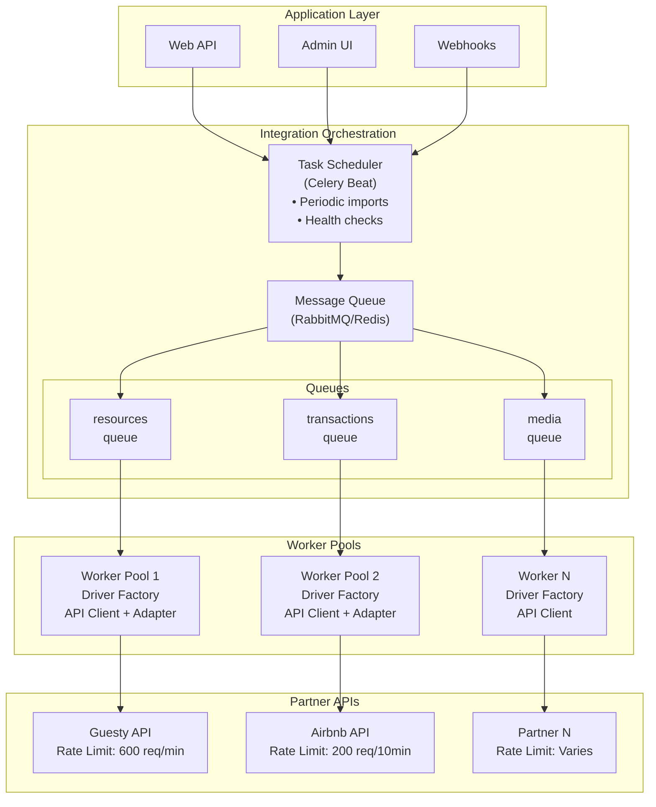
```mermaid
graph TB
    subgraph APP["Application Layer"]
        WebAPI["Web API"]
        AdminUI["Admin UI"]
        Webhooks["Webhooks"]
    end

    subgraph ORCH["Integration Orchestration"]
        Beat["Task Scheduler<br/>(Celery Beat)<br/>• Periodic imports<br/>• Health checks"]
        Queue["Message Queue<br/>(RabbitMQ/Redis)"]

        subgraph QUEUES["Queues"]
            PropQ["resources<br/>queue"]
            ResvQ["transactions<br/>queue"]
            PhotoQ["media<br/>queue"]
        end
    end

    subgraph WORKERS["Worker Pools"]
        W1["Worker Pool 1<br/>Driver Factory<br/>API Client + Adapter"]
        W2["Worker Pool 2<br/>Driver Factory<br/>API Client + Adapter"]
        W3["Worker N<br/>Driver Factory<br/>API Client"]
    end

    subgraph PARTNERS["Partner APIs"]
        Guesty["Guesty API<br/>Rate Limit: 600 req/min"]
        Airbnb["Airbnb API<br/>Rate Limit: 200 req/10min"]
        PartnerN["Partner N<br/>Rate Limit: Varies"]
    end

    WebAPI --> Beat
    AdminUI --> Beat
    Webhooks --> Beat
    Beat --> Queue
    Queue --> PropQ
    Queue --> ResvQ
    Queue --> PhotoQ
    PropQ --> W1
    ResvQ --> W2
    PhotoQ --> W3
    W1 --> Guesty
    W2 --> Airbnb
    W3 --> PartnerN
```


### Key Design Principles

1. **Isolation** - Each integration is a separate driver with its own error handling
2. **Async by default** - All I/O operations are non-blocking via Celery tasks
3. **Idempotency** - Tasks can be safely retried without side effects
4. **Observable** - Comprehensive logging and metrics at every layer

---

## The Driver Pattern

The most important architectural decision was implementing a driver pattern that abstracts partner-specific logic while providing a consistent interface.

### Driver Architecture

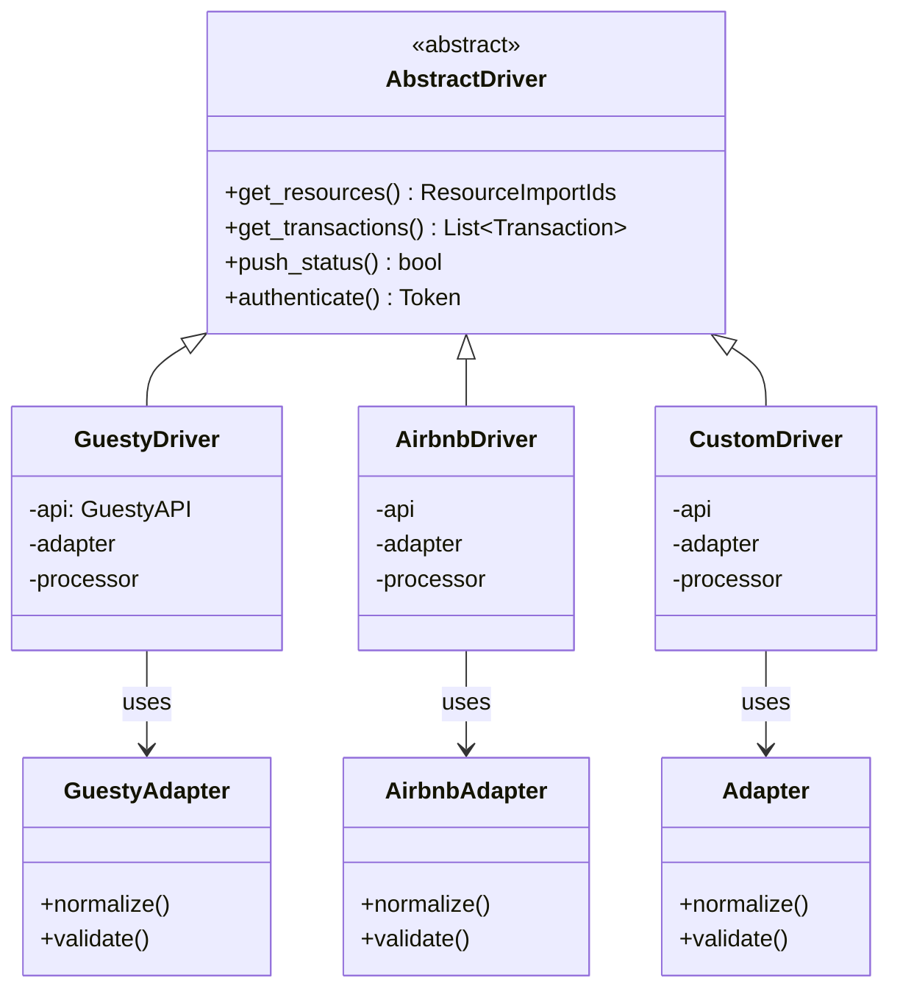
```mermaid
classDiagram
    class AbstractDriver {
        <<abstract>>
        +get_resources() ResourceImportIds
        +get_transactions() List~Transaction~
        +push_status() bool
        +authenticate() Token
    }

    class GuestyDriver {
        -api: GuestyAPI
        -adapter
        -processor
    }

    class AirbnbDriver {
        -api
        -adapter
        -processor
    }

    class CustomDriver {
        -api
        -adapter
        -processor
    }

    class GuestyAdapter {
        +normalize()
        +validate()
    }

    class AirbnbAdapter {
        +normalize()
        +validate()
    }

    class Adapter {
        +normalize()
        +validate()
    }

    AbstractDriver <|-- GuestyDriver
    AbstractDriver <|-- AirbnbDriver
    AbstractDriver <|-- CustomDriver
    GuestyDriver --> GuestyAdapter : uses
    AirbnbDriver --> AirbnbAdapter : uses
    CustomDriver --> Adapter : uses
```


### Why This Pattern Works

**Separation of Concerns:**
- **Driver** - Orchestration and business logic
- **API Client** - HTTP communication, rate limiting, auth
- **Adapter** - Data transformation and normalization
- **Processor** - Domain-specific operations

**Example: Fetching Resources**

```python
from dataclasses import dataclass
from typing import List

@dataclass
class ResourceImportIds:
    """Result of get_resources() containing resource IDs by status"""
    resources_added_ids: List[str]    # Newly created resources
    resources_updated_ids: List[str]  # Modified resources
    resources_deleted_ids: List[str]  # Removed resources

# High-level task
@celery_task
def import_resources(integration_id: int):
    driver = DriverFactory.get_driver(integration_id)
    resource_ids = driver.get_resources()  # Returns ResourceImportIds

    # Schedule dependent tasks for new and updated resources
    for resource_id in resource_ids.resources_added_ids:
        import_media.delay(integration_id, resource_id)
```

The driver handles all partner-specific complexity internally:

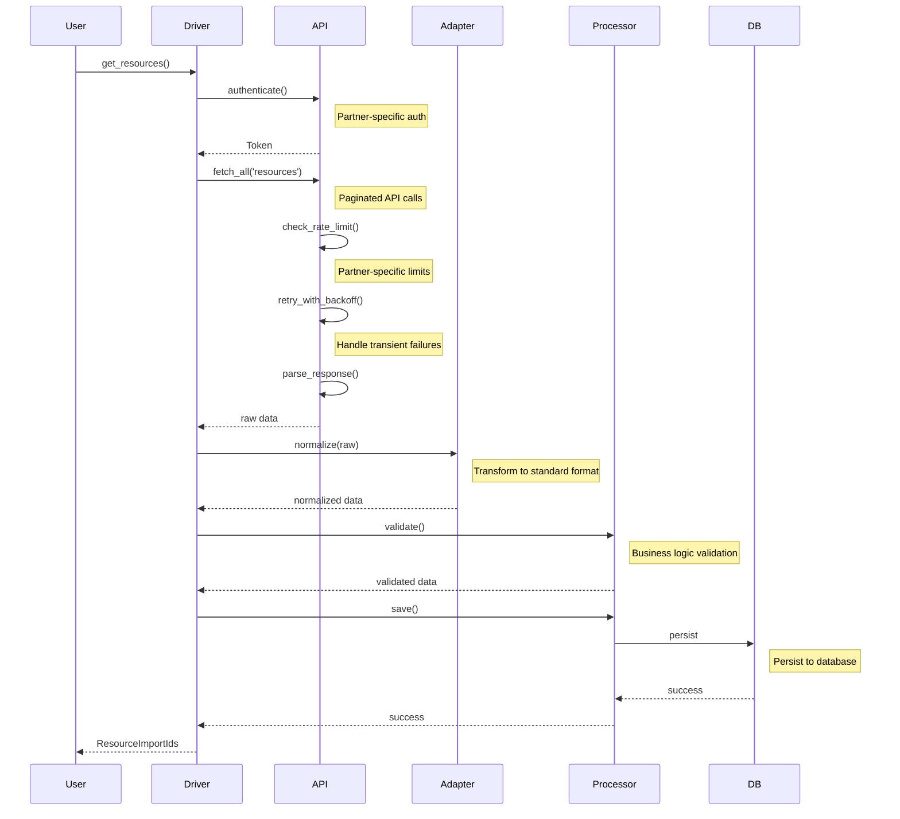
```mermaid
sequenceDiagram
    participant User
    participant Driver
    participant API
    participant Adapter
    participant Processor
    participant DB

    User->>Driver: get_resources()
    Driver->>API: authenticate()
    Note right of API: Partner-specific auth
    API-->>Driver: Token

    Driver->>API: fetch_all('resources')
    Note right of API: Paginated API calls
    API->>API: check_rate_limit()
    Note right of API: Partner-specific limits
    API->>API: retry_with_backoff()
    Note right of API: Handle transient failures
    API->>API: parse_response()
    API-->>Driver: raw data

    Driver->>Adapter: normalize(raw)
    Note right of Adapter: Transform to standard format
    Adapter-->>Driver: normalized data

    Driver->>Processor: validate()
    Note right of Processor: Business logic validation
    Processor-->>Driver: validated data

    Driver->>Processor: save()
    Processor->>DB: persist
    Note right of DB: Persist to database
    DB-->>Processor: success
    Processor-->>Driver: success
    Driver-->>User: ResourceImportIds
```


---

## Distributed Task Processing

### Celery Task Architecture

We use Celery with RabbitMQ for distributed task processing. The key insight: **task granularity matters**.

#### Task Hierarchy

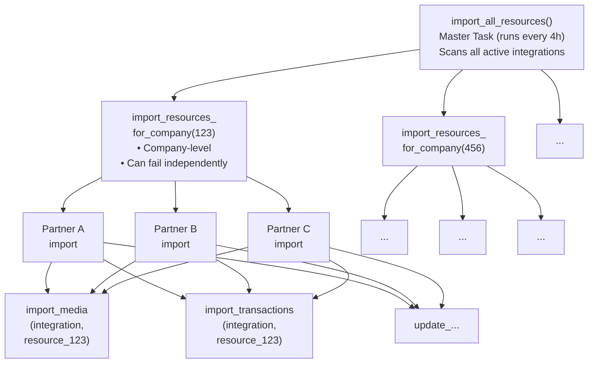
```mermaid
graph TD
    Master["import_all_resources()<br/>Master Task (runs every 4h)<br/>Scans all active integrations"]

    Master --> C1["import_resources_<br/>for_company(123)<br/>• Company-level<br/>• Can fail independently"]
    Master --> C2["import_resources_<br/>for_company(456)"]
    Master --> C3["..."]

    C1 --> G1["Partner A<br/>import"]
    C1 --> A1["Partner B<br/>import"]
    C1 --> T1["Partner C<br/>import"]

    C2 --> G2["..."]
    C2 --> A2["..."]
    C2 --> T2["..."]

    G1 --> Photos["import_media<br/>(integration,<br/>resource_123)"]
    A1 --> Photos
    T1 --> Photos

    G1 --> Reserv["import_transactions<br/>(integration,<br/>resource_123)"]
    A1 --> Reserv
    T1 --> Reserv

    G1 --> Update["update_..."]
    A1 --> Update
    T1 --> Update
```


### Task Design Principles

**1. Fine-grained tasks for parallelism**
```python
# BAD: Single monolithic task
@task
def import_everything(company_id):
    for integration in get_integrations(company_id):
        resources = api.get_resources()
        for resource in resources:
            media = api.get_media(resource.id)
            transactions = api.get_transactions(resource.id)
            # ... more work
    # Takes 30+ minutes, blocks worker

# GOOD: Decomposed tasks
@task
def import_company_resources(company_id):
    for integration in get_integrations(company_id):
        import_integration_resources.delay(integration.id)

@task
def import_integration_resources(integration_id):
    driver = get_driver(integration_id)
    resources = driver.get_resources()
    for resource_id in resources.resources_added_ids:
        import_resource_details.delay(integration_id, resource_id)
```

**2. Independent task failure**

When one company's integration fails, others continue processing:

- Company A fails ❌
- Company B succeeds ✓ → Other companies unaffected
- Company C succeeds ✓

**3. Task timeouts and retries**
```python
from celery import Celery
from myapp.exceptions import RateLimitError

app = Celery('tasks')

@app.task(
    bind=True,  # Required to access self
    max_retries=3,
    default_retry_delay=120,  # 2 minutes
    soft_time_limit=300,      # 5 minutes
    time_limit=360,           # 6 minutes (hard limit)
)
def import_resources(self, integration_id):
    try:
        # ... work
        pass
    except RateLimitError as e:
        # Exponential backoff
        raise self.retry(exc=e, countdown=min(2 ** self.request.retries * 60, 1800))
```

---

## Rate Limiting Strategies

This is where theory meets brutal reality. Every API has different rate limits, and violating them can get you temporarily banned.

### Common Rate Limit Patterns

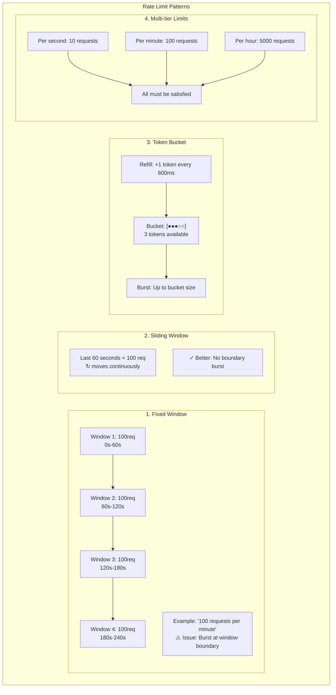
```mermaid
graph TD
    subgraph RL["Rate Limit Patterns"]
        subgraph FW["1. Fixed Window"]
            FW1["Window 1: 100req<br/>0s-60s"]
            FW2["Window 2: 100req<br/>60s-120s"]
            FW3["Window 3: 100req<br/>120s-180s"]
            FW4["Window 4: 100req<br/>180s-240s"]
            FWNote["Example: '100 requests per minute'<br/>⚠️ Issue: Burst at window boundary"]
        end

        subgraph SW["2. Sliding Window"]
            SWWindow["Last 60 seconds = 100 req<br/>↻ moves continuously"]
            SWNote["✓ Better: No boundary burst"]
        end

        subgraph TB["3. Token Bucket"]
            TBBucket["Bucket: [●●●○○]<br/>3 tokens available"]
            TBRefill["Refill: +1 token every 600ms"]
            TBBurst["Burst: Up to bucket size"]
        end

        subgraph MT["4. Multi-tier Limits"]
            MTSec["Per second: 10 requests"]
            MTMin["Per minute: 100 requests"]
            MTHour["Per hour: 5000 requests"]
            MTNote["All must be satisfied"]
        end
    end

    FW1 --> FW2
    FW2 --> FW3
    FW3 --> FW4
    TBRefill --> TBBucket
    TBBucket --> TBBurst
    MTSec --> MTNote
    MTMin --> MTNote
    MTHour --> MTNote
```


### Strategy 1: Header-based Rate Limiting

Many APIs return rate limit info in response headers:

```python
def check_rate_limit(self, headers):
    """
    Headers example:
    X-RateLimit-Remaining-Second: 8
    X-RateLimit-Remaining-Minute: 95
    """

    remaining_per_second = int(headers.get('X-RateLimit-Remaining-Second', 999))
    remaining_per_minute = int(headers.get('X-RateLimit-Remaining-Minute', 999))

    # Proactive throttling - don't wait until we hit 0
    if remaining_per_second < 5:
        time.sleep(1)  # Wait for window to reset

    if remaining_per_minute < 100:
        time.sleep(1)  # Slow down
```

**Lesson learned:** Be conservative. If the limit says "600/minute", treat it as 500/minute to account for clock skew and concurrent workers.

### Strategy 2: Celery Rate Limiting

```python
# Limit task execution rate
@celery_task(rate_limit='10/m')  # 10 tasks per minute
def call_partner_api(integration_id):
    # This task won't execute more than 10 times/min
    pass
```

**Problem:** This limits task *execution*, not API calls. One task might make 10 API calls.

**Better approach:** Separate queue per partner with concurrency control:

```python
# celeryconfig.py
task_routes = {
    'integrations.guesty.*': {'queue': 'guesty'},
    'integrations.airbnb.*': {'queue': 'airbnb'},
}

# Start workers with concurrency limits
# celery -A app worker -Q guesty -c 2  # Max 2 concurrent guesty tasks
# celery -A app worker -Q airbnb -c 1  # Max 1 concurrent airbnb task
```

### Strategy 3: Distributed Rate Limiting (Redis)

For APIs with strict limits across all servers:

```python
import redis
import time

class DistributedRateLimiter:
    def __init__(self, key, max_requests, window_seconds):
        self.redis = redis.Redis()
        self.key = f"ratelimit:{key}"
        self.max_requests = max_requests
        self.window = window_seconds

    def allow_request(self):
        now = time.time()
        window_start = now - self.window

        # First, check current count
        pipe = self.redis.pipeline()
        pipe.zremrangebyscore(self.key, 0, window_start)
        pipe.zcard(self.key)
        results = pipe.execute()
        request_count = results[1]

        # Only add request if under limit
        if request_count >= self.max_requests:
            return False

        # Add the new request
        pipe = self.redis.pipeline()
        pipe.zadd(self.key, {str(now): now})
        pipe.expire(self.key, self.window)
        pipe.execute()

        return True

# Usage
limiter = DistributedRateLimiter('guesty_api', max_requests=600, window_seconds=60)

if limiter.allow_request():
    response = api.call()
else:
    time.sleep(1)  # Wait and retry
```

### Strategy 4: Adaptive Rate Limiting

Learn from 429 responses:

```python
class AdaptiveRateLimiter:
    def __init__(self):
        self.request_interval = 0.1  # Start optimistic
        self.consecutive_429s = 0

    def before_request(self):
        time.sleep(self.request_interval)

    def after_request(self, response):
        if response.status_code == 429:
            self.consecutive_429s += 1
            # Exponential backoff
            self.request_interval *= 1.5

            # Check Retry-After header
            retry_after = response.headers.get('Retry-After')
            if retry_after:
                time.sleep(int(retry_after))
        else:
            self.consecutive_429s = 0
            # Slowly decrease interval (additive decrease)
            self.request_interval = max(0.05, self.request_interval - 0.01)
```

---

## Queue Management & Backpressure

### The Queue Buildup Problem

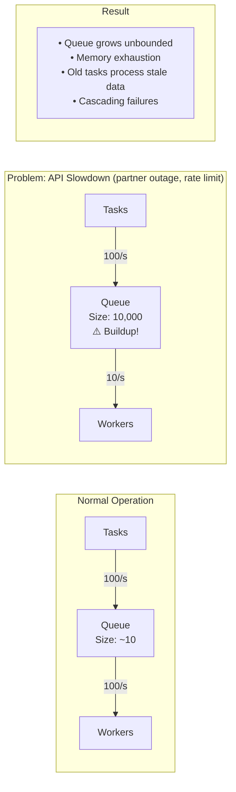
```mermaid
graph LR
    subgraph Normal["Normal Operation"]
        N1[Tasks] -->|100/s| N2[Queue<br/>Size: ~10] -->|100/s| N3[Workers]
    end

    subgraph Problem["Problem: API Slowdown (partner outage, rate limit)"]
        P1[Tasks] -->|100/s| P2[Queue<br/>Size: 10,000<br/>⚠️ Buildup!] -->|10/s| P3[Workers]
    end

    subgraph Result["Result"]
        R1["• Queue grows unbounded<br/>• Memory exhaustion<br/>• Old tasks process stale data<br/>• Cascading failures"]
    end
```


### Solution 1: Task Expiration

```python
@celery_task(expires=300)  # Task expires after 5 minutes
def import_transactions(integration_id, resource_id):
    # If this task waits in queue > 5 minutes, discard it
    # Fresh data will be imported in next scheduled run
    pass
```

### Solution 2: Queue Length Monitoring

```python
def should_enqueue_task(queue_name):
    """Check queue depth before adding more tasks"""
    queue_length = celery.app.control.inspect().active_queues()[queue_name]['messages']

    if queue_length > 10000:
        logger.warning(f"Queue {queue_name} backed up: {queue_length} messages")
        return False
    return True

# Usage
if should_enqueue_task('transactions'):
    import_transactions.delay(integration_id, resource_id)
else:
    logger.info(f"Skipping task - queue backed up")
```

### Solution 3: Circuit Breaker Pattern

Stop sending tasks when partner API is down:

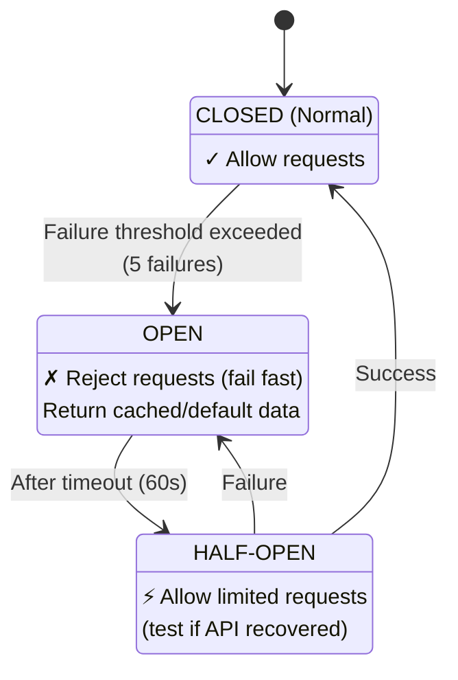
```mermaid
stateDiagram-v2
    [*] --> CLOSED

    CLOSED: CLOSED (Normal)
    CLOSED: ✓ Allow requests

    OPEN: OPEN
    OPEN: ✗ Reject requests (fail fast)
    OPEN: Return cached/default data

    HALF_OPEN: HALF-OPEN
    HALF_OPEN: ⚡ Allow limited requests
    HALF_OPEN: (test if API recovered)

    CLOSED --> OPEN: Failure threshold exceeded<br/>(5 failures)
    OPEN --> HALF_OPEN: After timeout (60s)
    HALF_OPEN --> CLOSED: Success
    HALF_OPEN --> OPEN: Failure
```


Implementation:

```python
from pybreaker import CircuitBreaker

# Create breaker per partner
guesty_breaker = CircuitBreaker(
    fail_max=5,           # Open after 5 failures
    timeout_duration=60,   # Try again after 60s
    exclude=[requests.HTTPError],  # Don't trip on expected errors
)

@guesty_breaker
def call_guesty_api():
    response = requests.get('https://api.guesty.com/...')
    response.raise_for_status()
    return response.json()

# Usage
try:
    data = call_guesty_api()
except CircuitBreakerError:
    logger.warning("Guesty API circuit breaker open - skipping import")
    return  # Don't queue more tasks
```

### Solution 4: Priority Queues

Not all tasks are equal:

```python
# High priority: User-initiated actions
@celery_task(queue='high_priority')
def sync_single_resource(resource_id):
    # User clicked "sync now" - should happen immediately
    pass

# Normal priority: Scheduled imports
@celery_task(queue='normal_priority')
def import_resources(integration_id):
    pass

# Low priority: Non-critical updates
@celery_task(queue='low_priority')
def import_media(resource_id):
    # Nice to have but not critical
    pass
```

Worker configuration:
```bash
# Worker processes queues in priority order
celery -A app worker -Q high_priority,normal_priority,low_priority
```

### Solution 5: Worker Downtime & Queue Explosions

The nightmare scenario: workers crash at 2 AM, scheduled tasks keep queuing.

```mermaid
timeline
    title Worker Downtime Disaster Timeline

    section 00:00 - Normal Operation
        Workers Active : Worker 1, Worker 2, Worker 3
        Queue Size : 50 tasks
        Status : ✓ Processing OK

    section 02:15 - Disaster Strikes
        Workers Crash : ✗ Worker 1 CRASHED (OOM)
                      : ✗ Worker 2 CRASHED (OOM)
                      : ✗ Worker 3 CRASHED (OOM)
        Queue Status : 50 tasks - Nobody processing!

    section 02:20 - Tasks Keep Coming
        Celery Beat : New tasks added!
        Queue Growth : 250 tasks (+200)

    section 02:30 - Backlog Growing
        More Tasks : Scheduled tasks arrive
        Queue Growth : 850 tasks (+600)

    section 03:00 - Queue Explosion
        Critical : Queue explosion!
        Queue Growth : 2,450 tasks (+1,600)

    section 06:00 - Engineer Wakes Up
        Alert : ⚠️ 10,000 tasks in queue!
              : Oldest task age: 3h 45m
              : No workers active since 02:15
        Queue Growth : 10,000+ tasks (+7,550)

    section Problems
        Impact : • Tasks hours old (stale data)
               : • 10+ hours to drain
               : • Duplicate/conflicting updates
               : • Wasted API quota
               : • Customer data not synced
```


**Defense 1: Worker Health Monitoring**

```python
# Celery worker events
from celery.events import EventReceiver
from kombu import Connection

def monitor_workers():
    """Alert when no workers are processing tasks"""
    with Connection(BROKER_URL) as conn:
        recv = EventReceiver(conn, handlers={
            'worker-heartbeat': on_heartbeat,
            'worker-offline': on_worker_offline,
        })

        # Track active workers
        active_workers = {}
        last_heartbeat = {}

        def on_heartbeat(event):
            active_workers[event['hostname']] = True
            last_heartbeat[event['hostname']] = time.time()

        def on_worker_offline(event):
            active_workers.pop(event['hostname'], None)
            alert_oncall(f"Worker {event['hostname']} went offline")

        # Periodic health check
        while True:
            recv.capture(limit=None, timeout=1, wakeup=True)

            # Check for stale heartbeats
            now = time.time()
            for hostname, last_beat in last_heartbeat.items():
                if now - last_beat > 60:  # No heartbeat for 1 min
                    alert_oncall(f"Worker {hostname} heartbeat stale")

            # Check if any workers are alive
            if not active_workers:
                critical_alert("NO WORKERS ACTIVE - QUEUE BUILDING UP")

            time.sleep(10)
```

**Defense 2: Smart Queue Draining**

```python
@celery_task
def import_properties(integration_id, enqueued_at=None):
    """Task with staleness check"""
    if enqueued_at is None:
        enqueued_at = datetime.utcnow()

    # Check task staleness
    age_seconds = (datetime.utcnow() - enqueued_at).total_seconds()

    if age_seconds > 3600:  # Task sat in queue for 1+ hour
        logger.warning(
            f"Skipping stale task for integration {integration_id}, "
            f"age: {age_seconds}s"
        )
        return  # Don't process stale data

    # Check if already processed
    last_run = get_last_successful_run(integration_id)
    if last_run and last_run > enqueued_at:
        logger.info(f"Already processed newer data, skipping")
        return

    # Process the task
    driver = get_driver(integration_id)
    driver.get_homes()
```

**Defense 3: Queue Purging on Recovery**

```python
def recover_from_worker_outage():
    """Called when workers come back online after downtime"""

    # Check queue depths
    from celery import current_app
    inspect = current_app.control.inspect()
    active_queues = inspect.active_queues()

    for queue_name, info in active_queues.items():
        queue_length = info.get('messages', 0)

        if queue_length > 5000:
            logger.warning(f"Queue {queue_name} has {queue_length} tasks")

            # Strategy 1: Purge and re-enqueue fresh
            if queue_name in ['properties', 'reservations']:
                logger.info(f"Purging stale {queue_name} queue")
                current_app.control.purge()

                # Re-trigger fresh imports
                trigger_fresh_import_for_all_integrations()

            # Strategy 2: Let it drain with staleness checks
            elif queue_name in ['photos', 'low_priority']:
                logger.info(f"Letting {queue_name} drain naturally")
                # Tasks will self-skip if stale

            # Strategy 3: Pause scheduling until drained
            else:
                logger.info(f"Pausing new tasks for {queue_name}")
                pause_scheduled_tasks(queue_name)
```

**Defense 4: Deployment Strategy**

```python
# Pre-deployment hook
def before_deploy():
    """Prepare for deployment to avoid queue buildup"""

    # 1. Stop scheduling new tasks
    logger.info("Pausing Celery Beat scheduler")
    os.system("supervisorctl stop celerybeat")

    # 2. Let current tasks drain
    logger.info("Waiting for tasks to complete...")
    wait_for_queue_drain(max_wait=300)  # Wait up to 5 min

    # 3. Graceful worker shutdown
    logger.info("Shutting down workers gracefully")
    os.system("celery -A app control shutdown")

# Post-deployment hook
def after_deploy():
    """Resume operations after deployment"""

    # 1. Start workers
    logger.info("Starting workers")
    os.system("supervisorctl start celery-workers")

    # 2. Verify workers are up
    if not verify_workers_active(timeout=60):
        critical_alert("Workers failed to start after deployment!")
        return

    # 3. Resume scheduling
    logger.info("Resuming Celery Beat scheduler")
    os.system("supervisorctl start celerybeat")

    logger.info("Deployment complete, system operational")
```

**Defense 5: Backup Queue Processing**

```python
# Cron job that runs every 5 minutes
def emergency_queue_processor():
    """Fallback processor in case Celery workers are down"""

    queue_stats = get_queue_stats()

    for queue_name, stats in queue_stats.items():
        messages = stats['messages']
        oldest_age = stats['oldest_age_seconds']

        # If queue building up AND old tasks (workers likely down)
        if messages > 1000 and oldest_age > 600:  # 10 min old
            logger.warning(
                f"Emergency processing for {queue_name}: "
                f"{messages} messages, oldest: {oldest_age}s"
            )

            # Process directly (bypass Celery)
            process_queue_directly(queue_name, max_tasks=100)

            # Alert
            alert_oncall(
                f"Queue {queue_name} processed via emergency fallback. "
                f"Check worker health!"
            )
```

---

## Error Handling & Retries

### Error Classification

Not all errors are equal. Classification determines retry strategy:

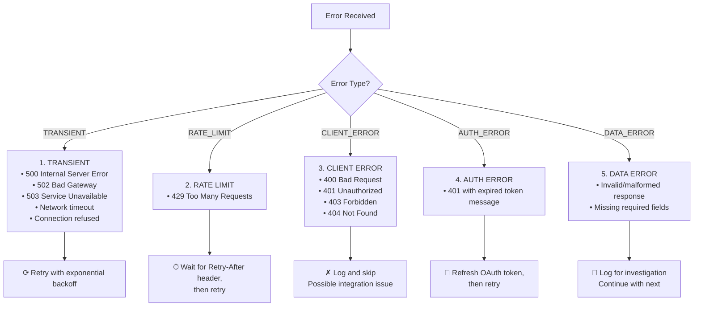
```mermaid
graph TD
    Error[Error Received]

    Error --> T{Error Type?}

    T -->|TRANSIENT| Transient["1. TRANSIENT<br/>• 500 Internal Server Error<br/>• 502 Bad Gateway<br/>• 503 Service Unavailable<br/>• Network timeout<br/>• Connection refused"]
    Transient --> TransientAction["⟳ Retry with exponential backoff"]

    T -->|RATE_LIMIT| RateLimit["2. RATE LIMIT<br/>• 429 Too Many Requests"]
    RateLimit --> RateLimitAction["⏱ Wait for Retry-After header,<br/>then retry"]

    T -->|CLIENT_ERROR| ClientError["3. CLIENT ERROR<br/>• 400 Bad Request<br/>• 401 Unauthorized<br/>• 403 Forbidden<br/>• 404 Not Found"]
    ClientError --> ClientAction["✗ Log and skip<br/>Possible integration issue"]

    T -->|AUTH_ERROR| AuthError["4. AUTH ERROR<br/>• 401 with expired token message"]
    AuthError --> AuthAction["🔑 Refresh OAuth token,<br/>then retry"]

    T -->|DATA_ERROR| DataError["5. DATA ERROR<br/>• Invalid/malformed response<br/>• Missing required fields"]
    DataError --> DataAction["📝 Log for investigation<br/>Continue with next"]
```


### Retry Strategy Implementation

```python
from requests.exceptions import RequestException, Timeout
from requests import HTTPError

@celery_task(
    bind=True,
    max_retries=3,
    default_retry_delay=60,
)
def import_properties(self, integration_id):
    try:
        driver = get_driver(integration_id)
        properties = driver.get_homes()
        return properties

    except HTTPError as e:
        status_code = e.response.status_code

        # Client errors - don't retry
        if 400 <= status_code < 500:
            if status_code == 429:  # Rate limit
                retry_after = int(e.response.headers.get('Retry-After', 60))
                logger.warning(f"Rate limited, retry after {retry_after}s")
                raise self.retry(exc=e, countdown=retry_after)

            elif status_code == 401:  # Auth error
                logger.error(f"Auth failed for integration {integration_id}")
                # Try to refresh token
                if refresh_oauth_token(integration_id):
                    raise self.retry(exc=e, countdown=5)
                else:
                    # Can't refresh - alert humans
                    alert_auth_failure(integration_id)
                    return
            else:
                # Other 4xx - don't retry
                logger.error(f"Client error {status_code}: {e.response.text}")
                return

        # Server errors - retry with backoff
        elif 500 <= status_code < 600:
            retry_count = self.request.retries
            backoff = min(2 ** retry_count * 60, 1800)  # Max 30 min
            logger.warning(f"Server error {status_code}, retry {retry_count}, backoff {backoff}s")
            raise self.retry(exc=e, countdown=backoff)

    except (Timeout, RequestException) as e:
        # Network errors - retry with backoff
        retry_count = self.request.retries
        backoff = min(2 ** retry_count * 30, 900)  # Max 15 min
        logger.warning(f"Network error: {e}, retry {retry_count}")
        raise self.retry(exc=e, countdown=backoff)

    except Exception as e:
        # Unexpected error - log and alert
        logger.exception(f"Unexpected error in import_properties: {e}")
        alert_on_call_engineer(integration_id, e)
        raise
```

### Dead Letter Queue

Tasks that fail after all retries go to a dead letter queue for investigation:

```python
@celery_task
def import_properties(integration_id):
    try:
        # ... work
    except Exception as e:
        if self.request.retries >= self.max_retries:
            # Final failure - send to DLQ
            dead_letter_queue.send({
                'task': self.name,
                'args': [integration_id],
                'error': str(e),
                'traceback': traceback.format_exc(),
                'failed_at': datetime.utcnow(),
            })
        raise
```

Monitor DLQ for patterns:
```sql
-- Find common failure patterns
SELECT error, COUNT(*) as count
FROM dead_letter_queue
WHERE failed_at > NOW() - INTERVAL '24 hours'
GROUP BY error
ORDER BY count DESC;
```

---

## Authentication Patterns

Every integration handles auth differently. Here are the common patterns:

### Pattern 1: API Key (Simplest)

```http
GET /api/properties HTTP/1.1
Host: api.partner.com
Authorization: Bearer abc123xyz
```


Implementation:
```python
class ApiKeyAuth:
    def __init__(self, api_key):
        self.api_key = api_key

    def __call__(self, request):
        request.headers['Authorization'] = f'Bearer {self.api_key}'
        return request

session.auth = ApiKeyAuth(api_key)
```

### Pattern 2: OAuth 2.0 (Common, Complex)

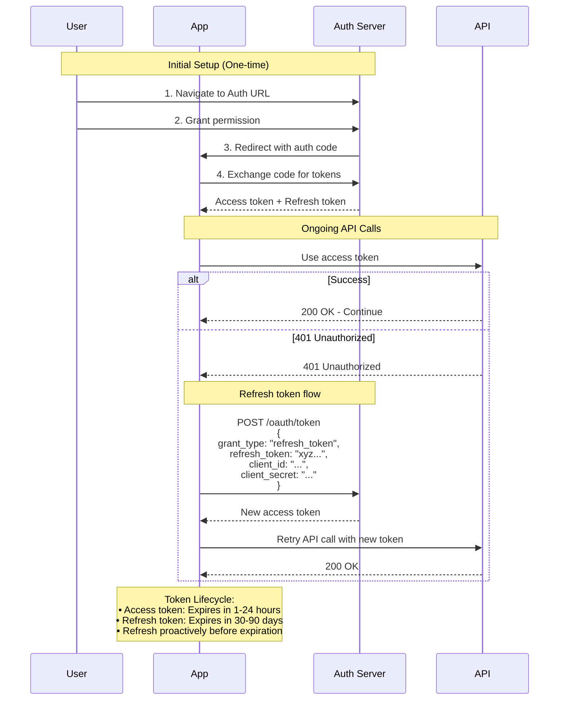
```mermaid
sequenceDiagram
    participant User
    participant App
    participant AuthServer as Auth Server
    participant API

    Note over User,AuthServer: Initial Setup (One-time)
    User->>AuthServer: 1. Navigate to Auth URL
    User->>AuthServer: 2. Grant permission
    AuthServer->>App: 3. Redirect with auth code
    App->>AuthServer: 4. Exchange code for tokens
    AuthServer-->>App: Access token + Refresh token

    Note over App,API: Ongoing API Calls
    App->>API: Use access token
    alt Success
        API-->>App: 200 OK - Continue
    else 401 Unauthorized
        API-->>App: 401 Unauthorized
        Note over App,AuthServer: Refresh token flow
        App->>AuthServer: POST /oauth/token<br/>{<br/>  grant_type: "refresh_token",<br/>  refresh_token: "xyz...",<br/>  client_id: "...",<br/>  client_secret: "..."<br/>}
        AuthServer-->>App: New access token
        App->>API: Retry API call with new token
        API-->>App: 200 OK
    end

    Note over App: Token Lifecycle:<br/>• Access token: Expires in 1-24 hours<br/>• Refresh token: Expires in 30-90 days<br/>• Refresh proactively before expiration
```


Implementation:

```python
import requests
from datetime import datetime, timedelta

class OAuthRefreshError(Exception):
    """Raised when OAuth token refresh fails"""
    pass

class OAuthSession:
    def __init__(self, integration_id):
        self.integration_id = integration_id
        self.load_tokens()

    def load_tokens(self):
        integration = CompanyIntegration.find(self.integration_id)
        self.access_token = integration.access_token
        self.refresh_token = integration.refresh_token
        self.expires_at = integration.token_expires_at

    def is_token_expired(self):
        # Refresh 5 minutes before actual expiry
        buffer = datetime.timedelta(minutes=5)
        return datetime.utcnow() + buffer >= self.expires_at

    def refresh_access_token(self):
        try:
            response = requests.post(
                'https://api.partner.com/oauth/token',
                data={
                    'grant_type': 'refresh_token',
                    'refresh_token': self.refresh_token,
                    'client_id': settings.OAUTH_CLIENT_ID,
                    'client_secret': settings.OAUTH_CLIENT_SECRET,
                },
                timeout=30  # Add timeout
            )
            response.raise_for_status()
        except requests.RequestException as e:
            raise OAuthRefreshError(f"Network error refreshing token: {e}")

        try:
            data = response.json()
        except ValueError as e:
            raise OAuthRefreshError(f"Invalid JSON response: {e}")

        # Validate response has required fields
        if 'access_token' not in data:
            raise OAuthRefreshError("No access_token in response")

        self.access_token = data['access_token']
        self.refresh_token = data.get('refresh_token', self.refresh_token)

        # Handle missing expires_in gracefully
        expires_in = data.get('expires_in', 3600)  # Default to 1 hour
        self.expires_at = datetime.utcnow() + datetime.timedelta(seconds=expires_in)

        # Persist to database
        self.save_tokens()

    def make_request(self, url, **kwargs):
        # Proactive token refresh
        if self.is_token_expired():
            self.refresh_access_token()

        # Make request
        headers = kwargs.pop('headers', {})
        headers['Authorization'] = f'Bearer {self.access_token}'

        response = requests.request(url=url, headers=headers, **kwargs)

        # Reactive token refresh (if proactive failed)
        if response.status_code == 401:
            self.refresh_access_token()
            headers['Authorization'] = f'Bearer {self.access_token}'
            response = requests.request(url=url, headers=headers, **kwargs)

        return response
```

### Pattern 3: Rotating Credentials

Some partners (looking at you, Airbnb) rotate credentials periodically via webhooks:

```python
# Webhook endpoint
@app.post('/webhooks/partner/credentials')
def update_credentials(request):
    data = request.json()
    integration_id = data['integration_id']
    new_secret = data['secret']

    integration = CompanyIntegration.find(integration_id)
    integration.update(api_secret=new_secret)

    return {'status': 'ok'}
```

**Critical lesson:** Always update credentials atomically and test before committing:

```python
def rotate_credentials(integration_id, new_secret):
    integration = CompanyIntegration.find(integration_id)
    old_secret = integration.api_secret

    # Test new credentials
    try:
        test_api_call(integration.api_key, new_secret)
    except AuthError:
        logger.error(f"New credentials invalid for {integration_id}")
        return False

    # Update
    integration.update(api_secret=new_secret)

    # Verify
    try:
        test_api_call(integration.api_key, new_secret)
    except AuthError:
        # Rollback
        integration.update(api_secret=old_secret)
        raise

    return True
```

---

## Webhook Handling

Many partners send real-time updates via webhooks. Proper webhook handling is critical for keeping data in sync without constant polling.

### Webhook Architecture

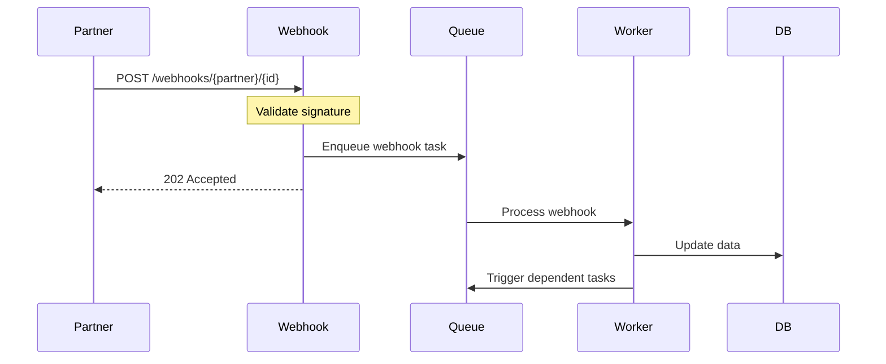
```mermaid
sequenceDiagram
    participant Partner
    participant Webhook
    participant Queue
    participant Worker
    participant DB

    Partner->>Webhook: POST /webhooks/{partner}/{id}
    Note over Webhook: Validate signature
    Webhook->>Queue: Enqueue webhook task
    Webhook-->>Partner: 202 Accepted
    Queue->>Worker: Process webhook
    Worker->>DB: Update data
    Worker->>Queue: Trigger dependent tasks
```

### Implementation

**1. Webhook Endpoint**

```python
from flask import Flask, request, jsonify
import hmac
import hashlib

app = Flask(__name__)

@app.route('/webhooks/<partner>/<int:integration_id>', methods=['POST'])
def handle_webhook(partner, integration_id):
    """
    Generic webhook handler for all partners
    Validates signature and queues for async processing
    """

    # 1. Validate signature
    signature = request.headers.get('X-Webhook-Signature')
    if not validate_webhook_signature(partner, integration_id, request.data, signature):
        logger.warning(f"Invalid webhook signature from {partner}")
        return jsonify({'error': 'Invalid signature'}), 401

    # 2. Log webhook receipt
    logger.info(
        "webhook_received",
        partner=partner,
        integration_id=integration_id,
        event_type=request.json.get('event_type'),
    )

    # 3. Queue for async processing (don't block partner's request)
    process_webhook.delay(
        partner=partner,
        integration_id=integration_id,
        payload=request.json,
        received_at=datetime.utcnow().isoformat()
    )

    # 4. Return immediately
    return jsonify({'status': 'accepted'}), 202


def validate_webhook_signature(partner, integration_id, payload, signature):
    """Validate webhook signature based on partner's method"""

    integration = get_integration(integration_id)
    secret = integration.webhook_secret

    if partner == 'partner_a':
        # HMAC-SHA256
        expected = hmac.new(
            secret.encode(),
            payload,
            hashlib.sha256
        ).hexdigest()
        return hmac.compare_digest(signature, expected)

    elif partner == 'partner_b':
        # SHA256 hash
        expected = hashlib.sha256(f"{payload}{secret}".encode()).hexdigest()
        return hmac.compare_digest(signature, expected)

    else:
        logger.error(f"Unknown partner signature validation: {partner}")
        return False
```

**2. Webhook Processing Task**

```python
@celery_task(
    bind=True,
    max_retries=3,
    default_retry_delay=60,
)
def process_webhook(self, partner, integration_id, payload, received_at):
    """Process webhook payload asynchronously"""

    try:
        event_type = payload.get('event_type')

        # Route to appropriate handler
        if event_type == 'resource.created':
            handle_resource_created(integration_id, payload['data'])

        elif event_type == 'resource.updated':
            handle_resource_updated(integration_id, payload['data'])

        elif event_type == 'resource.deleted':
            handle_resource_deleted(integration_id, payload['data']['id'])

        elif event_type == 'auth.revoked':
            handle_auth_revoked(integration_id)

        else:
            logger.warning(f"Unknown webhook event type: {event_type}")

        # Record successful processing
        log_webhook_processed(integration_id, event_type, received_at)

    except Exception as e:
        logger.error(f"Webhook processing failed: {e}")

        # Retry with exponential backoff
        if self.request.retries < self.max_retries:
            raise self.retry(exc=e)

        # Final failure - alert and log to DLQ
        alert_webhook_failure(partner, integration_id, payload, e)
```

**3. Idempotency Handling**

Webhooks may be delivered multiple times. Handle this with idempotency:

```python
def handle_resource_updated(integration_id, resource_data):
    """Handle resource update webhook with idempotency"""

    resource_id = resource_data['id']
    webhook_id = resource_data.get('webhook_id') or resource_data.get('event_id')

    # Check if already processed
    if webhook_already_processed(webhook_id):
        logger.info(f"Webhook {webhook_id} already processed, skipping")
        return

    # Get current version from database
    resource = Resource.query.filter_by(
        integration_id=integration_id,
        external_id=resource_id
    ).first()

    # Only update if webhook data is newer
    webhook_timestamp = parse_datetime(resource_data['updated_at'])

    if resource and resource.last_synced_at >= webhook_timestamp:
        logger.info(f"Resource {resource_id} already has newer data")
        mark_webhook_processed(webhook_id)
        return

    # Update resource
    if resource:
        resource.update_from_dict(resource_data)
        resource.last_synced_at = webhook_timestamp
    else:
        resource = Resource.create_from_dict(resource_data)

    # Mark webhook as processed
    mark_webhook_processed(webhook_id)

    logger.info(f"Resource {resource_id} updated from webhook")


# Idempotency tracking
def webhook_already_processed(webhook_id):
    """Check if webhook was already processed"""
    return redis.exists(f"webhook_processed:{webhook_id}")

def mark_webhook_processed(webhook_id):
    """Mark webhook as processed (24 hour expiry)"""
    redis.setex(f"webhook_processed:{webhook_id}", 86400, '1')
```

**4. Webhook Registration**

```python
def register_webhook(integration_id, webhook_url):
    """Register webhook URL with partner"""

    integration = get_integration(integration_id)
    driver = get_driver(integration)

    # Generate webhook secret
    webhook_secret = secrets.token_urlsafe(32)

    # Register with partner
    response = driver.api.post('/webhooks', json={
        'url': webhook_url,
        'events': [
            'resource.created',
            'resource.updated',
            'resource.deleted',
            'auth.revoked',
        ],
        'secret': webhook_secret,
    })

    # Save webhook config
    integration.update(
        webhook_url=webhook_url,
        webhook_secret=webhook_secret,
        webhook_id=response['id'],
    )

    logger.info(f"Webhook registered for integration {integration_id}")
```

### Webhook Best Practices

**1. Return 2xx Quickly**
- Accept webhook within 5 seconds
- Do all processing asynchronously
- Partners will retry if you timeout

**2. Validate Signatures**
- Always validate webhook signatures
- Use constant-time comparison (`hmac.compare_digest`)
- Reject invalid signatures immediately

**3. Handle Duplicates**
- Webhooks can be delivered multiple times
- Use idempotency keys
- Check timestamps before updating

**4. Monitor Webhook Health**
```python
# Track webhook metrics
webhook_received = Counter('webhooks_received', ['partner', 'event_type'])
webhook_processing_duration = Histogram('webhook_processing_seconds', ['partner'])
webhook_failures = Counter('webhook_failures', ['partner', 'error_type'])

# Alert on webhook failures
if webhook_failure_rate(partner) > 0.05:  # 5%
    alert_oncall(f"High webhook failure rate for {partner}")
```

**5. Retry Failed Webhooks**
```python
@celery_task
def replay_failed_webhooks(integration_id, since):
    """Manually replay failed webhooks from DLQ"""

    failed = WebhookFailure.query.filter(
        WebhookFailure.integration_id == integration_id,
        WebhookFailure.failed_at >= since,
        WebhookFailure.status == 'failed'
    ).all()

    for failure in failed:
        process_webhook.delay(
            partner=failure.partner,
            integration_id=integration_id,
            payload=failure.payload,
            received_at=failure.received_at
        )
        failure.status = 'retrying'

    db.session.commit()
```

---

## Architecture Decision Trees

Choosing the right patterns depends on your scale. Here are decision trees to guide you:

### Rate Limiting Strategy

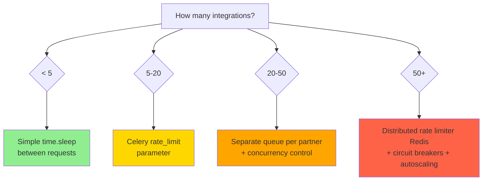
```mermaid
graph TD
    A[How many integrations?] --> B{< 5}
    A --> C{5-20}
    A --> D{20-50}
    A --> E{50+}

    B --> B1[Simple time.sleep<br/>between requests]
    C --> C1[Celery rate_limit<br/>parameter]
    D --> D1[Separate queue per partner<br/>+ concurrency control]
    E --> E1[Distributed rate limiter Redis<br/>+ circuit breakers + autoscaling]

    style B1 fill:#90EE90
    style C1 fill:#FFD700
    style D1 fill:#FFA500
    style E1 fill:#FF6347
```

### Queue Management Strategy

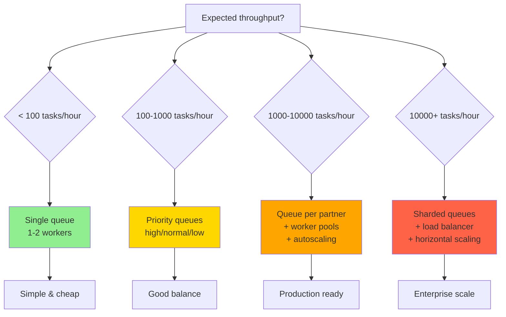
```mermaid
graph TD
    A[Expected throughput?] --> B{< 100 tasks/hour}
    A --> C{100-1000 tasks/hour}
    A --> D{1000-10000 tasks/hour}
    A --> E{10000+ tasks/hour}

    B --> B1[Single queue<br/>1-2 workers]
    C --> C1[Priority queues<br/>high/normal/low]
    D --> D1[Queue per partner<br/>+ worker pools<br/>+ autoscaling]
    E --> E1[Sharded queues<br/>+ load balancer<br/>+ horizontal scaling]

    B1 --> B2[Simple & cheap]
    C1 --> C2[Good balance]
    D1 --> D2[Production ready]
    E1 --> E2[Enterprise scale]

    style B1 fill:#90EE90
    style C1 fill:#FFD700
    style D1 fill:#FFA500
    style E1 fill:#FF6347
```

### Error Handling Strategy

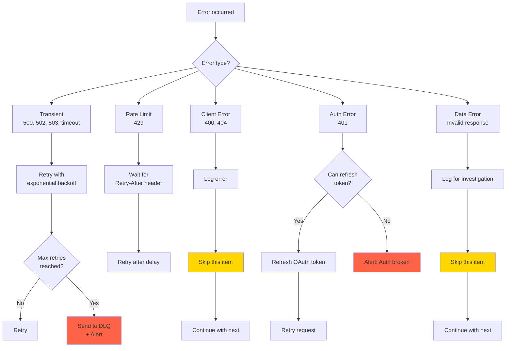
```mermaid
graph TD
    A[Error occurred] --> B{Error type?}

    B --> C[Transient<br/>500, 502, 503, timeout]
    B --> D[Rate Limit<br/>429]
    B --> E[Client Error<br/>400, 404]
    B --> F[Auth Error<br/>401]
    B --> G[Data Error<br/>Invalid response]

    C --> C1[Retry with<br/>exponential backoff]
    C1 --> C2{Max retries<br/>reached?}
    C2 -->|No| C3[Retry]
    C2 -->|Yes| C4[Send to DLQ<br/>+ Alert]

    D --> D1[Wait for<br/>Retry-After header]
    D1 --> D2[Retry after delay]

    E --> E1[Log error]
    E1 --> E2[Skip this item]
    E2 --> E3[Continue with next]

    F --> F1{Can refresh<br/>token?}
    F1 -->|Yes| F2[Refresh OAuth token]
    F2 --> F3[Retry request]
    F1 -->|No| F4[Alert: Auth broken]

    G --> G1[Log for investigation]
    G1 --> G2[Skip this item]
    G2 --> G3[Continue with next]

    style C4 fill:#FF6347
    style F4 fill:#FF6347
    style E2 fill:#FFD700
    style G2 fill:#FFD700
```

### Sync Strategy Selection

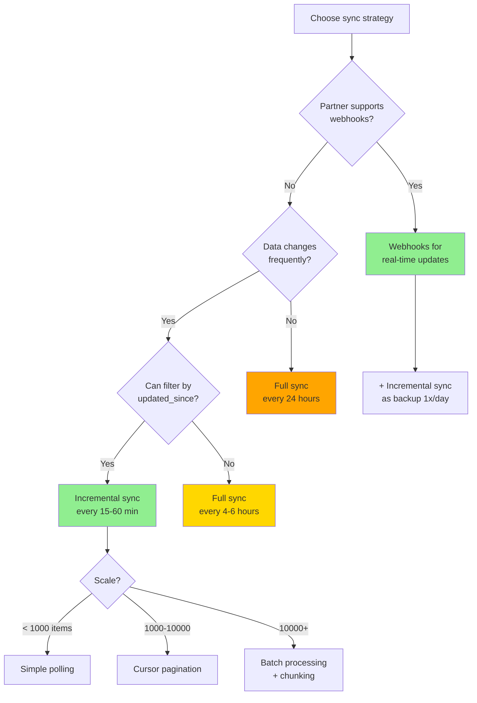
```mermaid
graph TD
    A[Choose sync strategy] --> B{Partner supports<br/>webhooks?}

    B -->|Yes| C[Webhooks for<br/>real-time updates]
    B -->|No| D{Data changes<br/>frequently?}

    D -->|Yes| E{Can filter by<br/>updated_since?}
    D -->|No| F[Full sync<br/>every 24 hours]

    E -->|Yes| G[Incremental sync<br/>every 15-60 min]
    E -->|No| H[Full sync<br/>every 4-6 hours]

    C --> I[+ Incremental sync<br/>as backup 1x/day]

    G --> J{Scale?}
    J -->|< 1000 items| K[Simple polling]
    J -->|1000-10000| L[Cursor pagination]
    J -->|10000+| M[Batch processing<br/>+ chunking]

    style C fill:#90EE90
    style G fill:#90EE90
    style F fill:#FFA500
    style H fill:#FFD700
```

### When to Use What: Data Storage

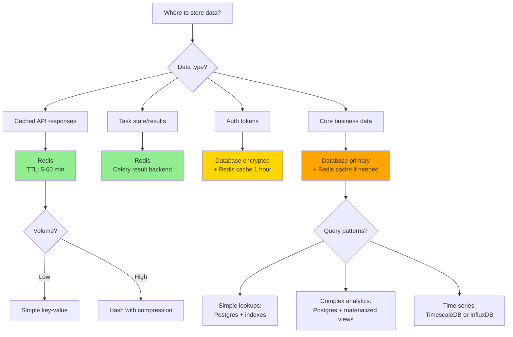
```mermaid
graph TD
    A[Where to store data?] --> B{Data type?}

    B --> C[Cached API responses]
    B --> D[Task state/results]
    B --> E[Auth tokens]
    B --> F[Core business data]

    C --> C1[Redis<br/>TTL: 5-60 min]
    D --> D1[Redis<br/>Celery result backend]
    E --> E1[Database encrypted<br/>+ Redis cache 1 hour]
    F --> F1[Database primary<br/>+ Redis cache if needed]

    C1 --> G{Volume?}
    G -->|Low| G1[Simple key-value]
    G -->|High| G2[Hash with compression]

    F1 --> H{Query patterns?}
    H --> H1[Simple lookups:<br/>Postgres + indexes]
    H --> H2[Complex analytics:<br/>Postgres + materialized views]
    H --> H3[Time series:<br/>TimescaleDB or InfluxDB]

    style C1 fill:#90EE90
    style D1 fill:#90EE90
    style E1 fill:#FFD700
    style F1 fill:#FFA500
```

---

## API Changes & Versioning

Partner APIs change without warning. Here's how to survive:

### Strategy 1: Version Pinning

```python
class PartnerAPI:
    BASE_URL = 'https://api.partner.com'
    API_VERSION = 'v2'  # Pin to specific version

    def get_url(self, endpoint):
        return f'{self.BASE_URL}/{self.API_VERSION}/{endpoint}'
```

### Strategy 2: Response Validation

Catch breaking changes early:

```python
from marshmallow import Schema, fields, ValidationError

class PropertySchema(Schema):
    id = fields.Str(required=True)
    name = fields.Str(required=True)
    address = fields.Dict(required=True)
    # ... other fields

def fetch_properties(self):
    response = self.api.get('properties')
    data = response.json()

    schema = PropertySchema(many=True)
    try:
        validated = schema.load(data)
    except ValidationError as e:
        logger.error(f"API response validation failed: {e.messages}")
        # Alert engineers
        alert_api_schema_change(self.partner, e.messages)
        raise

    return validated
```

### Strategy 3: Adapter Versioning

Support multiple API versions simultaneously:

```python
class GuestyAdapterV1:
    def normalize_property(self, raw):
        return {
            'external_id': raw['_id'],
            'name': raw['title'],
            'address': raw['address']['full'],
        }

class GuestyAdapterV2:
    def normalize_property(self, raw):
        return {
            'external_id': raw['id'],  # Changed from '_id'
            'name': raw['nickname'],    # Changed from 'title'
            'address': raw['location']['formatted'],  # New structure
        }

def get_adapter(integration):
    api_version = integration.metadata.get('api_version', 'v1')
    if api_version == 'v2':
        return GuestyAdapterV2()
    return GuestyAdapterV1()
```

### Strategy 4: Gradual Rollout

When partner announces breaking changes:

```python
# Feature flag for new API version
def get_api_version(integration_id):
    if is_feature_flag_enabled('guesty_api_v2', integration_id=integration_id):
        return 'v2'
    return 'v1'

# Rollout plan:
# Week 1: Enable for 1 test customer
# Week 2: Enable for 10% of customers
# Week 3: Enable for 50% of customers
# Week 4: Enable for 100% of customers
# Week 5: Remove v1 code
```

---

## Monitoring & Observability

You can't fix what you can't see. Comprehensive monitoring is non-negotiable.

### Metrics to Track

**API Call Metrics (per partner):**
- Total calls/min: `450/600` (75% utilization)
- Success rate: `99.2%`
- Average response time: `250ms`
- P95 response time: `800ms`
- P99 response time: `1.2s`

**Error Breakdown:**
- 4xx errors: `12/hour`
  - 401 Unauthorized: `8`
  - 404 Not Found: `4`
- 5xx errors: `3/hour`
- Timeouts: `1/hour`
- Rate limits (429): `0/hour` ✓

**Queue Metrics:**
- resources queue: `234 tasks` (23% capacity)
- transactions queue: `45 tasks` (5% capacity)
- media queue: `890 tasks` (45% capacity)
- Age of oldest task: `2m 34s`

**Task Metrics:**
- Tasks succeeded: `1,234/hour`
- Tasks failed: `12/hour`
- Tasks retried: `45/hour`
- Average task duration: `8.3s`

**Integration Health:**

| Partner | Status | Details |
|---------|--------|---------|
| Guesty | ✓ Healthy | Last run: 2m ago |
| Airbnb | ⚠ Degraded | Rate limited |
| Booking.com | ✗ Down | Auth failure |
| CloudBeds | ✓ Healthy | Last run: 5m ago |


### Implementation

```python
from prometheus_client import Counter, Histogram, Gauge

# Define metrics
api_calls_total = Counter(
    'integration_api_calls_total',
    'Total API calls',
    ['partner', 'endpoint', 'status_code']
)

api_call_duration = Histogram(
    'integration_api_call_duration_seconds',
    'API call duration',
    ['partner', 'endpoint']
)

queue_length = Gauge(
    'integration_queue_length',
    'Number of tasks in queue',
    ['queue_name']
)

# Instrument API calls
class LoggedApiSession(requests.Session):
    def __init__(self, partner):
        super().__init__()
        self.partner = partner

    def request(self, method, url, **kwargs):
        endpoint = url.split('/')[-1]  # Simple endpoint extraction

        with api_call_duration.labels(self.partner, endpoint).time():
            response = super().request(method, url, **kwargs)

        api_calls_total.labels(
            self.partner,
            endpoint,
            response.status_code
        ).inc()

        return response
```

### Alerting Rules

```yaml
# Prometheus alert rules
groups:
  - name: integrations
    rules:
      # High error rate
      - alert: HighAPIErrorRate
        expr: |
          rate(integration_api_calls_total{status_code=~"5.."}[5m]) > 0.05
        for: 10m
        annotations:
          summary: "High API error rate for {{ $labels.partner }}"

      # Auth failures
      - alert: AuthenticationFailures
        expr: |
          rate(integration_api_calls_total{status_code="401"}[5m]) > 0
        for: 5m
        annotations:
          summary: "Auth failures for {{ $labels.partner }}"

      # Queue backup
      - alert: QueueBackingUp
        expr: integration_queue_length > 5000
        for: 15m
        annotations:
          summary: "Queue {{ $labels.queue_name }} has {{ $value }} tasks"

      # Slow API calls
      - alert: SlowAPIResponses
        expr: |
          histogram_quantile(0.95,
            rate(integration_api_call_duration_seconds_bucket[5m])
          ) > 5
        for: 10m
        annotations:
          summary: "P95 latency for {{ $labels.partner }} is {{ $value }}s"
```

### Structured Logging

```python
import structlog

logger = structlog.get_logger()

# Every log includes context
logger.info(
    "api_call_completed",
    partner="guesty",
    endpoint="properties",
    integration_id=integration_id,
    duration_ms=response_time,
    status_code=response.status_code,
    properties_returned=len(properties),
)

# Enables powerful queries:
# "Show me all Guesty calls that took >2s"
# "Which integrations had auth failures today?"
# "What's the average properties per API call by partner?"
```

---

## Cascading Requests

Some operations trigger chains of API calls. This is where things get interesting.

### The Problem

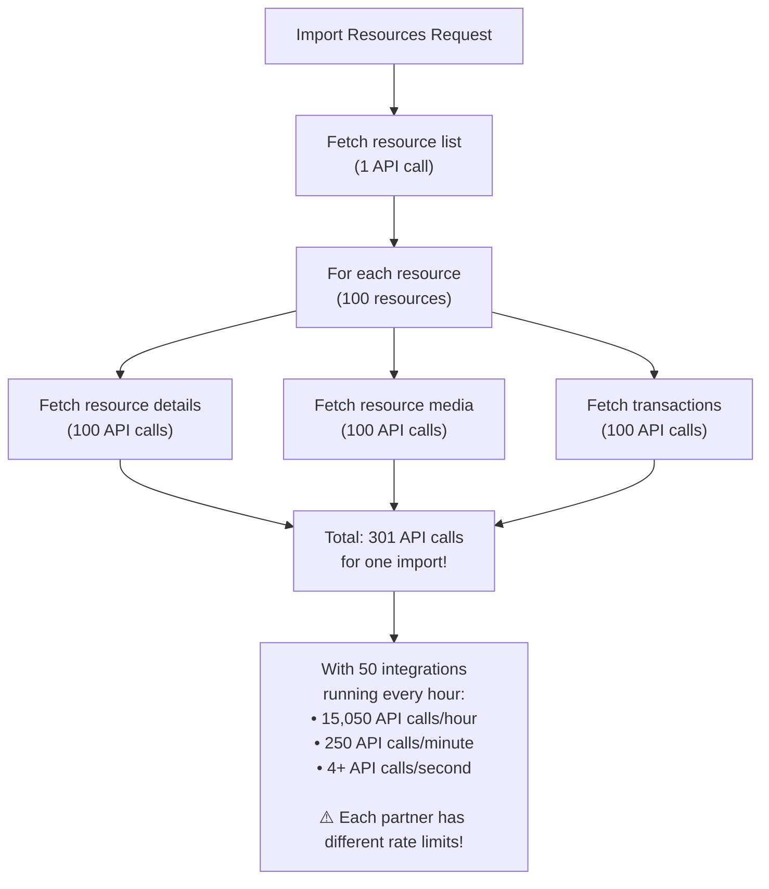
```mermaid
graph TD
    Import["Import Resources Request"]

    Import --> FetchList["Fetch resource list<br/>(1 API call)"]

    FetchList --> Loop["For each resource<br/>(100 resources)"]

    Loop --> Details["Fetch resource details<br/>(100 API calls)"]
    Loop --> Photos["Fetch resource media<br/>(100 API calls)"]
    Loop --> Reservations["Fetch transactions<br/>(100 API calls)"]

    Details --> Total["Total: 301 API calls<br/>for one import!"]
    Photos --> Total
    Reservations --> Total

    Total --> Scale["With 50 integrations<br/>running every hour:<br/>• 15,050 API calls/hour<br/>• 250 API calls/minute<br/>• 4+ API calls/second<br/><br/>⚠️ Each partner has different rate limits!"]
```


### Strategy 1: Batching

Fetch multiple items in one request:

```python
# BAD: N+1 queries
for resource_id in resource_ids:
    details = api.get(f'/resources/{resource_id}')  # 100 API calls

# GOOD: Batch fetch
resource_ids_str = ','.join(resource_ids)
details = api.get(f'/resources?ids={resource_ids_str}')  # 1 API call
```

### Strategy 2: Parallel with Concurrency Control

```python
from concurrent.futures import ThreadPoolExecutor, as_completed

def fetch_resource_details(resource_id):
    return api.get(f'/resources/{resource_id}')

resource_ids = [...]  # 100 IDs

# Limit concurrency to respect rate limits
MAX_CONCURRENT = 5

with ThreadPoolExecutor(max_workers=MAX_CONCURRENT) as executor:
    futures = {
        executor.submit(fetch_resource_details, rid): rid
        for rid in resource_ids  # Fixed variable name
    }

    results = []
    for future in as_completed(futures):
        resource_id = futures[future]  # Fixed variable name
        try:
            result = future.result()
            results.append(result)
        except Exception as e:
            logger.error(f"Failed to fetch resource {resource_id}: {e}")

# Result: 100 resources fetched in ~20 API calls (5 at a time)
# Instead of 100 sequential calls taking 100s, takes ~20s
```

### Strategy 3: Task Chaining

Break cascading requests into separate tasks:

```python
@celery_task
def import_properties(integration_id):
    driver = get_driver(integration_id)
    property_ids = driver.get_property_ids()  # Fast, just IDs

    # Chain: fetch details for each property
    for prop_id in property_ids:
        fetch_property_details.delay(integration_id, prop_id)

@celery_task
def fetch_property_details(integration_id, property_id):
    driver = get_driver(integration_id)
    details = driver.get_property_details(property_id)

    # Chain: fetch related data
    fetch_property_photos.delay(integration_id, property_id)
    fetch_reservations.delay(integration_id, property_id)

@celery_task
def fetch_property_photos(integration_id, property_id):
    # Fetches photos
    pass

@celery_task
def fetch_reservations(integration_id, property_id):
    # Fetches reservations
    pass
```

**Benefits:**
- Each task is independently retryable
- Failures don't cascade
- Easy to monitor progress
- Natural rate limiting via queue

### Strategy 4: Smart Prioritization

Don't fetch everything for every property:

```python
@celery_task
def import_properties(integration_id):
    properties = driver.get_properties()

    for prop in properties:
        # Always import critical data
        import_property_basic.delay(integration_id, prop.id)

        # Only import photos if changed
        if prop.photos_updated_at > last_import:
            import_photos.delay(integration_id, prop.id)

        # Only import future reservations
        if has_upcoming_reservations(prop.id):
            import_reservations.delay(integration_id, prop.id)
```

---

## Memory Management & Batching

One of the sneakiest failure modes: your integration works perfectly for 10 resources, then crashes with OOM (Out Of Memory) when processing 10,000.

### The Memory Bloat Problem

**Scenario: Import 5,000 resources for a large customer**

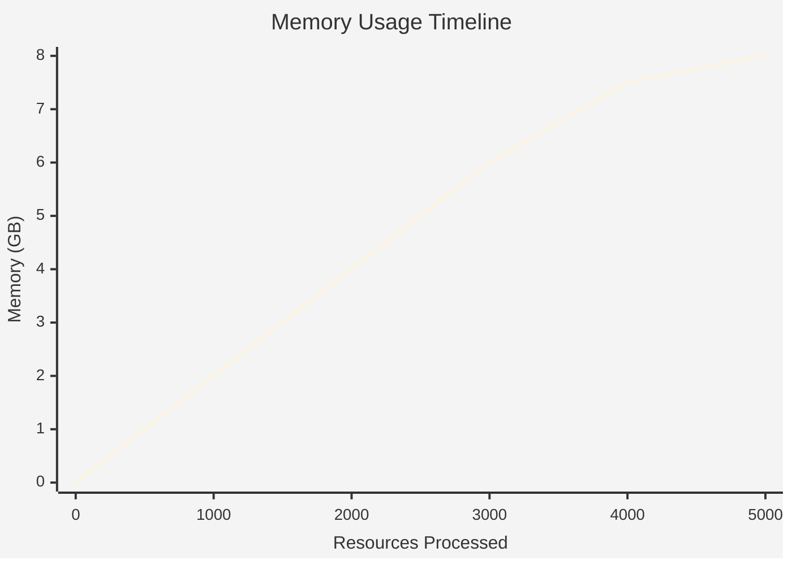
```mermaid
%%{init: {'theme':'base'}}%%
xychart-beta
    title "Memory Usage Timeline"
    x-axis "Resources Processed" [0, 1000, 2000, 3000, 4000, 5000]
    y-axis "Memory (GB)" 0 --> 8
    line [0, 2, 4, 6, 7.5, 8]
```

**Problem: Loading all data into memory at once**

| Factor | Impact |
|--------|--------|
| Each resource | ~50KB |
| 5,000 resources | 250MB base data |
| Python object overhead | ~3x multiplier |
| List/dict allocations | ~2x multiplier |
| **Total raw data** | **~1.5GB** |
| **Peak with processing** | **3-8GB! ⚠️ CRASH** |


**Root Causes:**
1. Loading entire dataset into memory
2. Building large lists/dicts without bounds
3. Not releasing references (Python GC can't collect)
4. SQLAlchemy session holding all objects
5. Pandas DataFrames growing unbounded

### Strategy 1: Chunking / Pagination

Process data in fixed-size chunks:

```python
# BAD: Load everything into memory
@celery_task
def import_all_reservations(integration_id):
    driver = get_driver(integration_id)

    # This loads ALL reservations into memory!
    all_reservations = driver.get_reservations()  # Could be 50,000+ items

    for reservation in all_reservations:  # Memory keeps growing
        process_reservation(reservation)
        save_reservation(reservation)
    # Memory not released until task completes

# GOOD: Process in chunks
@celery_task
def import_all_reservations(integration_id):
    driver = get_driver(integration_id)

    CHUNK_SIZE = 100  # Process 100 at a time
    offset = 0

    while True:
        # Fetch chunk
        chunk = driver.get_reservations(limit=CHUNK_SIZE, offset=offset)

        if not chunk:
            break  # No more data

        # Process chunk
        for reservation in chunk:
            process_reservation(reservation)
            save_reservation(reservation)

        # Clear chunk from memory
        del chunk

        # Move to next chunk
        offset += CHUNK_SIZE

        # Optional: Force garbage collection
        import gc
        gc.collect()

        logger.info(f"Processed {offset} reservations")
```

**Memory comparison:**
```
Without chunking: 5,000 items × 50KB = 250MB minimum
With chunking:    100 items × 50KB = 5MB at a time (50x reduction!)
```

### Strategy 2: Streaming / Generator Pattern

Use generators to process data lazily:

```python
# BAD: Return entire list
def fetch_all_properties(api):
    properties = []
    page = 1

    while True:
        response = api.get(f'/properties?page={page}')
        properties.extend(response['data'])  # List keeps growing!

        if not response['has_more']:
            break
        page += 1

    return properties  # Entire dataset in memory

# GOOD: Yield items one at a time
def stream_properties(api):
    """Generator that yields properties without loading all into memory"""
    page = 1

    while True:
        response = api.get(f'/properties?page={page}')

        for prop in response['data']:
            yield prop  # Yield one item at a time

        if not response['has_more']:
            break
        page += 1

# Usage
@celery_task
def import_properties(integration_id):
    api = get_api(integration_id)

    # Memory efficient: only one property in memory at a time
    for prop in stream_properties(api):
        process_property(prop)
        save_property(prop)
        # prop is garbage collected after this iteration
```

### Strategy 3: Database Batching

Batch database operations to avoid holding objects in session:

```python
# BAD: Session accumulates all objects
@celery_task
def import_properties(integration_id):
    session = get_session()
    properties = fetch_all_properties()  # 5,000 items

    for prop_data in properties:
        # SQLAlchemy session keeps reference to every object!
        property = Property(**prop_data)
        session.add(property)

    session.commit()  # Huge commit, all objects in memory
    # Memory only released after commit

# GOOD: Batch commits with session cleanup
@celery_task
def import_properties(integration_id):
    BATCH_SIZE = 100

    for chunk in chunked(stream_properties(api), BATCH_SIZE):
        session = get_session()

        for prop_data in chunk:
            property = Property(**prop_data)
            session.add(property)

        # Commit batch
        session.commit()

        # Critical: Close session to release memory
        session.close()

        # Alternative: Expunge objects
        # session.expunge_all()

def chunked(iterable, size):
    """Yield successive chunks from iterable"""
    chunk = []
    for item in iterable:
        chunk.append(item)
        if len(chunk) == size:
            yield chunk
            chunk = []
    if chunk:
        yield chunk
```

### Strategy 4: Bulk Operations

Use bulk operations instead of individual inserts:

```python
# BAD: Individual inserts
for prop_data in properties:
    Property.create(**prop_data)  # Separate query each time

# GOOD: Bulk insert
Property.bulk_insert([
    {'name': prop['name'], 'address': prop['address'], ...}
    for prop in properties
])

# BETTER: Bulk insert in chunks
for chunk in chunked(properties, 1000):
    Property.bulk_insert([
        {'name': p['name'], 'address': p['address']}
        for p in chunk
    ])
    # Each chunk is separate transaction
```

### Strategy 5: Memory Profiling

Identify memory leaks before they hit production:

```python
from memory_profiler import profile
import tracemalloc

# Method 1: Decorator-based profiling
@profile
@celery_task
def import_properties(integration_id):
    # Function body
    pass

# Outputs:
# Line #    Mem usage    Increment
# ======================================
#     12     50.2 MiB     0.0 MiB    def import_properties():
#     13     75.4 MiB    25.2 MiB        data = fetch_all()
#     14     75.4 MiB     0.0 MiB        for item in data:
#     15    145.8 MiB    70.4 MiB            process(item)  # Memory leak!

# Method 2: Tracemalloc for production monitoring
@celery_task
def import_properties(integration_id):
    tracemalloc.start()

    # Take snapshot before
    snapshot_before = tracemalloc.take_snapshot()

    # Do work
    properties = fetch_all_properties()
    for prop in properties:
        process_property(prop)

    # Take snapshot after
    snapshot_after = tracemalloc.take_snapshot()

    # Compare
    top_stats = snapshot_after.compare_to(snapshot_before, 'lineno')

    # Log top memory consumers
    logger.info("Top 10 memory allocations:")
    for stat in top_stats[:10]:
        logger.info(f"{stat}")

    # Alert if memory usage too high
    current, peak = tracemalloc.get_traced_memory()
    if peak > 1024 * 1024 * 1024:  # 1GB
        alert_oncall(f"High memory usage: {peak / 1024 / 1024:.1f}MB")

    tracemalloc.stop()
```

### Strategy 6: Explicit Garbage Collection

Force Python to release memory:

```python
import gc

@celery_task
def import_large_dataset(integration_id):
    for i, chunk in enumerate(fetch_in_chunks()):
        process_chunk(chunk)

        # Clear local references
        del chunk

        # Force GC every 10 chunks
        if i % 10 == 0:
            # Disable GC during processing
            gc.disable()

            # Process chunk
            # ...

            # Enable and force collection
            gc.enable()
            collected = gc.collect()
            logger.debug(f"GC collected {collected} objects")

            # Log memory stats
            memory_info = get_memory_usage()
            logger.info(f"Memory: {memory_info['rss']}MB RSS, {memory_info['vms']}MB VMS")
```

### Strategy 7: Circular Reference Detection

Find and break circular references that prevent GC:

```python
import gc
import sys

def find_circular_references():
    """Debug helper to find circular references"""
    gc.collect()  # Force collection first

    # Find all objects
    for obj in gc.get_objects():
        if isinstance(obj, dict):
            # Check for circular references in dicts
            for key, value in obj.items():
                if value is obj:
                    logger.warning(f"Circular reference found: {obj}")

# Common circular reference patterns

# Pattern 1: Parent-child relationship
class Property:
    def __init__(self):
        self.reservations = []

class Reservation:
    def __init__(self, property):
        self.property = property  # Reference to parent
        property.reservations.append(self)  # Parent references child
        # Circular reference!

# Solution: Use weak references
import weakref

class Reservation:
    def __init__(self, property):
        self.property = weakref.ref(property)  # Weak reference
        property.reservations.append(self)

# Pattern 2: Cached data with references
cache = {}

def get_property(property_id):
    if property_id in cache:
        return cache[property_id]

    prop = Property.find(property_id)
    cache[property_id] = prop  # Keeps reference forever!
    return prop

# Solution: Use LRU cache with size limit
from functools import lru_cache

@lru_cache(maxsize=1000)  # Limit cache size
def get_property(property_id):
    return Property.find(property_id)
```

### Strategy 8: Memory Limits per Task

Prevent runaway tasks from consuming all memory:

```python
import resource

@celery_task
def import_properties(integration_id):
    # Set memory limit: 512MB
    soft, hard = resource.getrlimit(resource.RLIMIT_AS)
    resource.setrlimit(resource.RLIMIT_AS, (512 * 1024 * 1024, hard))

    try:
        # Do work
        process_data()
    except MemoryError:
        logger.error(f"Task exceeded memory limit")
        # Graceful degradation
        process_data_in_smaller_chunks()

# Celery task time and memory limits
@celery_task(
    soft_time_limit=300,    # 5 min soft limit
    time_limit=360,         # 6 min hard limit
)
def import_properties(integration_id):
    pass
```

### Real-World Example: Processing 10,000 Properties

```python
@celery_task(bind=True)
def import_all_properties_chunked(self, integration_id):
    """Memory-efficient property import"""

    driver = get_driver(integration_id)
    stats = {
        'processed': 0,
        'failed': 0,
        'peak_memory_mb': 0,
    }

    CHUNK_SIZE = 100
    tracemalloc.start()

    try:
        # Stream properties (no memory buildup)
        for chunk_idx, property_chunk in enumerate(
            chunked(driver.stream_properties(), CHUNK_SIZE)
        ):
            # Track memory
            current, peak = tracemalloc.get_traced_memory()
            peak_mb = peak / 1024 / 1024
            stats['peak_memory_mb'] = max(stats['peak_memory_mb'], peak_mb)

            # Alert if memory growing
            if peak_mb > 500:  # 500MB threshold
                logger.warning(f"High memory usage: {peak_mb:.1f}MB")
                gc.collect()

            # Process chunk with separate session
            session = get_session()

            try:
                bulk_data = []
                for prop_data in property_chunk:
                    try:
                        # Transform data
                        normalized = normalize_property(prop_data)
                        bulk_data.append(normalized)
                        stats['processed'] += 1
                    except Exception as e:
                        logger.error(f"Failed to process property: {e}")
                        stats['failed'] += 1

                # Bulk insert chunk
                if bulk_data:
                    Property.bulk_insert(bulk_data)
                    session.commit()

            except Exception as e:
                session.rollback()
                logger.error(f"Failed to save chunk {chunk_idx}: {e}")
            finally:
                session.close()

            # Clear chunk from memory
            del property_chunk
            del bulk_data

            # Force GC every 10 chunks
            if chunk_idx % 10 == 0:
                collected = gc.collect()
                logger.info(
                    f"Chunk {chunk_idx}: {stats['processed']} processed, "
                    f"GC collected {collected} objects, "
                    f"Peak memory: {peak_mb:.1f}MB"
                )

            # Update task progress
            self.update_state(
                state='PROGRESS',
                meta={
                    'processed': stats['processed'],
                    'failed': stats['failed'],
                }
            )

    finally:
        tracemalloc.stop()

    logger.info(
        f"Import complete: {stats['processed']} processed, "
        f"{stats['failed']} failed, "
        f"Peak memory: {stats['peak_memory_mb']:.1f}MB"
    )

    return stats
```

### Memory Management Checklist

**Memory Optimization Checklist:**

- ✓ Use generators/streaming instead of loading all data
- ✓ Process data in chunks (100-1000 items)
- ✓ Use bulk operations for database writes
- ✓ Close database sessions after each batch
- ✓ Delete large objects after use (`del variable`)
- ✓ Force garbage collection in long-running tasks
- ✓ Avoid circular references (use `weakref`)
- ✓ Profile memory usage in development
- ✓ Set memory limits per task
- ✓ Monitor memory in production
- ✓ Clear caches periodically
- ✓ Use LRU cache with size limits
- ✓ Avoid global state accumulation


**Key Insight:** Memory issues are like compound interest - small leaks accumulate over time. A 1MB leak per task becomes 1GB after 1,000 tasks. Design for bounded memory usage from day one.

---

## Data Consistency

Integration data is inherently eventually consistent. Embrace it.

### Challenge: Concurrent Updates

**Scenario: Two workers processing same resource**

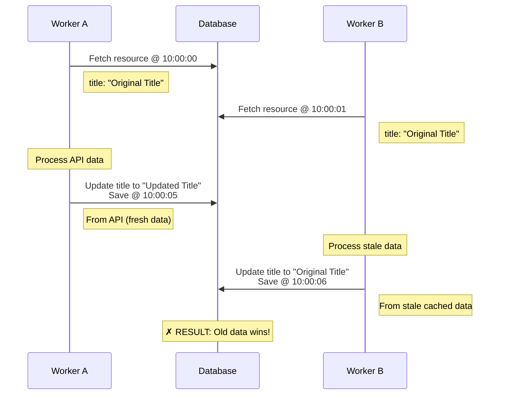
```mermaid
sequenceDiagram
    participant WA as Worker A
    participant DB as Database
    participant WB as Worker B

    WA->>DB: Fetch resource @ 10:00:00
    Note right of WA: title: "Original Title"

    WB->>DB: Fetch resource @ 10:00:01
    Note right of WB: title: "Original Title"

    Note over WA: Process API data
    WA->>DB: Update title to "Updated Title"<br/>Save @ 10:00:05
    Note right of WA: From API (fresh data)

    Note over WB: Process stale data
    WB->>DB: Update title to "Original Title"<br/>Save @ 10:00:06
    Note right of WB: From stale cached data

    Note over DB: ✗ RESULT: Old data wins!
```


### Solution 1: Last-Write-Wins with Timestamps

```python
def update_resource(resource_id, new_data, fetched_at):
    resource = Resource.find(resource_id)

    # Only update if data is newer
    if fetched_at > resource.last_synced_at:
        property.update(
            name=new_data['name'],
            address=new_data['address'],
            last_synced_at=fetched_at,
        )
        return True
    else:
        logger.info(f"Skipping stale update for property {property_id}")
        return False
```

### Solution 2: Optimistic Locking

```python
from sqlalchemy.orm import version_id_column

class Property(Base):
    __tablename__ = 'properties'

    id = Column(Integer, primary_key=True)
    name = Column(String)
    version = version_id_column()  # Auto-incremented on each update

def update_property(property_id, new_data):
    from sqlalchemy.orm.exc import StaleDataError

    session = get_session()
    try:
        property = session.query(Property).filter_by(id=property_id).one()
        property.name = new_data['name']
        session.commit()  # Fails if version changed
    except StaleDataError:
        session.rollback()
        logger.warning(f"Concurrent update detected for property {property_id}")
        # Retry or skip
```

### Solution 3: Idempotency Keys

Make operations idempotent:

```python
@celery_task
def import_reservations(integration_id, property_id, idempotency_key):
    # Check if already processed
    cache_key = f'import_res:{idempotency_key}'
    if redis.exists(cache_key):
        logger.info(f"Skipping duplicate import: {idempotency_key}")
        return

    # Do the import
    reservations = driver.get_reservations(property_id)
    for res in reservations:
        upsert_reservation(res)

    # Mark as processed (24 hour expiry)
    redis.setex(cache_key, 86400, '1')

# Usage: generate stable idempotency key
idempotency_key = f"{integration_id}:{property_id}:{date.today().isoformat()}"
import_reservations.delay(integration_id, property_id, idempotency_key)
```

### Solution 4: Event Sourcing

Store all changes as events:

```python
# Instead of updating property directly:
property.name = "New Name"  # Lost history

# Store events:
events.append({
    'type': 'property.name_changed',
    'property_id': property_id,
    'old_value': 'Beach House',
    'new_value': 'Ocean Villa',
    'source': 'guesty_api',
    'timestamp': datetime.utcnow(),
})

# Rebuild current state from events
def get_property_state(property_id):
    events = Event.query.filter_by(property_id=property_id).order_by('timestamp')
    state = {}
    for event in events:
        apply_event(state, event)
    return state
```

---

## Testing Strategies

Testing integrations is hard because you depend on external APIs.

### Strategy 1: Record & Replay (VCR)

```python
import vcr

# First run: records real API responses
# Subsequent runs: replays from cassette
@vcr.use_cassette('fixtures/vcr_cassettes/guesty_properties.yaml')
def test_fetch_properties():
    api = GuestyAPI(client_id='test', client_secret='test')
    properties = api.get_homes()

    assert len(properties) > 0
    assert properties[0]['_id']
    assert properties[0]['nickname']

# Cassette file (auto-generated):
# interactions:
# - request:
#     method: GET
#     uri: https://api.guesty.com/api/v2/listings
#   response:
#     status: {code: 200}
#     body: {string: '{"results": [...]}'}
```

**Benefits:**
- Tests don't hit real API (fast, free)
- Deterministic results
- Works offline

**Drawbacks:**
- Cassettes get stale
- Need to refresh periodically

### Strategy 2: Contract Testing

Validate our assumptions about partner APIs:

```python
import pytest

def test_guesty_api_contract():
    """Validates Guesty API still matches our expectations"""
    api = GuestyAPI(client_id=TEST_CREDS['id'], client_secret=TEST_CREDS['secret'])

    # Test 1: Auth works
    assert api.is_authenticated

    # Test 2: Properties endpoint exists
    properties = api.get_homes()
    assert isinstance(properties, list)

    # Test 3: Property structure matches schema
    if properties:
        prop = properties[0]
        assert '_id' in prop
        assert 'nickname' in prop
        assert 'address' in prop
        assert 'accommodates' in prop

    # Test 4: Rate limit headers present
    response = api._last_response
    assert 'X-RateLimit-Remaining-Minute' in response.headers

# Run these tests daily against production APIs
# Alert if contracts break
```

### Strategy 3: Integration Test Environment

Some partners provide sandbox/test environments:

```python
# config.py
if ENV == 'production':
    GUESTY_BASE_URL = 'https://api.guesty.com'
elif ENV == 'test':
    GUESTY_BASE_URL = 'https://api.sandbox.guesty.com'
```

**Reality check:** Most partners don't have good test environments. When they exist:
- Often missing features
- Stale data
- Different behavior than production
- Extra cost

### Strategy 4: Chaos Testing

Simulate failures to ensure resilience:

```python
import random

class ChaosAPISession(requests.Session):
    def request(self, *args, **kwargs):
        # Randomly inject failures
        if random.random() < 0.1:  # 10% failure rate
            failure_type = random.choice([
                'timeout',
                '500_error',
                '429_rate_limit',
                'network_error',
            ])

            if failure_type == 'timeout':
                time.sleep(30)
                raise Timeout("Simulated timeout")
            elif failure_type == '500_error':
                return Mock(status_code=500, text="Internal Server Error")
            elif failure_type == '429_rate_limit':
                return Mock(status_code=429, headers={'Retry-After': '60'})
            elif failure_type == 'network_error':
                raise ConnectionError("Simulated network failure")

        return super().request(*args, **kwargs)

# Use in staging environment
if ENV == 'staging':
    session_class = ChaosAPISession
else:
    session_class = requests.Session
```

---

## Lessons Learned

After 40+ integrations, here are the hard-won lessons:

### 1. Expect Failure

**❌ Don't:** Assume APIs are reliable
```python
properties = api.get_properties()  # What if this fails?
for prop in properties:
    save(prop)
```

**✅ Do:** Design for failure
```python
try:
    properties = api.get_properties()
except APIError as e:
    logger.error(f"Failed to fetch properties: {e}")
    alert_on_call()
    return  # Graceful degradation

for prop in properties:
    try:
        save(prop)
    except Exception as e:
        logger.error(f"Failed to save property {prop['id']}: {e}")
        # Continue with next property
```

### 2. Rate Limits Are Real

**Mistake:** Treating rate limits as suggestions

**Reality:** You will get banned. Recovery is painful (support tickets, manual approval).

**Defense in depth:**
1. Read the docs (they're usually wrong)
2. Implement conservative limits (50-70% of stated limit)
3. Use multiple layers (per-worker, per-queue, distributed)
4. Monitor actual limits via response headers
5. Implement backoff on 429s
6. Have circuit breakers

### 3. Authentication Will Break

**Plan for:**
- Token expiration (even "long-lived" tokens)
- Token refresh failures
- Credential rotation
- OAuth provider outages
- Webhook auth updates

**Solution:** Monitoring + Alerts + Runbooks

```python
# Alert on auth failures
if auth_failure_count_last_hour(partner) > 5:
    page_oncall(f"{partner} auth failing - check credentials")
```

### 4. APIs Change Without Warning

**Examples I've seen:**
- Field renamed (`property_name` → `name`)
- Response structure changed (flat → nested)
- Pagination method changed (offset → cursor)
- Rate limits tightened (1000/min → 100/min)
- Endpoints deprecated with no notice

**Defense:**
- Version pinning
- Response validation (schemas)
- Contract tests (daily)
- Adapter pattern (easy to swap implementations)
- Feature flags (gradual rollouts)

### 5. One Integration, Many Edge Cases

**Common issues:**
- Missing required fields (e.g., no address for some properties)
- Inconsistent data types (string vs int for IDs)
- Timezone confusion (UTC? Local? Ambiguous?)
- Encoding issues (UTF-8? Latin-1? Emoji?)
- Null vs empty string vs missing field

**Solution:** Defensive parsing + validation

```python
def parse_property(raw):
    return {
        'id': str(raw['id']),  # Always string, even if sometimes int
        'name': raw.get('name', '').strip() or 'Untitled Property',
        'address': raw.get('address', {}).get('formatted', 'Unknown'),
        'capacity': int(raw.get('accommodates') or 0),
        'created_at': parse_datetime(raw.get('createdAt')),  # Handles many formats
    }
```

### 6. Logs Are Your Best Friend

When something goes wrong (and it will), comprehensive logs make the difference between 15 minute debugging and 4 hour investigation.

**Log:**
- Every API call (URL, method, status, duration)
- Every error (with context: integration_id, property_id, etc.)
- State changes (property created, updated, deleted)
- Rate limit info (headers, delays)
- Auth events (token refresh, failures)

**Don't log:**
- API keys, tokens, passwords (obviously)
- PII without careful consideration
- High-cardinality data in metric labels

### 7. Monitoring Must Be Actionable

**Bad alert:**
```
"API error rate increased"
```

**Good alert:**
```
"Guesty API 401 errors for integration #1234 (Company: ACME Inc)
Last successful auth: 2 hours ago
Action: Check if customer revoked permissions
Runbook: https://wiki.company.com/integrations/guesty-auth-failures"
```

### 8. Start Simple, Add Complexity When Needed

**Don't prematurely optimize:**
- First integration: Simple cron job might be fine
- 5 integrations: Add basic queue
- 10+ integrations: Distributed tasks
- 40+ integrations: Need all the patterns in this post

**Over-engineering early is worse than under-engineering.**

### 9. Memory Leaks Kill Silently

**The problem:** Works perfectly for 100 items, crashes mysteriously at 10,000.

**Common causes:**
- Loading entire dataset into memory
- SQLAlchemy session holding all objects
- Circular references preventing GC
- Cached data growing unbounded
- Large lists/dicts built incrementally

**Solutions:**
```python
# BAD: Load everything
all_items = fetch_all()  # 10,000 items in memory!
for item in all_items:
    process(item)

# GOOD: Stream/chunk
for chunk in fetch_in_chunks(size=100):
    process_chunk(chunk)
    del chunk  # Release memory
    gc.collect()  # Force cleanup
```

**Key insight:** Profile memory in dev, monitor in prod. Memory issues compound over time.

### 10. Worker Downtime = Queue Disaster

**Scenario:** Workers crash at 2 AM, scheduler keeps queuing tasks.

**Result:** 10,000+ stale tasks by morning, 10+ hours to drain.

**Defense:**
- Monitor worker heartbeats (alert within 1 minute)
- Task staleness checks (skip tasks older than 1 hour)
- Queue depth alerts (page when > 1000)
- Graceful deployment (drain before restart)
- Emergency fallback processor

**Critical:** Most "queue backup" problems are actually "worker down" problems.

### 11. Partner APIs Are Not Created Equal

Tier 1 (Great):
- Comprehensive docs
- Webhook support
- Reasonable rate limits
- Stable APIs
- Responsive support
- Example: Stripe, Twilio

Tier 2 (Okay):
- Basic docs
- Some rate limits
- Breaking changes occasionally
- Slow support
- Example: Most PMS systems

Tier 3 (Painful):
- Outdated docs (or no docs)
- Aggressive rate limits
- Frequent breaking changes
- No support
- Example: You know who you are

**Adjust complexity accordingly.** Don't build the same architecture for all partners.

### 12. Documentation Debt Is Real

**Document:**
- Partner-specific quirks
- Rate limits (real ones, not official docs)
- Auth renewal process
- Common failures + solutions
- Deployment considerations

**Example quirks doc:**
```markdown
## Guesty Integration

### Rate Limits
Official: 600 req/min
Actual: ~500 req/min (aggressive throttling around 550)
Per-second limit: 10 req/s (undocumented!)

### Auth
- Token expires after 24 hours
- Refresh can take up to 30s
- Refresh endpoint rate limited to 10/hour

### Known Issues
- Property IDs sometimes change (merge/split operations)
- Address field can be null even for published properties
- Photos API occasionally returns 502 (retry works)

### Support
- Response time: 3-5 business days
- Slack channel: #vendor-guesty
```

---

## Conclusion

Building scalable integrations is a marathon, not a sprint. The patterns in this post took years to develop through trial, error, and production incidents.

**Key Takeaways:**

1. **Isolation** - Use driver pattern to contain partner-specific logic
2. **Async** - Celery/queues for distributed processing
3. **Rate Limiting** - Multiple layers, conservative limits, adaptive backoff
4. **Error Handling** - Classify errors, retry intelligently, dead letter queue
5. **Circuit Breakers** - Fail fast when partner is down
6. **Memory Management** - Chunk data, stream processing, explicit GC
7. **Worker Monitoring** - Heartbeat checks, queue depth alerts, graceful deploys
8. **Monitoring** - Comprehensive metrics, actionable alerts
9. **Testing** - Contract tests, chaos engineering, record/replay
10. **Data Consistency** - Timestamps, optimistic locking, idempotency
11. **Documentation** - Runbooks, quirks, postmortems

**Remember:** Integration engineering is fundamentally different from building your own APIs. You're operating in a hostile, unpredictable environment where Murphy's Law is the only constant.

The teams that succeed are those that:
- Expect failure and design for resilience
- Monitor relentlessly
- Iterate based on production feedback
- Document everything (especially the weird stuff)

**Final Advice:** Start simple. Add complexity only when you feel the pain. Every pattern in this post was born from a production incident.

Good luck, and may your rate limits be generous and your tokens forever fresh.

---

*Questions? Want to discuss integration architecture? Find me on [GitHub](https://github.com/julianjurai) or [LinkedIn](https://linkedin.com/in/julianjurai).*
